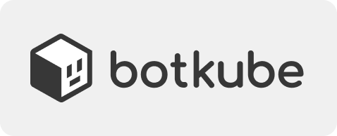

  

  Documentation website source files

  
  
  

## Overview

This repository contains source code of the Botkube documentation website, accessible under the [docs.botkube.io](https://docs.botkube.io) address. The documentation source files reside under the [**content**](./docs) directory.

## Contributing

You can contribute to documentation by following instructions described in [CONTRIBUTING.md](CONTRIBUTING.md).

## Licence

This project is licensed under the [MIT License](LICENSE).

## Tooling

- [Cloudflare](https://cloudflare.com) - Continuous deployment and hosting of this documentation
- [Docusaurus](https://docusaurus.io/) - Used to build this docs website
