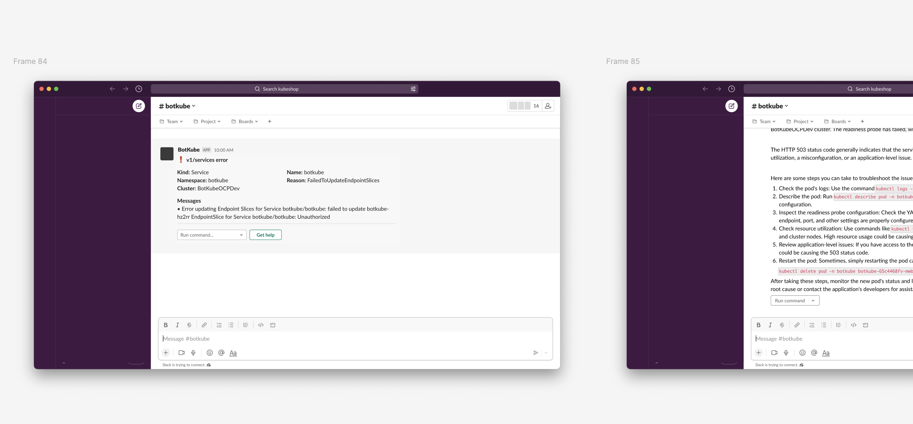
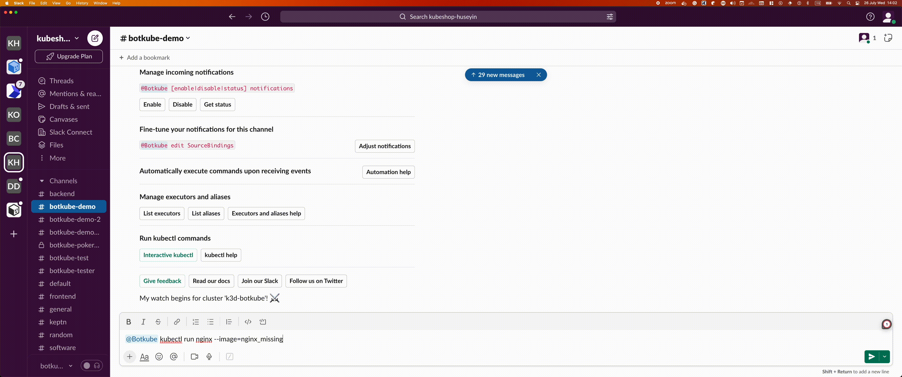
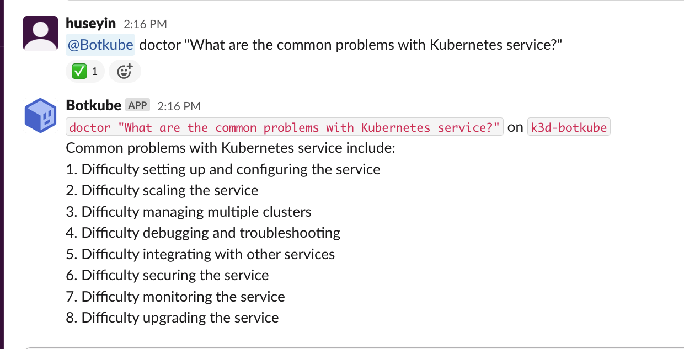
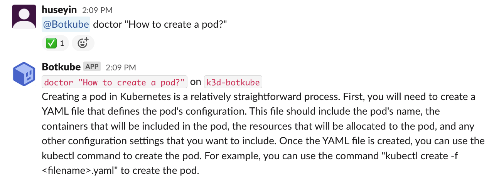

# Building a ChatGPT Plugin: From Ideation to Implementation

## Introduction

The Botkube team is a group of dedicated individuals with a common focus on developing innovative solutions in the technology landscape. With AI getting more and more widely used, the team saw an opportunity to explore the potential of AI-powered chatbots in the DevOps space.

A significant event that played a crucial role in shaping the trajectory of the ChatGPT plugin was the company-wide hackathon organized by Kubeshop. The hackathon was a great opportunity for the team to brainstorm ideas and collaborate on projects that would help people making Kubernetes life easier, simpler and faster.

This blog post aims to document the entire process involved in the creation of the Botkube ChatGPT plugin. From the initial spark of the idea during the hackathon to the final stages of implementation, we'll take you on a behind-the-scenes journey. Expect insights into the challenges, breakthroughs, and collaborative efforts that went into making this vision a reality.

## Ideation Phase: The Company-Wide Hackathon

It all started with the internal Kubeshop hackathon. During this intense and collaborative event, team members from diverse backgrounds came together to brainstorm, experiment, and find novel solutions to challenges in the Kubernetes space, as a part of the existing projects in Kubeshop portfolio. The hackathon's theme was to help Developers, Testers, DevOPS, SRE’s or their managers with making Kubernetes life easier, simpler, faster. In 48 hours, the teams had to come up with an idea, build a prototype, and present their proof-of-concept solution to the judges.

The Botkube team came up with 14 different ideas. As the hackathon time was limited, the team had to filter out the ideas we should focus on. After a series of dicussions and internal voting, we decided to improve the Botkube onboarding experience. This consisted of 4 different parts:

- Botkube Cloud Migration Tool, to seamlessly migrate existing Botkube installation to Botkube Cloud.
- Botkube Cloud Instance Builder, a convenient drag-and-drop UI tool to configure Botkube instance.
- Exec plugin, to install and run any CLI application directly from chat platform, without any hassle.
- ChatGPT executor plugin, which is the main topic of this blog post.

The ChatGPT plugin was the most voted idea internally, as we all saw the potential to bring significant value to the users. The team, guided by the goal of selecting an idea with the highest impact, set specific criteria to evaluate each proposal. We considered factors such as feasibility, market demand, and alignment with the Botkube's long-term vision. The ChatGPT plugin idea ticked all the boxes, showing promise to address real customer needs and aligning perfectly with the Botkube's mission.

## Planning and Conceptualization

Once the ChatGPT executor plugin was selected as a part of our hackathon topic, the team started working on the project. The first step was to define the goals and objectives of the plugin.

The main goal was to lower the barrier of entry for new Botkube users. Sometimes it is hard to understand and troubleshoot the Kubernetes errors and their meaning, especially for beginners. That's why the idea was to introduce "Get help" button under incoming error events.



The button would pass the error data to the ChatGPT plugin, which would use return an AI-generated response with actionable buttons. The user would be able to click on the buttons to execute specific commands, such as `kubectl describe pod` or `kubectl logs pod`. This would help the user to troubleshoot the issue without the need to search for the solution on the Internet.

Another use case we considered is answering human questions directly from the chat. The user would be able to ask questions like "How to create a Pod?" or "How to troubleshoot non-working Service?" and get an AI-generated response. This would be useful for new users who are not familiar with Kubernetes concepts and terminology.

Final part of this phase was to come up with a name for the plugin. This was one of the hardest challenges.

> There are only two hard things in Computer Science: cache invalidation and naming things.
>
> -- Phil Karlton

We decided to call it "Doctor", as it would help users to diagnose and fix Kubernetes issues. 🩺

## Development Process

The enthusiasm and dedication displayed by the team during the ideation phase laid a strong foundation for the development of the ChatGPT plugin. As we already knew what we wanted to develop, we had to decide on the specific technologies and tools to use.

Choosing plugin language was the first step. Botkube plugin API uses Hashicorp's [`go-plugin`](https://github.com/hashicorp/go-plugin) gRPC interface. While it has cross-language support, we decided to stick to Go as it is the primary language used in Botkube. We also wanted to leverage existing Go SDK and pipelines we set up for Botkube Go codebase.

The next step was a bit more challenging: choosing the right AI model. We wanted to use a pre-trained model to avoid the need for training data and the time-consuming training process. The most important thing was to be able to answer Kubernetes-related questions efficiently. After careful consideration, we decided to use OpenAI's GPT-3 (`text-davinci-003`) model for the chatbot.

While ChatGPT integration is very straightforward, another little challenge was to construct a prompt which produces predictable results, and to parse the response from the model, so that we could render interactive output for a user. After a little bit of testing and experimenting, we achieved the desired result.

Last part was to integrate the ChatGPT plugin into Kubernetes source plugin which watches for Kubernetes events and send notifications to the chat interface. We extended the Kubernetes plugin with `extraButtons` configuration property which accepts command templates and renders them as interactive buttons as a part of each notification:

```yaml
k8s-err-events-with-ai-support: # Source configuration name
  displayName: "Kubernetes Errors with AI support" # Source display name

  botkube/kubernetes: # Kubernetes plugin configuration
    # ...
    config:
      # ...
      extraButtons:
        - enabled: true
          trigger:
            type: ["error"] # show the button only on error events
          button:
            displayName: "Get Help" # button label
            commandTpl: "doctor --resource={{ .Kind | lower }}/{{ .Name }} --namespace={{ .Namespace }} --error={{ .Reason }} --bk-cmd-header='AI assistance'" # button command template, rendered with Kubernetes event data for each event
```

This way, we were able to render the "Get help" button under each error event. As the implementation is generic, users can also benefit from it and configure virtually any command button under specific types of events.

## Result

In 48 hours, Botkube team was able to deliver a fully-working ChatGPT plugin called "Doctor". The plugin is able to help troubleshooting Kubernetes cluster issues based on incoming events. It's best used in combination with Slack integration, as it provides interactive buttons to help users navigate through the troubleshooting process. No typing required!



It also exposes ChatGPT prompt, so you can ask some arbitrary, not necessarily Kubernetes-related questions:




The team was very happy with the result, and we decided to **ship it to all users in Botkube 1.2 release**! 🎉

How to get started, you ask? [Install Botkube](https://docs.botkube.io/), if you haven't already, and enable Doctor plugin following the [Configuration](https://docs.botkube.io/configuration/executor/doctor) document. Then, learn how to use it by reading the [Usage](https://docs.botkube.io/usage/executor/doctor) document.

## Conclusion

The journey from the hackathon ideation to the final ChatGPT plugin has been nothing short of remarkable. It all began with the internal Kubeshop hackathon, where the Botkube team collaborated intensely and passionately to brainstorm ideas for making Kubernetes life easier, simpler, and faster. After carefully evaluating various proposals, the ChatGPT plugin emerged as the most promising idea, driven by its potential to revolutionize the Botkube onboarding experience and provide users with an unparalleled DevOps tool.

This would not have been possible without the spirit of cross-team collaboration and innovation that thrives within the company. The hackathon served as a platform for team members from diverse backgrounds to unite, share their expertise, and collectively explore innovative solutions. This collaborative approach fostered a culture of creativity and knowledge-sharing that continues to inspire future projects.

The Doctor plugin was just the beginning of our journey. We plan to continually enhance its functionality, leveraging user feedback and insights to make it more versatile and user-friendly. That's why your feedback is very important to us.

Let us know what do you think about the ChatGPT-based Doctor plugin! We are always open to feedback and suggestions. If you have any questions, feel free to reach out to us on [Slack](https://slack.botkube.io/) or [Twitter](https://twitter.com/botkube_io).
