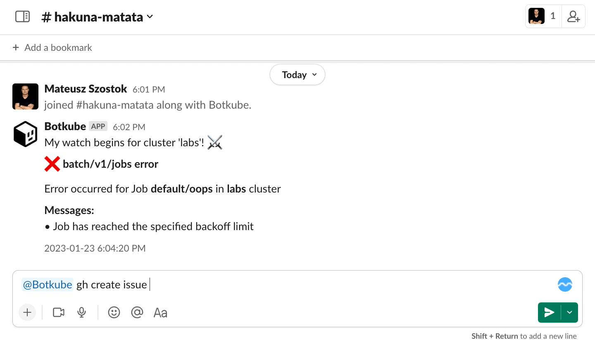
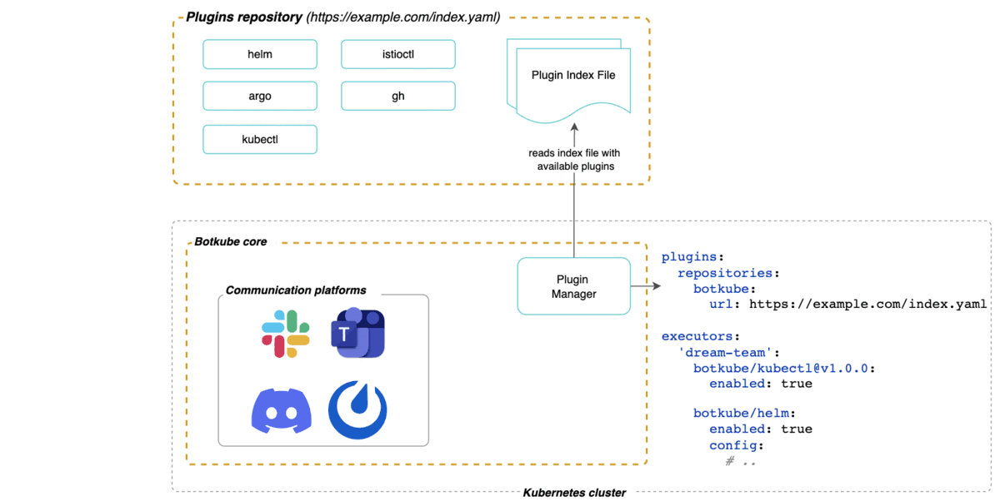
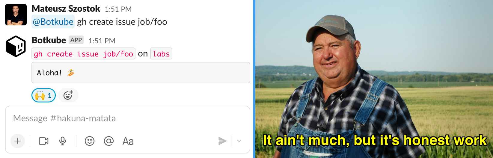

Botkube gives you fast and simple access to your clusters right from your communication platform. It does that by sending Kubernetes notifications (via [_sources_](https://docs.botkube.io/architecture/#source)) and allowing you to run `kubectl` and `helm` commands (via [_executors_](https://docs.botkube.io/architecture/#executor)) straight from the platform (Slack, Discord, Microsoft Teams and Mattermost).

In the recent Botkube 0.17 release, we took it to the next level by giving you an easy way to bring your own tools to a chat window!

In this blog post, you will learn how to develop your own executor plugin to fill the gap in your daily workflow.

## Goal

To make it simple but functional, I will show you how to develop an executor that creates an issue for failing Kubernetes resources such as Job, Deployment, StatefulSet, and Pod.



### Why it's worth it

Because with just a few lines of code, we will automate the process of creating a GitHub issue that out-of-the box contains Kubernetes-specific information useful for further debugging. All of that, directly from Slack, Discord, Mattermost, or MS Teams! No need for connecting to your cluster in your terminal, installing and running `kubectl` commands and copy-pasting fetched details into your browser.

Instead, you will be able to type `@Botkube gh create issue pod/foo` from any device that has access to your chat, including mobile apps.

## Prerequisites

- Access to a Kubernetes cluster
  :::info
  To create a local cluster for testing purposes using [`k3d`](https://k3d.io/v5.0.1/#installation), run:
  ```bash
  k3d cluster create
  ```
  :::
- [Botkube installed and configured](https://docs.botkube.io/installation/).
- Basic understanding of the Go language
- [Go](https://go.dev/doc/install) at least 1.18.

## What's under the hood

To understand better what we will develop, I want to give you a bigger picture of the Botkube plugin system. The below animation focuses only on the executor part, but it's almost the same for sources.



The new part is a plugin repository that we [introduced in `0.17`](https://botkube.io/blog/botkube-v017-release-notes). Plugin repository is a place where you store your plugin binaries and index files. Any static file server can be used, and in this blog post we will use a GitHub release. It’s similar to what you know from the Helm ecosystem.

The plugin manager consumes user's configuration, and downloads and starts **only** enabled plugins from a given repository. Plugins are running directly on the Kubernetes cluster where the Botkube core was installed.

Such approach allows us to decouple the Botkube core and its extensions. Thanks to that, we can:

- Avoid having the Botkube core crash if a given plugin malfunctions
- Write extensions in any language as gRPC is used

From the end-user's perspective, you can:

- Specify and use multiple plugin repositories at the same time
- Enable different plugin versions within the same Botkube version

To learn more, see [Botkube architecture](https://docs.botkube.io/architecture/).

## Step-By-Step Instructions

To quickly onboard you to Botkube plugins, we maintain the [kubeshop/botkube-plugins-template](https://github.com/kubeshop/botkube-plugins-template) repository that has all batteries included. Our first step is to bootstrap your own GitHub repository.

:::tip
**TODO:** Embed a ~5min video where we show all the steps from this how-to blog post.
:::

### Repository setup

1. Navigate to [`botkube-plugins-template`](https://github.com/kubeshop/botkube-plugins-template).

2. Click **Use this template**, and then **Create a new repository**.

   

   By doing so, you will create your own plugin repository with a single commit.

3. Clone your repository locally:

   ```bash
   gh clone {owner}/{repo_name} # for example, gh clone mszostok/botkube-plugins
   ```

4. Create and push a new tag to perform the initial release:

   ```bash
   git tag v0.0.1
   git push --tags
   ```

   After a few minutes you should see a new GitHub release.

Voilà! You are already an owner of fully functional Botkube plugins. Now it's time to add your own brick by creating a GitHub executor.

### Develop GitHub executor

import Gist from 'react-gist';

1. Create a `cmd/gh/main.go` file with the following template:

   <Gist id="1dbff1ac28b30024134e74ec7cbac563" />

   This template code imports required packages and registers `GHExecutor` as the gRPC plugin. Our `GHExecutor` service already implements the required [Protocol Buffers](https://github.com/kubeshop/botkube/blob/main/proto/executor.proto) contract. As you can see, we require **only 2 methods**.

   - The **`Metadata`** method returns basic information about your plugin. This data is used when the plugin index is [generated in an automated way](https://docs.botkube.io/plugin/repo).

   - The **`Execute`** method is the heart of your executor plugin. This method runs your business logic and returns the output as plaintext. Next, the Botkube core sends back the response to a given communication platform.

2. To download the imported dependencies, in your terminal, run:

   ```bash
   go mod tidy
   ```

3. Great! At this stage you already have a functional Botkube executor plugin. However, for now, it only responds with a hard-coded "Aloha!" greeting. But it can do that already on all supported communication platforms.

   

   Don't worry, in the next steps, we will implement our business logic.

4. Add support for user configuration:

   <Gist id="39fc1614e2849319314786fc53efe52d" />

   For each `Execute` method call, Botkube attaches the list of associated configurations. The input parameters are defined by the user, when enabling a given plugin:

   ```yaml
   executors:
     "plugin-based":
       repo-name/gh:
         enabled: true # If not enabled, plugin is not downloaded and started.
         config: # Plugin's specific configuration.
           github:
             repository: "mszostok/repository"
             token: "github_pat_foo"
             issueTemplate: |
               ## Description

               This issue refers to the problems connected with {{ .Type | code "bash" }} in namespace {{ .Namespace | code "bash" }}

               {{ .Logs | code "bash"}}
   ```

   In our case, we need to have a GitHub token, GitHub repository where the issue should be created, and an issue template. The remaining parameters can be hard-coded on the plugin side, however, your plugin will be more flexible if you allow your users to change it without rebuilding your plugins.

   It's up to the plugin author to merge the passed configurations. You can use our helper function from the plugin extension package (`pluginx`). To learn more, see [Passing configuration to your plugin](https://docs.botkube.io/plugin/custom-executor#passing-configuration-to-your-plugin).

5. Let's implement command parsing to properly understand command syntax:

   Our goal is to parse `gh create issue KIND/NAME [-n, --namespace]`.

   There are a lot of great libraries supporting command parsing. The most popular is probably [`cobra`](https://github.com/spf13/cobra), but for our use case, we will just use the helper function from our plugin extension package.

   <Gist id="6965d521ebb04a858b04df60d04c8af6" />

   Under the hood, the `pluginx.ParseCommand` method uses [`go-arg`](https://github.com/alexflint/go-arg).

6. We are almost there! Now let's fetch the issue details:

   <Gist id="85896e45d9d074143d60343b1d2f941c" />

   Here, we fetch logs and the cluster version, but you can extend it to fetch other details about your cluster. To make it as simple as possible, we use the `kubectl` CLI and avoid reimplementing a bit more complicated logic for fetching logs from all different Kubernetes kinds.

7. Render issue description:

   <Gist id="4811d91af7c576cf36dae2650413119d" />

   In this step, we use the issue template that the user specified in plugin configuration. I decided to use the [Go template](https://pkg.go.dev/text/template), as it fits perfectly into our template rendering flow.

8. Finally! Submitting an issue!

   <Gist id="bedd74bad437c9d3160242d3abaabe74" />

   GitHub provides a great [`gh`](https://cli.github.com) CLI, which we use to submit our issue. To learn more about the CLI syntax, see their [manual](https://cli.github.com/manual/gh_issue_create).

   :::note
   The `gh` CLI doesn't accept fine-grained access tokens. As a workaround, you can use the [Go SDK](https://gist.github.com/mszostok/defa5a5390e87b4f011b986742f714d8).
   :::

9. The last part is to download our dependencies.

   <Gist id="46caa050ec651eb656f99e32c657821b" />

   We already improved this step and in the 0.18 version Botkube will download defined [dependencies automatically](https://docs.botkube.io/next/plugin/dependencies). For now, you can use the `pluginx.DownloadDependencies` function to call our downloader explicitly. The syntax will remain the same.

Congrats! The `gh` plugin is finally implemented. Now, let's play a DevOps role! 😈 In the next section, I will show you how to build and release your brand-new executor plugin.

### Release the `gh` executor

It's time to build your plugin. For that purpose, we will use [GoReleaser](https://goreleaser.com/). It simplifies building Go binaries for different architectures. The important thing is to produce the binaries for the architecture of the host platform where Botkube is running. Adjust the `goos`, `goarch`, and `goarm` properties based on this architecture.

Add new build entry under `.goreleaser.yaml`:

```yaml
builds:
  - id: gh
    main: cmd/gh/main.go
    binary: executor_gh_{{ .Os }}_{{ .Arch }}

    no_unique_dist_dir: true
    env:
      - CGO_ENABLED=0
    goos:
      - linux
      - darwin
    goarch:
      - amd64
      - arm64
    goarm:
      - 7
```

Now, we need to distribute our plugins. As we mentioned earlier, a plugin repository can be any static file server. The [kubeshop/botkube-plugins-template](https://github.com/kubeshop/botkube-plugins-template) repository comes with two [GitHub Actions](https://github.com/features/actions):

1. The [`.github/workflows/release.yml`](https://github.com/kubeshop/botkube-plugins-template/blob/main/.github/workflows/release.yml) action, which builds the plugin binaries and index file each time a new tag is pushed.
2. The [`.github/workflows/pages-release.yml`](https://github.com/kubeshop/botkube-plugins-template/blob/main/.github/workflows/pages-release.yml) action, which updates GitHub Pages with plugin binaries and index file each time a new tag is pushed.

To cut a new release, you need to commit all your work and tag a new commit:

```bash
git add -A
git commit -m "Implement gh executor"
git tag v1.0.0
```

Next, let's push our changes and the new tag:

```bash
git push
git push --tags
```

This triggers GitHub Action:


**What this automation does under the hood**

This automation:

1. Installs the latest [GoReleaser](https://goreleaser.com/) tool.
2. Builds all plugin binaries defined in the `.goreleaser.yaml` file.
3. Generates an index file using the [Botkube helper tool](https://docs.botkube.io/plugin/repo#generate-index-file).
4. Generates a release description.
5. Uses the [`gh`](https://cli.github.com) CLI to create a new GitHub release.

### Use the `gh` executor

In the description of a new GitHub release, you will see the repository URL that you can use within Botkube.

#### Steps

1. Follow one of our [installation guides](https://docs.botkube.io/installation). Once you reach the Botkube deployment step, add flags specified in the steps below to `helm install`.
2. Export required environment variables:

   :::info
   Follow the official GitHub guide on how to create a [personal access token](https://docs.github.com/en/authentication/keeping-your-account-and-data-secure/creating-a-personal-access-token#creating-a-personal-access-token-classic). To be able to create GitHub issues, add the `repo` permission.
   :::

   ```bash
   export REPOSITORY={repo} # format OWNER/REPO_NAME, e.g. kubeshop/botkube
   export GITHUB_TOKEN={token}
   ```

3. Add the `gh` executor related configuration:

   ```bash
   # example configuration for `gh` executor
   -f https://gist.github.com/mszostok/88e6852f93429928d1183e52226921fc/raw \
   --set 'plugins.repositories.botkube-plugins.url'=${PLUGINS_URL} \
   --set 'executors.plugin-based.botkube-plugins/gh.config.github.repository'=${REPOSITORY} \
   --set 'executors.plugin-based.botkube-plugins/gh.config.github.token'=${GITHUB_TOKEN} \
   ```

4. Depending on the selected platform, add the `plugin-based` executor binding. For Slack, it looks like this:

   ```bash
   --set communications.default-group.socketSlack.channels.default.bindings.executors=['plugin-based']
   ```

If you follow all the steps above, you will have all the necessary flags allowing you to install Botkube with the `gh` executor!

Here's an example of a full command that you should have constructed for Slack installation:

```bash
export SLACK_CHANNEL_NAME={channel_name}
export SLACK_APP_TOKEN={token}
export SLACK_BOT_TOKEN={token}
export REPOSITORY={repo} # format OWNER/REPO_NAME, e.g. kubeshop/botkube
export GITHUB_TOKEN={token}

helm install --version v0.17.0 botkube --namespace botkube --create-namespace \
--set communications.default-group.socketSlack.enabled=true \
--set communications.default-group.socketSlack.channels.default.name=${SLACK_CHANNEL_NAME} \
--set communications.default-group.socketSlack.channels.default.bindings.executors=['plugin-based'] \
--set communications.default-group.socketSlack.appToken=${SLACK_APP_TOKEN} \
--set communications.default-group.socketSlack.botToken=${SLACK_BOT_TOKEN} \
# example configuration for `gh` executor
-f https://gist.github.com/mszostok/88e6852f93429928d1183e52226921fc/raw \
--set 'plugins.repositories.botkube-plugins.url'=${PLUGINS_URL} \
--set 'executors.plugin-based.botkube-plugins/gh.config.github.repository'=${REPOSITORY} \
--set 'executors.plugin-based.botkube-plugins/gh.config.github.token'=${GITHUB_TOKEN} \
botkube/botkube
```

## Summary

Botkube executors are powerful because they can glue together three important parts: Kubernetes clusters, communicators, and tools of your choice. There would be nothing special about it if it wasn't, in fact, unburdening you of those implementation-specific details.

As you noticed, you can focus purely on your business logic. Without the need to use different chat libraries, know how to establish secure connection, or make your extension available only on specific channels. What's more, not only do you not have to learn it, but you don't have to support it either, as we do it for you.

Once Botkube is deployed, your extension will be available to you and your teammates in a given channel. There is no need to maintain your local setup. Thanks to that, you can also easily run executors on private clusters.

Botkube extensions can be used with other Botkube functionality too. It means that you can use them to create automation. We will shed more light on that in the next blog post. Stay tuned!

> Implement once, access everywhere (Slack, Discord, Mattermost, MS Teams).

## How can I get involved?

The implemented plugin is as simple as possible. However, it is a great base for further extension based on your needs; for example: introduce your own Kubernetes annotation to route the notification to a specific repository, add a threshold to create issues only for constantly failing Pods, etc. The possibilities are endless, and we cannot wait to see what kind of great workflows you will create!

As always, we want to hear your feedback and ideas about Botkube. Help us plan the Botkube roadmap, get the features you’d like implemented.

There are plenty of options to contact us:

- [GitHub issues](https://github.com/kubeshop/botkube/issues)
- [Slack](https://join.botkube.io/)
- or email our Product Leader at [blair@kubeshop.io](mailto:blair@kubeshop.io).

Thank you for taking the time to learn about Botkube 🙌

### Resources

- The GitHub repository with the `gh` executor [source-code](https://github.com/kubeshop/botkube-plugins-template)
- [Official Botkube documentation](https://docs.botkube.io)
- [Creating automated actions](https://docs.botkube.io/configuration/action)
