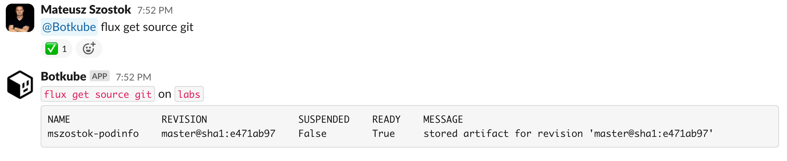
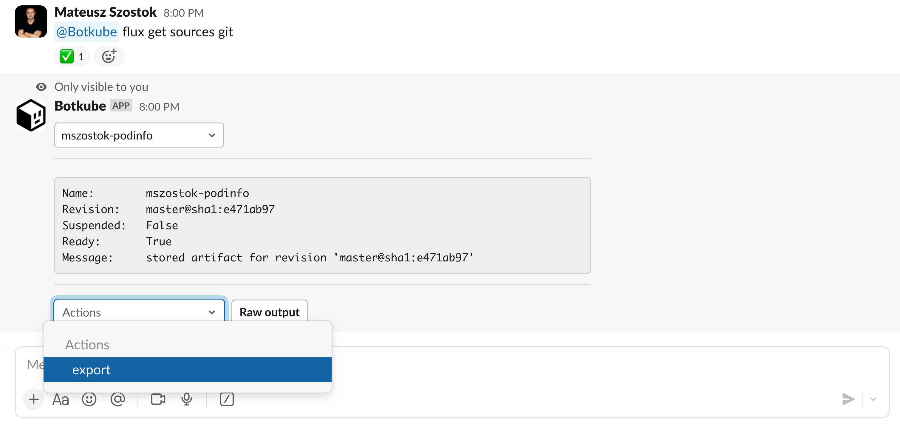
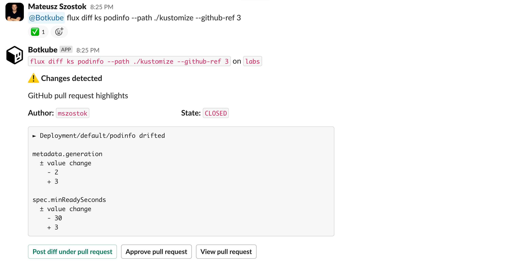
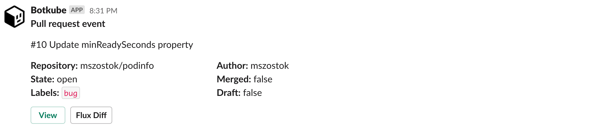
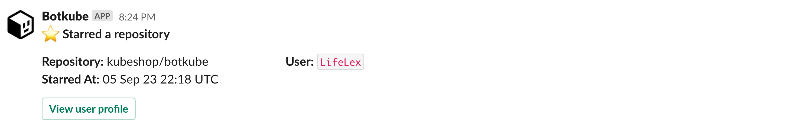

# Creating the Botkube Flux Plugin for Day 2 operations

Hey there, tech enthusiasts! Today we're diving into the world of GitOps with the brand-new Botkube Flux plugin.

## Introduction

In Botkube, we move towards GitOps by developing such extensions like Flux plugin. We all know the importance of GitOps workflow automation—it's the backbone of modern Kubernetes management. But sometimes, we encounter situations where automation is needed but hasn't been implemented yet. That's where Botkube steps in.

The Botkube Flux plugin is designed to bridge the gap between your Kubernetes clusters and GitHub repositories. It enables you to execute commands directly from Slack using interactive forms. Plus, it keeps you in the loop by notifying you about GitHub pull requests that are altering your kustomization files. It provides a dedicated button to show a diff report between the pull request and your current cluster state.

In this blog post, we will reveal the cards and dive deep into the thought process and implementation details of the Flux plugin. You'll get to know the Zapier-like aspect of Botkube that connects Kubernetes clusters, GitHub, and the Flux CLI – all of this to make you fall in love with your Day 2 operations.

## The Evolution of Flux Executor Plugin

Now, let's get into the nitty-gritty of this plugin's journey. Picture yourself as part of a team managing Kubernetes applications with multiple pull requests. Our goal is to integrate with Flux CD to simplify Day 2 operations for Flux users. Let's take a closer look at the user story:

1. Be able to run Flux CLI commands from any communication platform, just like you do in your terminal:
   

2. Next, let's make it mobile friendly. The secret ingredient is interactivity like buttons and select menus.
   
   Typing or copy-pasting a long names doesn't work well. Now, you have a handy Flux client right in your pocket, ready with just a few clicks.
   And we are just half-way there 😈

3. Here comes the last, but unique, part that makes the difference: **support for Day 2 operations**. In our case, we stitched together three important parts: Kubernetes cluster, GitHub platform, and Flux CLI. As a result, we've provided a streamlined experience for generating a diff report in the context of GitHub pull requests and the current cluster state.

   
   🎁 As you may notice, the diff report notification includes some useful actions out-of-the-box:

   - Posting the diff report as a GitHub comment.
   - Approving the pull request.
   - Viewing the pull request.

4. Now, when we're happy about the result, we are still missing one more part to **automate our day 2 operation**.

   Even though the diffing flow integrates with GitHub, it still requires two manual steps:

   - discovering that a new pull request was created
   - constructing a Flux related command
     :::note
     We could use Botkube aliases in order to just run `@Botkube cluster-diff [PR-Number]`.
     :::

   That's how the GitHub Events source was born. Now we can set up a complete workflow to:

   1. Watch for GitHub pull requests that changes files in `kustomize` directory. Alternatively, we can use label selectors.
   2. Get notification on Slack about new pull request.
   3. Render and embed event-aware button to run a diff report.
      

Now, you may think that what we achieve in those 4 steps it's great but will be hard to configure. Is it? We hope that included YAML sample proves that it is not:

- Flux Executor, with optional GitHub token:
  ```yaml
  botkube/flux:
    github:
      auth:
        accessToken: "ghp_"
  ```
- GitHub Events workflow:

  ```yaml
  botkube/github-events: # GitHub Events
    github:
      auth:
        accessToken: "ghp_"

    repositories:
      - name: mszostok/podinfo
        on:
          pullRequests:
            - types: ["open"]
              paths:
                include: ["kustomize/.*"]
              notificationTemplate:
                extraButtons:
                  - displayName: "Flux Diff"
                    commandTpl: "flux diff ks podinfo --path ./kustomize --github-ref {{ .HTMLURL }} "
  ```

  We've kept the syntax generic, allowing you to configure different command buttons under specific types of events.

## Interactivity and Decision-Making

Thanks to automated notifications with event-aware buttons, you can easily generate reports and share them with your team or contributors.

While posting diff reports can be fully automated, you might want to do it intentionally by clicking a button. Why? Because the report may contain sensitive information that you don't want to fully disclose to external contributors.

Using, for example, GitHUb Action, unfortunately, doesn't give us this freedom. We tried to automate the whole workflow while still keeping you as the decision-maker when it comes to sharing the report or directly approving the PR.

With that being said, nothing blocks us from adding in the future support for AI assistance. Imagine an AI that reviews the diff report and decides whether to proceed with automated approval. Are you ready for AIOps? Exciting times ahead!

## Manual Approach vs. Botkube Flux Plugin

While you were reading the first part of the Flux plugin evolution, did you consider what kind of manual steps would be required without the plugin? Let's break it down:

1. Checking GitHub repository for a new pull requests.
2. **(One-time operation)** Downloading and installing Flux CLI on you localhost.
3. Manually connecting to the related Kubernetes cluster.
4. **(One-time operation)** Cloning the repository.
5. Checking out the pull request.
6. Constructing a Flux command.
7. Sharing the diff report on Slack/GitHub.

Even if we exclude the one-time operations, we're left with 5 steps for each new pull request. Lots of manual steps mean lots of room for human errors. Plus, all that jumping between different sites and context switching can impact your productivity. It's much better to focus on the main aspect, which is the review, and let automation handle the rest.

## Behind the Scenes: Developing the Botkube Flux Plugin

The development of the Botkube Flux Executor plugin involved several key aspects:

1. 🕹️ **Interactivity**: We leveraged the [`exec`](https://docs.botkube.io/usage/executor/exec#table-parser) plugin developed in previous release, making adding interactivity almost out-of-the-box. The `exec` plugin allows you to port any CLI into the communication platform window.

   In this case, we reused it as Go SDK. Here is the blueprint that describes translation of CLI table output into an interactive message:

   ```yaml
   - trigger:
       command:
         regex: "flux get sources (bucket|chart|helm|oci)"
       type: "parser:table:space"
       message:
         selects:
           - name: "Item"
             keyTpl: "{{ .Name }}"
   ```

This makes the implementation much simpler, so we could focus more on native support for the diffing flow.

2. 🗃️ **Storing blueprints**: The blueprints used for converting CLI output into interactive messages are not stored directly in the Go code. Instead, we store them as YAML files in a dedicated folder so that IDEs, the GitHub platform, and others can provide us with valid syntax highlighting and formatting.
   Next, we use Go embed functionality, which is really handy here. With just three lines of code, Go embeds the entire directory with our manifests:

   ```go
   import "embed"

   //go:embed store
   var f embed.FS
   ```

   Thanks to embedding it, we can distribute it as a single plugin binary, and we don't need to make any external download calls on startup.

3. 🔍 & 🔐 **Auto-discovering GitHub repos**: In order to discover related GitHub repository, we need to get Flux custom resource. We used the [`controller-runtime`](https://github.com/kubernetes-sigs/controller-runtime/blob/main/pkg/client/client.go) client, which supports Go types natively. This eliminated the need to work with the unstructured type, making things smoother and less error-prone. This is backed by dedicated plugin **RBAC** impersonation that we introduced a couple releases ago.

4. 🔄 **Cloning and checking out PR**: Checking out a pull request can be tricky, especially when dealing with external contributors and their forks. Instead of reinventing the wheel, we integrated the widely-known `gh` CLI. It was easy to add an external dependency just by defining:
   ```go
   "gh": {
   		URLs: map[string]string{
   				"darwin/amd64":  "https://github.com/cli/cli/releases/download/v2.32.1/gh_2.32.1_macOS_amd64.zip//gh_2.32.1_macOS_amd64/bin",
   				"linux/amd64":   "https://github.com/cli/cli/releases/download/v2.32.1/gh_2.32.1_linux_amd64.tar.gz//gh_2.32.1_linux_amd64/bin",
   				// etc.
   		},
   },
   ```
   Under the hood we use `go-getter` library which has a lot of great features. If you need to download assets from different sources, we recommend that library your projects as well.

The trickiest part was to develop GitHub Events source. The best way is to use GitHub App with the webhook approach. However, we didn't want to require you to have an external endpoint exposed from your cluster.

We started with [GitHub repository events endpoint](https://docs.github.com/en/rest/activity/events?apiVersion=2022-11-28#list-repository-events). But it turned out that even though it serves events that we are interested in, it was not meant to be used for the real-time use-cases. We still integrate with the `events` API, but it's recommended for event subscription where time is not that important. For example, getting notification about new stars on your GitHub repositories:



To achieve our e2e goal, we decided to develop a custom polling mechanism that uses [pull request endpoint](https://docs.github.com/en/rest/pulls/pulls?apiVersion=2022-11-28#list-pull-requests). The polling mechanism forces us to be more rational about the number of calls to fit into defined rate limits. We decided on two things:

1. [Conditional requests](https://docs.github.com/en/rest/overview/resources-in-the-rest-api?apiVersion=2022-11-28#conditional-requests) because receiving a 304 response doesn't count against token rate limit.
2. Adding support for GitHub App tokens. By using GitHub Apps, you can increase your maximum rate limits because multiple GitHub Apps are independent and do not share the rate limits. Where, using multiple Personal Access Tokens (PATs) for the same account will result in sharing the same rate limit.

In the future, we can consider adding a token rotator that automatically switches tokens before hitting the rate limit.

For the [Botkube web app](https://app.botkube.io/) we will consider native integration using GitHub App, to reduce friction with the initial setup for Flux and GitHub Events plugins.

## Conclusion

The Botkube Flux plugin offers valuable solutions for streamlining GitOps workflows. Its capabilities, including mobile-friendly interactivity and automated Day 2 operations support, can significantly enhance your Kubernetes management.

We encourage you to explore the Botkube Flux plugin and consider integrating it into your workflows. Don't hesitate to share your feedback and ideas about Botkube. Feel free to reach out to us on Slack or Twitter.

Thank you for taking the time to learn about Botkube 🙌
