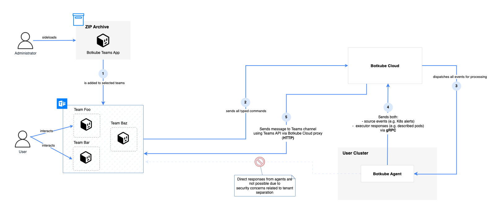

# Microsoft Teams Integration with Botkube: A Technical Journey

## Introduction

If you are already familiar with Botkube, then you know that it's an open-source collaborative tool to help you monitor and troubleshoot Kubernetes clusters. Botkube integrates the most popular communication platforms, and Microsoft Teams is one of them.

The very first version of the integration came in [February 2020](https://github.com/kubeshop/botkube/pull/242). However, to be completely honest, even in 2023 it still wasn't on par with the other ones. It came with a lot of limitations, and some of them were considered as blockers for many users.

Fortunately, these times are over now! We've been working hard on a brand-new Microsoft Teams integration, which we introduced as a part of [Botkube 1.6 release](https://botkube.io/blog/botkube-1-6-release).

Now, let's talk about how we got here.

## Inspiration from the Field

During our conversations with users at events like KubeCon, we found out that many IT companies rely on Microsoft Teams for their communication. It's not surprising, considering that Microsoft Teams is one of the most popular communication platforms in the world. It is used by over 1 million organizations and 320 million users ([source](https://www.demandsage.com/microsoft-teams-statistics/)).

Through discussions with various users and organizations, a common problem surfaced--many faced challenges due to the requirement for a public endpoint on their Kubernetes clusters and difficult configuration steps. Also, the integration lacked some of the core features that were available in other platforms like Slack. This was usually a blocker for them.

Right after the Botkube Cloud launch, we were focusing on the seamless multi-cluster Slack integration, as it was without doubt the most popular communication platform among our users. However, we knew that we had to do something about the Microsoft Teams integration as well. Because of the way the Microsoft Teams API works, the only way we could fix this problem properly was a dedicated infrastructure for handling the communication between Botkube and Microsoft Teams.

That was the time we were approached by a large enterprise company that was using Microsoft Teams as their main communication tool. They were interested in a proper multi-cluster solution for their customer's Kubernetes clusters. After a series of interviews and discussions, we aggregated the feedback and started working on the new Microsoft Teams integration, showing the first results to the company along the way.

  <small>Source: <a href="https://tenor.com" target="_blank">tenor.com</a></small>

## Technical journey

### Investigation and research

The very first stage was to investigate various aspects of the Microsoft Teams communication platform and its API. We wanted to understand the limitations and challenges we would face during the development process. We also wanted to make sure that we could deliver the features that were missing in the previous version of the integration.

This phase consisted of multiple different steps, including:

- Research around Microsoft Teams Bot Framework and Graph API capabilities.
- Multi-tenancy architecture design with a proof of concept application (covering security, multi-cluster support, and scalability).
- App distribution, installation and permission granting process.
- Interactivity support for the Microsoft Teams messages.

Every single step was crucial to the success of the feature and had it own challenges. During the investigation stage, we quickly realized that this solution will be slightly different from the multi-cluster Slack integration we've built before.

### Architecture design

After our set of investigations, we had a clear picture what we're going to build. We established the following architecture:

Let me go through the diagram.

Until our Microsoft Teams app is approved by Microsoft and listed in the Microsoft Teams apps catalog, we distribute a ZIP file for manual sideloading by a Microsoft Teams organization administrator.

After installing the app, to use Microsoft API for fetching team and channel information, we need to grant the app permissions to access the Microsoft Teams API. This is done by the organization administrator only once for the whole organization.

Same as for Slack integration, in Botkube Cloud we use a message broker internally, to ensure scalability, and reliability. Every Botkube Agent connects via gRPC to Botkube Cloud to receive events from Microsoft Teams.

Because of the way the Microsoft Teams API works, and to ensure proper tenant separation, both source notifications and executor commands are routed via Botkube Cloud. This is different from the Slack integration, where we could use the Slack API directly from the Botkube instance for handling incoming notifications. However, Botkube Cloud is used simply as a proxy, without storing any event data.

### Interactivity support

Interactivity support for the Microsoft Teams messages was one of the challenging parts of the development process. We wanted to make sure that the user experience is as good as possible, and close to the Slack integration. Fortunately, Microsoft Teams uses Microsoft's Adaptive Cards format, which is a flexible way to present interactive content in Microsoft Teams messages. Moreover, in-place message updates are supported, to ensure the content is always up-to-date. But, of course, technical details were different from the Slack integration, so we needed to render the messages differently.

After a while we were able to achieve similar feeling to the users familiar with our multi-cluster Slack solution. Here's a quick comparison:

### Development and testing

Thanks to the Microsoft Teams proof of concept application, we were able to quickly start the development process. The fact that we built the multi-cluster Slack integration before also helped tremendously. We were able to reuse some of the concepts like gRPC communication between Botkube Agent and Botkube Cloud, and the message broker infrastructure.

After busy weeks full of development and testing, we were able to deliver the first version of the new Microsoft Teams integration. While it's not yet perfect, it's a huge step forward. We are working on adding more features and improving the existing ones, continuously refining the integration based on user feedback, including the one from the company that came to us with the initial request.

## New Microsoft Teams integration: Key Features

So what the first version of the new Microsoft Teams integration brings to the table? Let's take a look at the key features:

- Multi-cluster support.
- Enhanced per-channel plugin configuration including RBAC policy.
- Interactive messages.
- Actionable notifications.

While some features known from Slack, such as the Kubectl command builder, are not yet available in the new Microsoft Teams integration, we are working on adding them in the future releases.
Still, every single item listed above weren't available in the previous version of the Microsoft Teams integration. And, what's the most important, **we simplified the configuration process**. It still isn't perfect, but we think that it's a huge step forward.

As the previous integration was so painful to set up, we decided to deprecate it. Worry not, though! The new Microsoft Teams integration is now available to all users as a part of the [Botkube Cloud](https://app.botkube.io) offering--both Free and Team plans.

  <small>Your reaction after trying out the new Microsoft Teams integration (hopefully!). Source: <a href="https://tenor.com" target="_blank">tenor.com</a></small>

## Setting Up and Configuration

Interested in trying out the brand-new Microsoft Teams integration in Botkube? To get started, create a free [Botkube Cloud](https://app.botkube.io) account and follow the [Microsoft Teams](https://docs.botkube.io/installation/teams) instruction. To see the multi-cluster support in action, enable the free Botkube Cloud trial and connect as many Botkube installations as you want!

## What do you think? Let us know!

We are constantly working on improving Botkube and its new Microsoft Teams integration. Our roadmap is driven by user feedback and community contributions. Let us know what you think about the new integration and how we can make it better. You can reach out to us on the [Botkube Community workspace](https://slack.botkube.io/), or simply [create an issue](https://github.com/kubeshop/botkube) on our GitHub repository.
