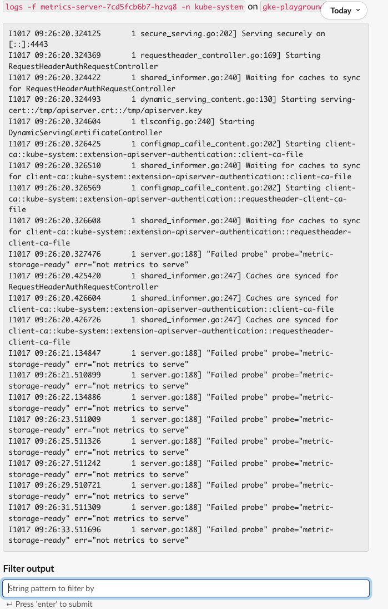
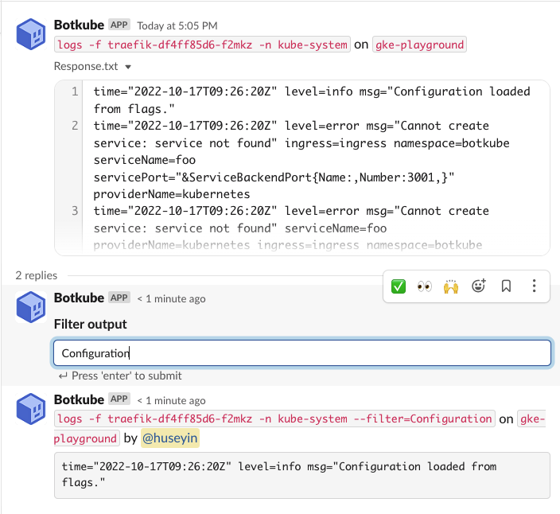

In Botkube you can specify [executor plugins](../plugins/index.md) which allows you to run arbitrary commands via the configured chat platforms.
To check which executors are enabled, and get the aliases configured for them, run `@Botkube list executors`.
There are also built-in Botkube commands available, as well as other features, such as global flags and aliases.

## Command Aliases

Botkube can define multiple aliases for arbitrary commands. The aliases are replaced with the underlying command before executing it. Aliases can replace a single word or multiple ones. For example, you can define a `k` alias for `kubectl`, or `kgp` for `kubectl get pods`.

Aliases work for all commands, including [executor plugins](../plugins/index.md) and Botkube built-in ones.

Aliases are defined globally for the whole Botkube installation.

### Botkube Cloud configuration

You can configure aliases in the Botkube Cloud dashboard.

1. If you don't have an existing Botkube instance, create a new one, according to the [Installation](../installation/slack/index.md) docs.
2. From the [Botkube Cloud homepage](https://app.botkube.io), click the **Aliases** link in the top right corner.
3. Click **Create new** button.
4. Provide display name, alias and command.

   For example, for `exec` plugin, you can provide display name as `Exec alias`, alias as `x`, and command as `exec`.

5. Select instances for which you want to enable the alias.
6. Click **Apply** button.

### Self-hosted Botkube configuration

To configure the aliases for the self-hosted Botkube installation, use the following syntax:

```yaml
# Custom aliases for given commands.
# The aliases are replaced with the underlying command before executing it.
# Aliases can replace a single word or multiple ones. For example, you can define a `k` alias for `kubectl`, or `kgp` for `kubectl get pods`.
#
## Format: aliases.{alias}
aliases:
  kc:
    command: kubectl
    displayName: "Kubectl alias"
  k:
    command: kubectl
    displayName: "Kubectl alias"
## Multi-word alias example:
#  kgp:
#    command: kubectl get pods
#    displayName: "Get pods"
```

The default configuration for Helm chart can be found in the [values.yaml](https://github.com/kubeshop/botkube/blob/main/helm/botkube/values.yaml) file.

### Examples

Alias is a shortcut for a longer command or just a part of it. It can be defined for all commands, including executor plugins and built-in Botkube commands. When you use an alias, the command is replaced with the underlying command before executing it. For example, `@Botkube k get pods` is replaced with `@Botkube kubectl get pods` before executing it.

Once you configured aliases, you can use them interchangeably with a full command. For example:

- `k` as `kubectl`,
- `kgp` as `kubectl get pods`,
- `kgpa` as `kubectl get pods -A`,
- `hh` as `helm history`,
- `a` as `list actions`, the built-in Botkube command,

and so on. Your imagination is the limit!

Aliases are defined globally for the whole Botkube installation. To see which aliases are available for current conversation, run `@Botkube list aliases`.

## Built-in Botkube commands

### Get help

Run `@Botkube help` to find information about the supported commands.

### Check Botkube status

Run `@Botkube ping` to the channel where Botkube is added. The Botkube will respond you with the **pong** message from all the configured clusters.

For multi-cluster configuration, use the [`--cluster-name` flag](#specify-cluster-name) to get response from the cluster mentioned in the flag.

### List Botkube executors

To check which executors are enabled, run `@Botkube list executors`.

### List Botkube sources

To check which sources are enabled, run `@Botkube list sources`.

### Botkube Cloud commands

The Botkube Cloud related commands are available for Cloud Slack and Microsoft Teams integrations.
To see the list of Botkube Cloud commands, read the following sections:

- [Using Botkube Cloud app for Slack](../installation/slack/cloud-slack.mdx#using-botkube-cloud-app-for-slack),
- [Using Botkube Cloud app for Microsoft Teams](../installation/teams/index.md#using-botkube-app-for-microsoft-teams).

### Notification-related commands

To learn about the commands related to Notifications, see the [Manage notifications with Botkube commands](./event-notifications.md#manage-notifications-with-botkube-commands) section.

### Action-related commands

To learn about the commands related to Actions, see the [Manage actions with Botkube commands](./automated-actions.md#manage-actions-with-botkube-commands) section.

### View Botkube configuration

Run `@Botkube show config` message from the configured channel where Botkube is added. The bot will reply to you with the configuration with which the controller is running.

## Global flags

There are global flags available for all commands, regardless of which executor is used.

### Specify cluster name

:::warning
Multi-cluster approach is supported only for Cloud Slack, Microsoft Teams, Mattermost and Discord integrations. Socket Slack require separate Slack app for each Botkube installation.
:::

If you have installed Botkube backend on multiple clusters, you can pass `--cluster-name` flag to execute kubectl command on specific cluster.

To get the list of all clusters configured in botkube, you can use the ping command.

For cluster-specific response, use `--cluster-name` flag to specify the cluster's name on which command needs to be executed.
Use of this flag allows you to get response from any channel or group where Botkube is added.

The flag is ignored in the [notification-related commands](#notification-related-commands) as they can be executed from the configured channel only.

### Run commands on all clusters

When using Cloud Slack or Microsoft Teams integration, you can use `--all-clusters` flag to execute a command on all the target clusters.

### Filtering text output

Use the `--filter` flag to filter the output of Botkube executor commands. This returns any lines matching the flag's provided value.

The `--filter` flag uses simple string matching. And, only works for Botkube executor commands that return text output, e.g. `kubectl` or `list executors` commands.

#### Interactive output filtering

:::info
Interactive output filtering is only available for the [Slack](../installation/slack/index.md) and [Microsoft Teams](../installation/teams/index.md) integrations that supports interactive messages.
:::

:::caution
Using the interactive filter input field causes the command to be re-executed. Be careful when using it for read-write commands.
This issue is tracked in [botkube#907](https://github.com/kubeshop/botkube/issues/907).
:::

Sometimes you can get long response from a certain command and you may want to filter that to see a subset of the actual result.
For each communication platform, you can use the `--filter` flag at the end of your command. To learn more, see the [Filtering text output](#filtering-text-output) section.

If you use the [Slack integration](../installation/slack/index.md) that supports interactive messages, there is another option to handle that: interactive output filtering.
Interactivity is achieved via an input action text box where you can add your filter criteria as text and press the **Enter** button.

#### Long response filtering

Output Filter input text box will be attached to your command response if response has more than 15 lines. Let's see an example for this situation.

1. List pods with `@Botkube kubectl get pods -n kube-system`
   
2. Let's check the logs of `metrics-server` with `@Botkube kubectl logs -f metrics-server-7cd5fcb6b7-hzvq8 -n kube-system`
   
3. Notice that Filter Output is attached to response. Type `RequestHeaderAuthRequestController` to filter and press `Enter`.
   

#### Attachment response filtering

Command response is uploaded as text file once the actual size of response message reaches the limit of messaging platform. Let's take a look how Filter Output behaves for this situation.

1. List the pods with `@Botkube kubectlc get pods -n kube-system`
   
2. Let's check the logs of Traefik with command `@Botkube kubectl logs -f traefik-df4ff85d6-f2mkz -n kube-system`. Notice that, you might have different pod list, so please select a suitable one for your case.
   
3. Since the response is big, it is uploaded as file and you can realize a reply thread. Please expand it to see filter output.
4. Assume we want to see log lines only containing `Configuration` word. Type `Configuration` in the Filter Output input box and click enter. You will see filtered result as a response.
   
