## Prerequisites

- Botkube Cloud account which you can create [here](https://app.botkube.io) for free.

## Create a Botkube Cloud Instance with Discord

1. Go to Botkube Cloud [Web App](https://app.botkube.io/) and create a new instance.

   You can do it by clicking "Create an Instance" button on Home Page or under this link [Create an Instance](https://app.botkube.io/instances/add)

2. Fill in the `Instance Display Name` and click `Next` button.

   

3. Click `Add platform` dropdown, and select `Discord` option.
   

4. Create Botkube app at your Discord Server

   Reach https://discordapp.com/developers/applications.

   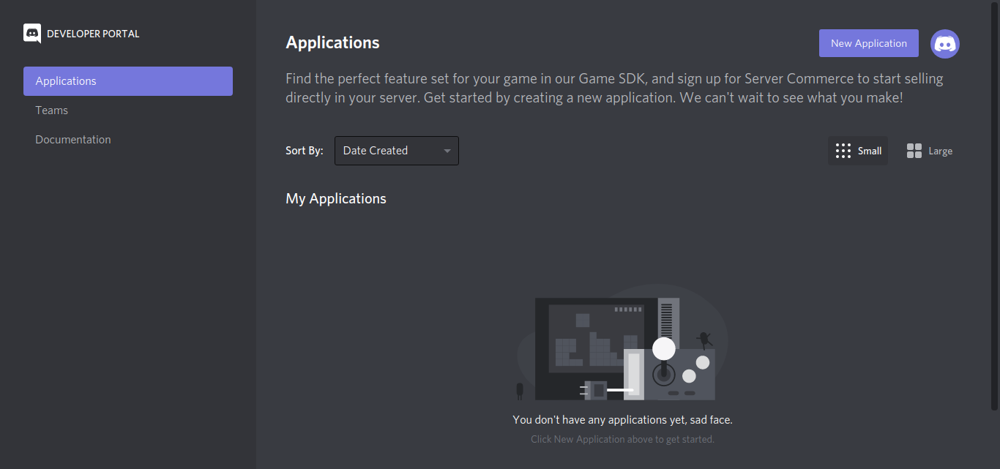

5. Create a "New Application" named Botkube and add a bot named **Botkube** into the Application.

   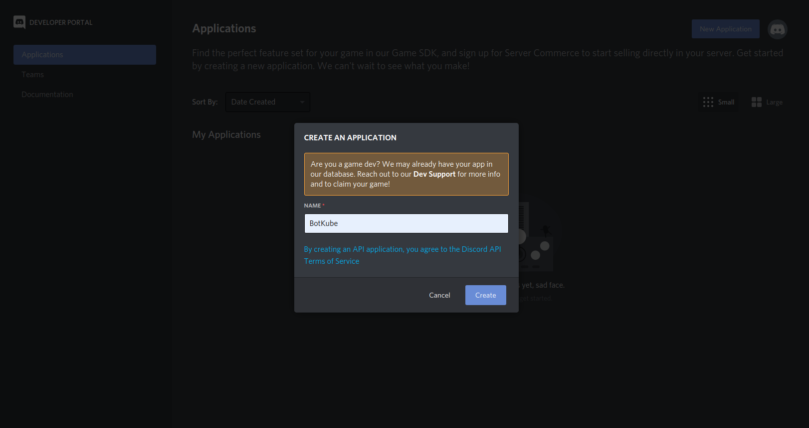

6. Copy the Application **APPLICATION ID**

   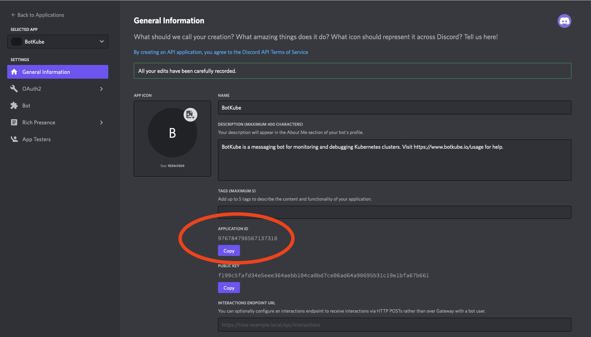

   and paste it in the `BotID` field in the form.

   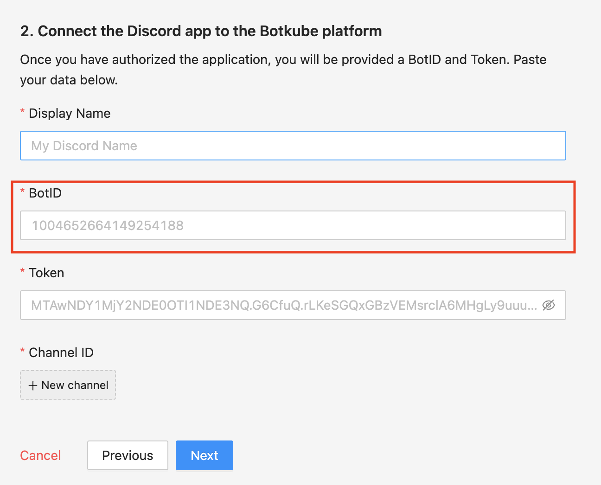

7. Add a description - `Botkube helps you monitor your Kubernetes cluster, debug critical deployments and gives recommendations for standard practices by running checks on the Kubernetes resources.`.

   Set the Botkube icon (Botkube icon can be downloaded from [this link](https://github.com/kubeshop/botkube/blob/main/branding/logos/botkube-color-192x192.png)).

   Click on Save Changes to update the Bot.

8. Now, reach the **Bot** page and Click **Add Bot** to add a Discord Bot to your application.

   

9. After Bot creation, now you can see a bot is added to your application. Click on the **Reset Token** button.

   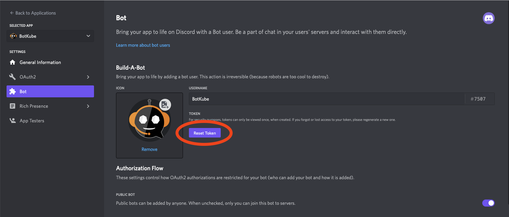

10. Copy the Token and paste it in `Token` field the form.

    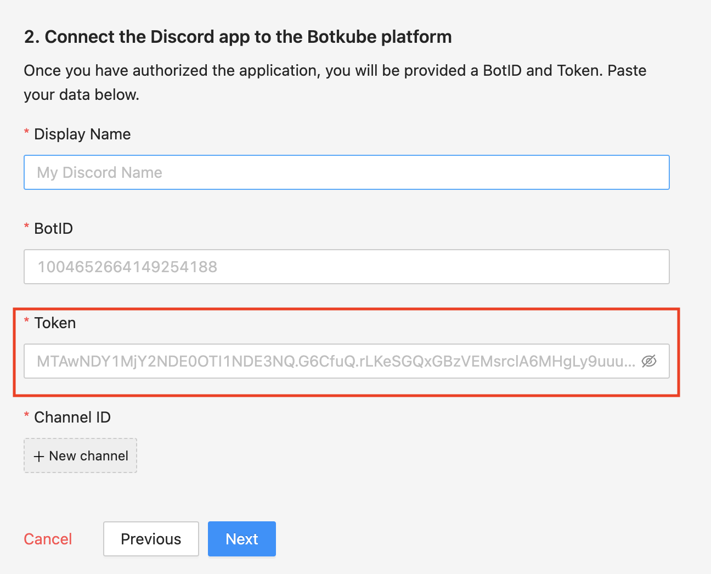

11. Go to the **OAuth2** page. Generate the URL with suitable permissions using the **OAuth2 URL Generator** available under the OAuth2 section to add bot to your Discord server.


the generated URL contains **YOUR_CLIENT_ID**, Scope and permission details.

```
https://discord.com/api/oauth2/authorize?client_id={YOUR_CLIENT_ID}&permissions={SET_OF_PERMISSIONS}&scope=bot
```

12. Copy and Paste the generated URL in a new tab, select the discord server to which you want to add the bot, click Continue and Authorize Bot addition.

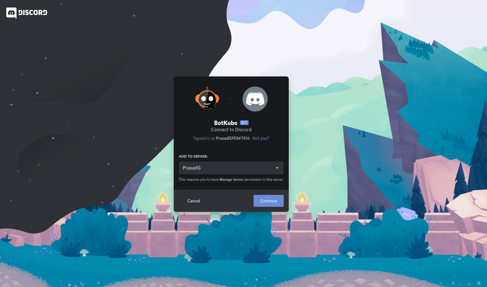


13. Switch to the Discord app. Navigate to **User settings** and select **Advanced** tab.

    Enable the **Developer Mode**.

    

14. Create a new channel or select an existing one and copy the **CHANNEL ID**.

    To get the channel ID, right-click on a channel you want to receive notification in and click on **Copy ID**.

    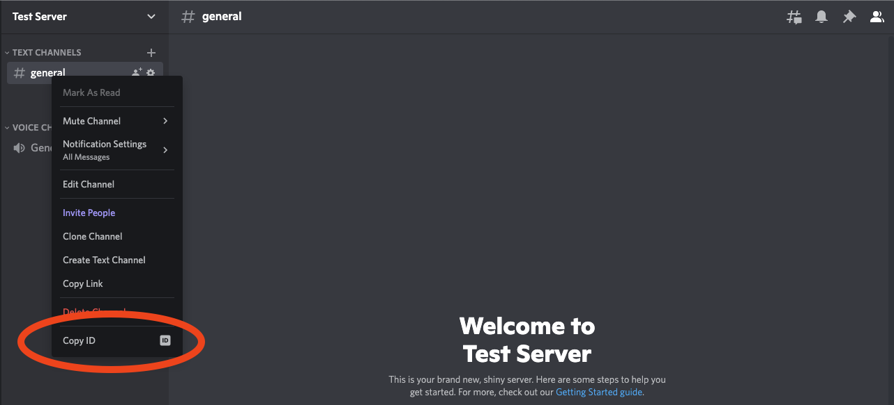

    Copy the channel ID and create it in `Channel ID` field in the form.

    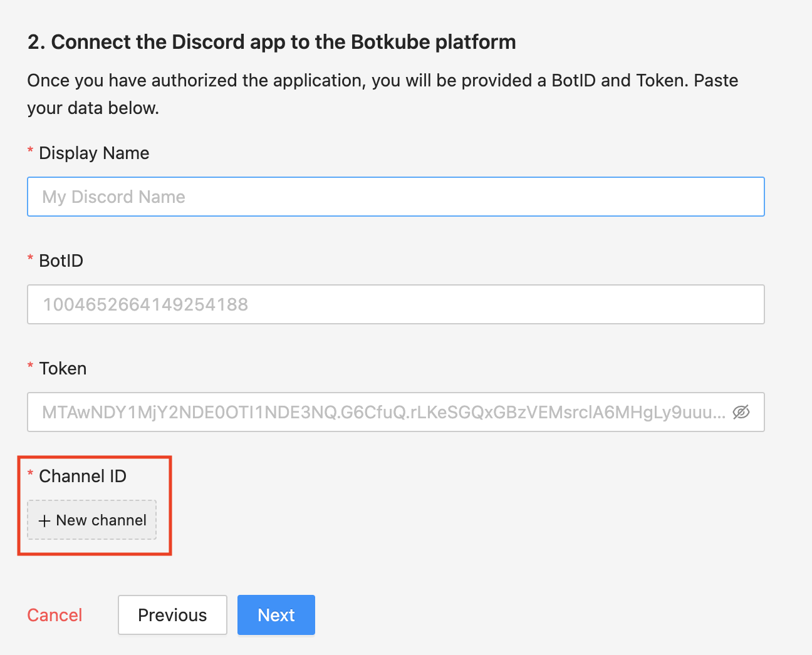

15. Add plugins you want to enable in your Botkube instance and click `Next` button.

    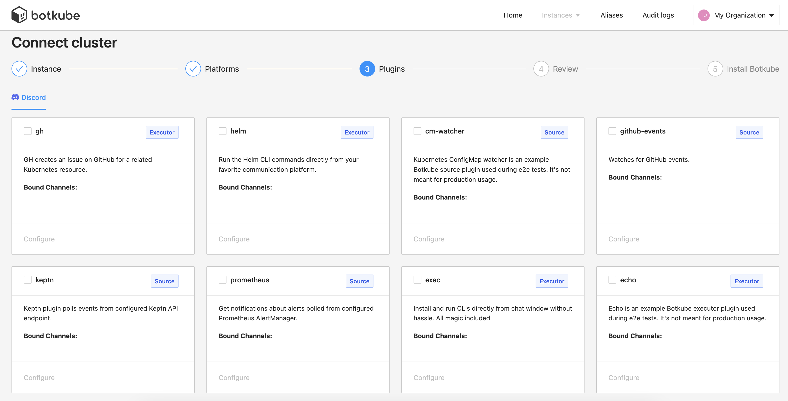

16. Include optional `default aliases` and `default actions` and click `Create` button to create Botkube Cloud instance.

    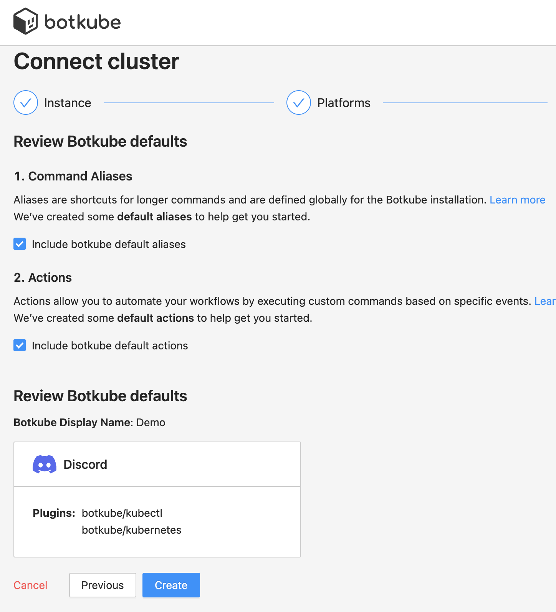

17. Follow the instructions in the summary page to deploy Botkube into your environment.

    

## Clean up

### Remove Botkube from Discord Server

- Go to Discord Developers Portal [Applications](https://discord.com/developers/applications) page,
- Click on "Botkube" and click on "Delete App" button.

### Remove Botkube from Kubernetes cluster

1. Go to Botkube Cloud instances page and click `Manage` button of the instance you want to remove.

2. Click `Delete instance` button, type instance name in the popup and click `Delete instance`.

   :::caution
   Remember to execute the displayed command to completely remove Botkube and related resources from your cluster.
   :::

   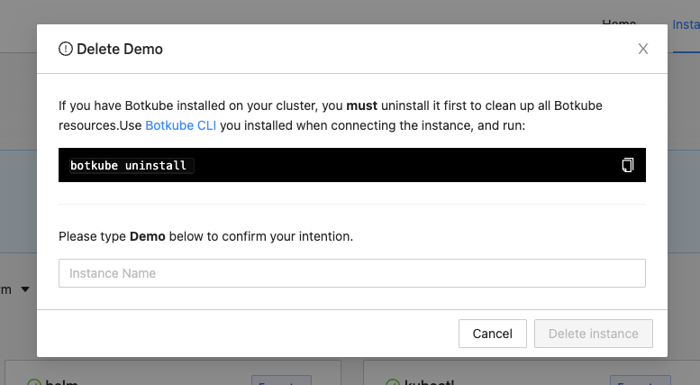
