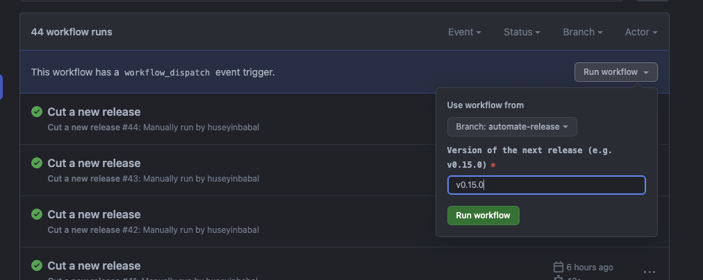
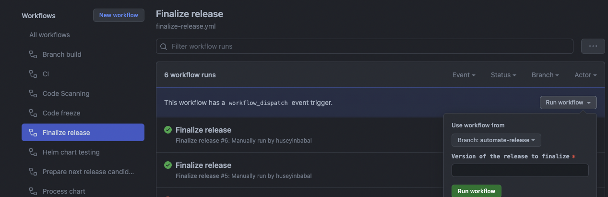
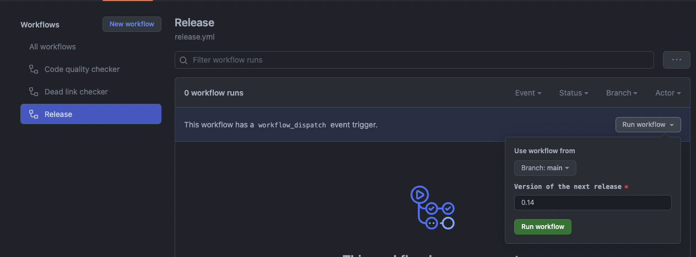

This document describes how to prepare and publish a new Botkube release.

## Prerequisites

- Proper permission on main `botkube` or `botkube-docs` repositories to trigger GitHub Actions.

## The `botkube` repository

:::info
Draft GitHub releases need to be manually checked and marked as pre-releases or published directly in the GitHub UI.
:::

### New minor or major release

1. Navigate to [**Cut a new release**](https://github.com/kubeshop/botkube/actions/workflows/cut-new-release.yml) workflow.
2. Click on **Run workflow** drop-down, fill **Version** field. (e.g. `v0.14.0`), and click **Run Workflow**.
   
3. It will generate all the needed artifacts and tag it with a release candidate tag, e.g. `v0.14.0-rc.1`.

   3.1. After final release candidate tests have been successful, continue to step 4.

   3.2. If bug is detected in the release candidate, create a pull-request with a bug fix against the release branch. Once the pull-request is merged, and the [**Prepare next release candidate**](https://github.com/kubeshop/botkube/actions/workflows/next-rc.yml) workflow will be automatically triggered, and a new release candidate will be published, e.g. `v0.14.0-rc.2`.

4. Navigate to [**Finalize release**](https://github.com/kubeshop/botkube/actions/workflows/finalize-release.yml) workflow and click on **Run workflow** drop-down and fill **Version** field to finalize specific release. (e.g. `v0.14.0`)
   
5. If you need to do the patch release after you executed the [**Finalize release**](https://github.com/kubeshop/botkube/actions/workflows/finalize-release.yml) workflow, go to [**New patch release**](#new-patch-release).

### New patch release

Let say that you have published `v0.15.0` release and detected a problem in this version. As an action item, you may want to create set of PRs
against a given release branch which is this case is `release-0.15`. After merging PRs to that release branch the [**Prepare next release candidate**](https://github.com/kubeshop/botkube/actions/workflows/next-rc.yml) workflow **won't be executed until you will not cut a new patch version** `v0.15.1`.

1. Navigate to [**Cut a new release**](https://github.com/kubeshop/botkube/actions/workflows/cut-new-release.yml) workflow.
2. Click on **Run workflow** drop-down and provide a patch release version like `v0.15.1`.

   By doing this, workflow will use `release-0.15` as base release branch which was already created in minor and major releases,
   and will introduce new release candidates on top of that like `v0.15.1-rc.1`.

3. Rest flow is the same as describe in 3rd point in [**New minor or major release**](#new-minor-or-major-release) section.

### What this automation does under the hood?

Let say that, our current production version is `v0.14.0` and we want to do another minor release which is `v0.15.0`. Once you apply
the release steps described above, it will perform following actions;

- Creates a release branch like `release-0.15` and pushes to remote
- Processes Helm Chart to update helm docs, tags it as `v0.15.0-rc.1` and pushes to remote
- Generates Docker images for Botkube core
- Builds Botkube plugins (sources and executors)
- Generates Botkube plugin index YAML file
- Generates changelog
- Creates draft release candidate with changelog body. Additionally, adds Botkube plugins binaries and index YAML as assets.
- Publishes Helm chart
- After release candidate verification and triggering **Finalize Release** workflow, it repeats steps 2,3,4,5 with `v0.15.0`

## The `botkube-docs` repository

### Release Steps

- Go to Botkube Docs [Actions page](https://github.com/kubeshop/botkube-docs/actions), and click **Release workflow**
- Click **Run workflow** drop-down and fill the **Version** input for the next release, e.g. 0.14
  

  :::warning
  Don't use semantic version format, only provide Major and Minor fields of semantic version like `0.14`
  :::

### What this automation does under the hood?

- Generates a release branch like `release/0.14`
- Copies current documentation `./docs` to `./versioned_docs`,
- Updates `./versions.json` file,
- Creates new sidebar in `./versioned_sidebars`,
- Creates an automatic PR against `main` branch

### Archiving the older versions

Currently, archiving older versions is manual. To archive an older version, follow these steps:

- Remove the version from `versions.json`
- Remove all files under `versioned_docs/version-{version}`
- Remove sidebar file under `versioned_sidebars/version-{version}-sidebars.json`
- Add the version to `versions-archived.json` with a working link to the archived version.

  You can find the link from the Cloudflare Pages job run, e.g. https://github.com/kubeshop/botkube-docs/runs/15868100283.

## Release Botkube Cloud

After the releases on `botkube` and `botkube-docs`, proceed with the releases related to Botkube Cloud.

1. Release Botkube Cloud plugins, matching the Botkube Agent release version.
2. Use the latest Botkube Agent version in Botkube Cloud and release it.
