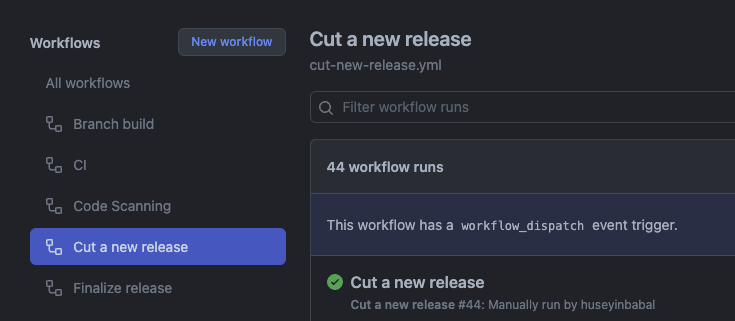

This document describes how to prepare and publish a new Botkube release.

## Prerequisites

- Proper permission on main `botkube` or `botkube-docs` repositories to trigger Github Actions.

## The `botkube` repository

### Release Steps

- Go to BotKube repository [Actions page](https://github.com/kubeshop/botkube/actions), and click **Cut a new release** workflow.
  
- Click on **Run workflow** drop-down, fill **Version** field. (e.g. v0.14.0), and click **Run Workflow**. 
  
- It will generate all the needed artifacts and tag it with a release candidate tags. Once you verify everything is ok on release candidate,
  continue with **Finalize Release** by going to [Actions](https://github.com/kubeshop/botkube/actions) page and click on **Finalize release.**
- Click on **Run workflow** drop-down and fill **Version** field to finalize specific release. (e.g. v0.14.0)
  

:::warning
For the patch releases, it is enough to trigger a **Cut a new release** workflow and provide a patch release version like v0.14.1.
By doing this, workflow will use `release-0.14` as base release branch (we will see it in detail in next section) which is already created in minor and major releases,
and will introduce new release candidates on top of that like v0.14.1-rc.1.
:::

### What this automation does under the hood?
Let say that, our current production version is `v0.14.0` and we want to do another minor release which is `v0.15.0`. Once you apply
the release steps described above, it will perform following actions;
- Creates a release branch like `release-0.15` and pushes to remote
- Processes Helm Chart to update helm docs, tags it as `v0.15.0-rc.1` and pushes to remote
- Generates docker images
- Generates changelog
- Creates release candidate with changelog body
- Publishes helm chart
- After release candidate verification and triggering Finalize Release workflow, it repeats steps 2,3,4,5 with `v0.15.0`

### What to do on bug detection on release branch?
Let say that you have published `v0.15.0` release and detected a problem in this version. As an action item, you may want to create set of PRs
against dedicated release branch which is `release-0.15` in our case. After one or more PRs are merged to that release branch,
you can proceed with another release cut with a version `v0.15.1`. This will apply same steps as in the release steps.

## The `botkube-docs` repository

### Release Steps

- Go to BotKube Docs [Actions page](https://github.com/kubeshop/botkube-docs/actions), and click **Release workflow**
- Click **Run workflow** drop-down and fill the **Version** input for the next release, e.g. 0.14
  

:::warning
Don't use semantic version format, only provide Major and Minor fields of semantic version like `0.14`
:::

### What this automation does under the hood?

- Generates a release branch like `release/0.14`
- Copies current documentation `./docs` to `./versioned_docs`,
- Updates `./versions.json` file,
- Creates new sidebar in `./versioned_sidebars`,
- Creates an automatic PR against `main` branch
