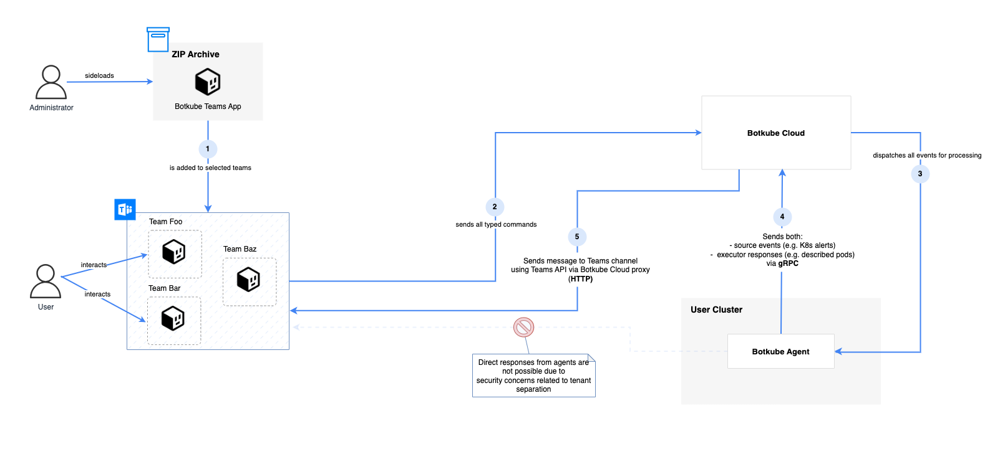

# Cloud Teams connections overview

This document describes the communication between the Botkube Cloud control-plane and the Botkube Agent configured with the Cloud Teams platform enabled.

### Agent outbound connections

- HTTPS: `https://api.segment.io/*`
- HTTPS: `https://api.botkube.io/*`
- HTTPS: `https://github.com/kubeshop/botkube/releases/download/*`
- HTTP/2: `teams.botkube.io:50054`
- Docker images: https://ghcr.io more about required ports you can on [About GitHub's IP addresses](https://docs.github.com/en/authentication/keeping-your-account-and-data-secure/about-githubs-ip-addresses):
  - `*.github.com`
  - `*.pkg.github.com`
  - `*.ghcr.io`
  - `*.githubusercontent.com`

### Agent inbound

The Botkube Agent doesn't export any endpoints.

# Components details

## Agent

The Botkube Agent Docker image is hosted on the GitHub Container registry, which uses the package namespace https://ghcr.io. The image format link:

- [`ghcr.io/kubeshop/botkube:{botkube_version}`](https://github.com/kubeshop/botkube/pkgs/container/botkube), e.g., `ghcr.io/kubeshop/botkube:v1.9.0`

### Plugin manager

The index and archives for open source plugins are stored under a given Botkube GitHub release as [its assets](https://github.com/kubeshop/botkube/releases/tag/v1.9.0):

- Plugin index: `https://github.com/kubeshop/botkube/releases/download/{botkube_version}/plugins-index.yaml`, e.g., https://github.com/kubeshop/botkube/releases/download/v1.9.0/plugins-index.yaml
- Plugin archive: `https://github.com/kubeshop/botkube/releases/download/{botkube_version}/{plugin_name_and_arch}.tar.gz` e.g., https://github.com/kubeshop/botkube/releases/download/v1.9.0/executor_kubectl_linux_amd64.tar.gz
  - Plugin links can also be found in the `plugins-index.yaml` file.

For the Botkube Cloud exclusive plugins, we serve plugin index via the Botkube Cloud API (`api.botkube.io`). As we use Google Cloud Storage as the storage provider, all the plugins are fetched from the `https://storage.googleapis.com` origin.

During startup, the Botkube Agent downloads plugins index and all enabled plugins. They are stored under the `/tmp` folder mounted as the [`emptyDir`](https://github.com/kubeshop/botkube/blob/release-1.9/helm/botkube/templates/deployment.yaml#L146-L147). There is no Persistent Volume (PV), meaning that when the Agent Pod is, for example, rescheduled to another node, it downloads all dependencies again. To ensure that the [plugin manager](index.md#plugin-manager) does not make external calls, all required plugins must be present. You can achieve this by mounting a Persistent Volume Claim (PVC) at this path. Later, you can mount your Persistent Volume (PV) with cached plugins.

### Plugin dependencies

Each plugin may define required external dependencies that are downloaded by the [Plugin manager](#plugin-manager) at Agent startup. For now, those dependencies are taken from the official sources and are not mirrored to the Botkube Cloud registry. Here are the links that describe external dependencies for each officially supported plugin:

- [`kubectl`](../configuration/executor/kubectl.md) executor: https://github.com/kubeshop/botkube/blob/release-1.9/internal/executor/kubectl/executor.go#L33-L42

`helm` plugin:

- `helm` dependency:
  - https://get.helm.sh/helm-v3.6.3-darwin-amd64.tar.gz//darwin-amd64
  - https://get.helm.sh/helm-v3.6.3-darwin-arm64.tar.gz//darwin-arm64
  - https://get.helm.sh/helm-v3.6.3-linux-amd64.tar.gz//linux-amd64
  - https://get.helm.sh/helm-v3.6.3-linux-arm64.tar.gz//linux-arm64
- `exec` plugin:
  - `eget` dependency:
    - https://github.com/zyedidia/eget/releases/download/v1.3.3/eget-1.3.3-darwin_amd64.tar.gz//eget-1.3.3-darwin_amd64
    - https://github.com/zyedidia/eget/releases/download/v1.3.3/eget-1.3.3-darwin_arm64.tar.gz//eget-1.3.3-darwin_arm64
    - https://github.com/zyedidia/eget/releases/download/v1.3.3/eget-1.3.3-linux_amd64.tar.gz//eget-1.3.3-linux_amd64
    - https://github.com/zyedidia/eget/releases/download/v1.3.3/eget-1.3.3-linux_arm64.tar.gz//eget-1.3.3-linux_arm64
- `flux` plugin:
  - `flux` dependency:
    - https://github.com/fluxcd/flux2/releases/download/v2.0.1/flux_2.0.1_darwin_amd64.tar.gz
    - https://github.com/fluxcd/flux2/releases/download/v2.0.1/flux_2.0.1_darwin_arm64.tar.gz
    - https://github.com/fluxcd/flux2/releases/download/v2.0.1/flux_2.0.1_linux_amd64.tar.gz
    - https://github.com/fluxcd/flux2/releases/download/v2.0.1/flux_2.0.1_linux_arm64.tar.gz
  - `gh` dependency:
    - https://github.com/cli/cli/releases/download/v2.32.1/gh_2.32.1_macOS_amd64.zip//gh_2.32.1_macOS_amd64/bin
    - https://github.com/cli/cli/releases/download/v2.32.1/gh_2.32.1_macOS_arm64.zip//gh_2.32.1_macOS_arm64/bin
    - https://github.com/cli/cli/releases/download/v2.32.1/gh_2.32.1_linux_amd64.tar.gz//gh_2.32.1_linux_amd64/bin
    - https://github.com/cli/cli/releases/download/v2.32.1/gh_2.32.1_linux_arm64.tar.gz//gh_2.32.1_linux_arm64/bin

If a plugin is not listed here, then it doesn't have any external dependencies.

### Analytics

The Agent uses the official [Go SDK](https://github.com/segmentio/analytics-go) to send anonymous analytics to https://segment.io. This library is sending a POST request on the `https://api.segment.io` endpoint.

### Control-plane connection

The Agent communicates with the Cloud control-plane using GraphQL. All requests are executed as a `POST` request on the `https://api.botkube.io/graphql` endpoint. We use that connection to:

- Fetch Agent's configuration
- Send audit logs
- Periodically send Agent heartbeat
- Watch configuration changes
  - all changes e.g., changing plugin configuration done on the Cloud UI Dashboard triggers Agent restart with 1 min (polling is used)

#### Security

The `https://api.botkube.io/graphql` endpoint is protected by JWT tokens. For the Agent, we use machine API tokens that are issued separately for each [Botkube Instance](#botkube-instance). This token allows you to work only in the context of a given Instance.

### Cloud Teams connection

The Cloud Teams platform communicates only with the Botkube control-plane using gRPC (HTTP/2 connection). For gRPC, TLS is enabled. We use [bidirectional streaming RPC](https://grpc.io/docs/what-is-grpc/core-concepts/#bidirectional-streaming-rpc}) to send the user `@Botkube` commands to the Agent and send Agent responses back to the Cloud control-plane.

#### Security

The `teams.botkube.io:50054` connection is protected by machine API tokens that are issued separately for each [Botkube Instance](#botkube-instance). This token allows you to work only in the context of a given Instance.

## Concurrency Limits

Concurrency limits restrict the number of simultaneous connections to our Cloud Teams router. You are allowed a maximum of 2 concurrent connections to support rollback updates.

## Rate Limiting

Rate limiting controls the frequency of requests that a component can send or receive. Rate limiting protects the Cloud Teams Router from misconfigured installations that may overload the system. Rate limiting is based on the Agent’s Instance ID. **We drop any messages that exceed the limit and do not push them into Pub/Sub.** You are allowed a maximum of 20 requests per second.

## Cloud Dashboard

Such constrains applies in the context of the Cloud organization:

1. The organization has exactly one owner
2. The organization owner cannot be removed.
3. The organization owner is also a billing person.
4. All organization members have the same full permission. They can add and remove members and update organization information.
5. A user can be a member of multiple organizations.
6. Instances are always scoped to a given organization.

## Useful links

- [Botkube Agent architecture](https://docs.botkube.io/architecture/)
- [Cloud Teams installation tutorial](https://docs.botkube.io/installation/teams/)

## Terminology

### Botkube Instance

A Botkube Instance is created on the Botkube Cloud side and holds the Botkube Agent configuration.
