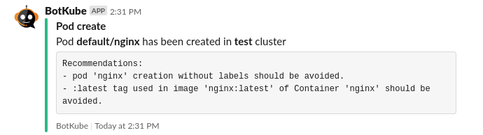

You can extend BotKube functionality by writing additional filters. The **FilterEngine** runs these filters on the Event struct before forwarding it as a notification to a channel. These filters can check resource specs, validate some checks and add messages to the Event struct.

We have already defined a filter to add suggestions in the notifications if container image in pod specs is using **latest** tag.



**Let's see, how we can write a filter like this.**

## A. Writing a filter

Prerequisites:

- As of now, you can write filters only using Go language. So you need to be familiar with it.
- Understanding of Kubernetes Objects needed (https://kubernetes.io/docs/concepts/overview/working-with-objects/kubernetes-objects/)

### 1. Create a new .go file

Create a new file (e.g `object_annotation_checker.go`) in the `pkg/filterengine/filters/` directory.

Set package name as "filters" and import required packages:

```go
package filters

import (
	"context"
	"fmt"

	"github.com/sirupsen/logrus"
	"k8s.io/apimachinery/pkg/api/meta"
	metaV1 "k8s.io/apimachinery/pkg/apis/meta/v1"
	"k8s.io/client-go/dynamic"

	"github.com/kubeshop/botkube/pkg/events"
	"github.com/kubeshop/botkube/pkg/utils"
)
```

### 2. Create a structure and implement "Run() and Describe()" methods for the struct.

FilterEngine has an interface Filter defined for the filters:

```go
type Filter interface {
	Run(context.Context, *events.Event)
	Name() string
	Describe() string
}
```

Create a struct which implements the Filter interface. Use logger instance taken as an argument from the constructor:

```go
// ObjectAnnotationChecker forwards events to specific channels based on a special annotation if it is set on a given K8s resource.
type ObjectAnnotationChecker struct {
	log        logrus.FieldLogger
	dynamicCli dynamic.Interface
	mapper     meta.RESTMapper
}

// NewObjectAnnotationChecker creates a new ObjectAnnotationChecker instance.
func NewObjectAnnotationChecker(log logrus.FieldLogger, dynamicCli dynamic.Interface, mapper meta.RESTMapper) *ObjectAnnotationChecker {
	return &ObjectAnnotationChecker{log: log, dynamicCli: dynamicCli, mapper: mapper}
}

// Run filer and modifies event struct
func (f *NamespaceChecker) Run(ctx context.Context, event *events.Event) {

	// your logic goes here

}

// Name returns the filter's name.
func (f *ObjectAnnotationChecker) Name() string {
	return "ObjectAnnotationChecker"
}

// Describe describes the filter.
func (f *ObjectAnnotationChecker) Describe() string {
	return "Filters or reroutes events based on botkube.io/* Kubernetes resource annotations."
}
```

### 3. Add your logic in the Run() function

Now, put your logic in the **Run()** function to parse resource object, run validation and modify Event struct. The fields in the Event struct can be found [here](https://github.com/kubeshop/botkube/blob/main/pkg/events/events.go).

```go
// Run filters and modifies event struct.
func (f *ObjectAnnotationChecker) Run(ctx context.Context, event *events.Event) error {
	// get objects metadata
	obj, err := utils.GetObjectMetaData(ctx, f.dynamicCli, f.mapper, event.Object)
	if err != nil {
		return fmt.Errorf("while getting object metadata: %w", err)
	}

	// Check annotations in object
	if f.isObjectNotifDisabled(obj) {
		event.Skip = true
		f.log.Debug("Object Notification Disable through annotations")
	}

	if channel, ok := f.reconfigureChannel(obj); ok {
		event.Channel = channel
		f.log.Debugf("Redirecting Event Notifications to channel: %s", channel)
	}

	f.log.Debug("Object annotations filter successful!")
	return nil
}
```

### 4. Register your filter in the Filter Engine

Open [**pkg/filterengine/with_all_filters.go**](https://github.com/kubeshop/botkube/blob/main/pkg/filterengine/with_all_filters.go) file and call the constructor of your new filter in the `WithAllFilters` method:

```go
// WithAllFilters returns new DefaultFilterEngine instance with all filters registered.
func WithAllFilters(logger *logrus.Logger, dynamicCli dynamic.Interface, mapper meta.RESTMapper, cfg config.Filters) *DefaultFilterEngine {
	filterEngine := New(logger.WithField(componentLogFieldKey, "Filter Engine"))
	filterEngine.Register([]RegisteredFilter{
		{
			Filter:  filters.NewObjectAnnotationChecker(logger.WithField(filterLogFieldKey, "Object Annotation Checker"), dynamicCli, mapper),
			Enabled: cfg.Kubernetes.ObjectAnnotationChecker,
		},

		// Your filter goes here:
		{
			Filter:  filters.NewNodeEventsChecker(
				logger.WithField(filterLogFieldKey, "Node Events Checker") // make sure to use `logger.WithField`
			),
			Enabled: cfg.Kubernetes.NodeEventsChecker, // you can use a configuration field or set a fixed `true` or `false` default value to enable/disable the filter during the initial app startup
		},
	}...)

	return filterEngine
}

```

## B. Rebuild and deploy the BotKube backend

- Build the BotKube backend docker image with `make container-image`.
- Push the image to Dockerhub registry.
- Install/Upgrade your BotKube deployment (Steps are provided [here](../../installation/index.mdx)).

_The implementation of built-in filters can be found at: https://github.com/kubeshop/botkube/tree/main/pkg/filterengine/filters_
