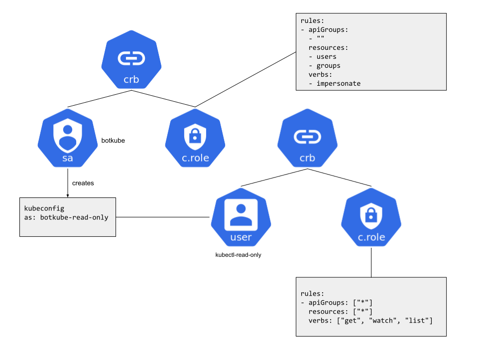

Botkube allows users to restrict plugins by defining [RBAC](https://en.wikipedia.org/wiki/Role-based_access_control) rules as part of plugin configuration.

Based on this configuration Botkube generates a temporary [kubeconfig](https://kubernetes.io/docs/concepts/configuration/organize-cluster-access-kubeconfig/) file with user/group impersonation.
This kubeconfig is available to plugins in the `Execute` and `Stream` contexts. If you're a plugin developer and want to learn more, refer to [Plugin Development](../plugin/custom-executor.md#passing-kube-config-to-your-plugin) docs.

:::note
kubeconfig files are generated on-demand. Plugins have to define an `rbac` section in the configuration to enable
kubeconfig generation.
:::

### Architecture

Botkube uses its own cluster credentials to generate a temporary kubeconfig and the temporary kubeconfig
only [impersonates](https://kubernetes.io/docs/reference/access-authn-authz/authentication/#user-impersonation) the requested user/group.

For source plugins the kubeconfig is generated once - during plugin startup.
For executor plugins the kubeconfig is generated every time a command is sent to the plugin, which allows
for greater flexibility, such as including the name of the channel the command was sent from in the
kubeconfig generation.

#### Configuration

Each executor and source plugin can provide a `context` section witch `rbac` and `defaultNamespace` config.
This config is then mapped to kubernetes RBAC.

Supported mapping:

- **Static** mapping - user or group impersonation, always the same subject for given plugin
- **Channel** mapping - name of the channel is used as subject for group impersonation, only available for executor plugins

#### Example - kubectl executor with read-only RBAC

In this example a single executor plugin is defined with static RBAC that maps to user `kubectl-read-only`.

1. Executor definition with RBAC:

```yaml
executors:
  "kubectl-read-only":
    botkube/kubectl@v1:
      enabled: true
      context:
        rbac:
          user:
            type: Static
            static:
              value: kubectl-read-only
```

Here we define a plugin with _Static_ mapping to **User.rbac.authorization.k8s.io** `kubectl-read-only`.

2. ClusterRole and ClusterRoleBinding

```yaml
  apiVersion: rbac.authorization.k8s.io/v1
  kind: ClusterRole
  metadata:
    name: kubectl-read-only
  rules:
  - apiGroups: ["*"]
    resources: ["*"]
    verbs: ["get", "watch", "list"]
  ---
  apiVersion: rbac.authorization.k8s.io/v1
  kind: ClusterRoleBinding
  metadata:
    name: kubectl-read-only
  roleRef:
    apiGroup: rbac.authorization.k8s.io
    kind: ClusterRole
    name: kubectl-read-only
  subjects:
  - kind: User
    name: kubectl-read-only
    apiGroup: rbac.authorization.k8s.io
```

When this executor plugin is invoked, a kubeconfig impersonating user `kubectl-read-only` is generated by Botkube
and passed to the plugin. The plugin then can authenticate with the API server with identity of user `kubectl-read-only`.



#### Example: kubernetes source plugin with static mapping

In this example a single source plugin is defined with static RBAC that maps to user `kubernetes-read-only`.

1. Botkube config:

```yaml
sources:
  "kubernetes":
    botkube/kubernetes@v1:
      context:
        rbac:
          user:
            type: Static
            static:
              values: kubernetes-read-only
```

2. Kubernetes RBAC

```yaml
  apiVersion: rbac.authorization.k8s.io/v1
  kind: ClusterRole
  metadata:
    name: reader
  rules:
  - apiGroups: ["*"]
    resources: ["*"]
    verbs: ["get", "watch", "list"]
  ---
  apiVersion: rbac.authorization.k8s.io/v1
  kind: ClusterRoleBinding
  metadata:
    name: reader
  roleRef:
    apiGroup: rbac.authorization.k8s.io
    kind: ClusterRole
    name: reader
  subjects:
  - kind: User
    name: kubernetes-read-only
    apiGroup: rbac.authorization.k8s.io
```

#### Example: kubectl executor plugin with channel name mapping

In this example **kubectl** executor plugin is configured with channel name mapping and bound to two channels,
`ch-1` and `ch-2`.

In kubernets RBAC Group `ch-1` is given write access, while Group `ch-2` is given only read access.
Therefore users in channel `ch-2` cannot create/update/delete resources, while users in `ch-1` can.

1. Botkube config:

```yaml
executors:
  "kubectl":
    botkube/kubectl@v1:
      context:
        rbac:
          group:
            type: ChannelName
communications:
  "default-group":
    socketSlack:
      channels:
        "ch-1":
          name: ch-1
          bindings:
            executors:
              - kubectl
        "ch-2":
          name: ch-2
          bindings:
            executors:
              - kubectl
```

2. Kubernetes RBAC

```yaml
  apiVersion: rbac.authorization.k8s.io/v1
  kind: ClusterRoleBinding
  metadata:
    name: editor
  roleRef:
    apiGroup: rbac.authorization.k8s.io
    kind: ClusterRole
    name: editor
  subjects:
  - kind: Group
    name: ch-1
    apiGroup: rbac.authorization.k8s.io
  ---
  apiVersion: rbac.authorization.k8s.io/v1
  kind: ClusterRole
  metadata:
    name: editor
  rules:
  - apiGroups: ["*"]
    resources: ["*"]
    verbs: ["get", "watch", "list", "update", "create", "delete"]
  ---
  apiVersion: rbac.authorization.k8s.io/v1
  kind: ClusterRoleBinding
  metadata:
    name: read-only
  roleRef:
    apiGroup: rbac.authorization.k8s.io
    kind: ClusterRole
    name: read-only
  subjects:
  - kind: Group
    name: ch-2
    apiGroup: rbac.authorization.k8s.io
  ---
  apiVersion: rbac.authorization.k8s.io/v1
  kind: ClusterRole
  metadata:
    name: read-only
  rules:
  - apiGroups: ["*"]
    resources: ["*"]
    verbs: ["get", "watch", "list"]
```

### Limitations

#### Shared file system

Botkube executes plugin in the same pod and container - plugins share resources.
If you're a plugin developer and decide to write kubeconfig to the file system, be aware
that it will be accessible by all plugins in the container.

#### Merging of RBAC config

Plugins of the same type but with unique RBAC config cannot be bound to the same channel.

### Troubleshooting

In most cases troubleshooting Botkube RBAC issues means [troubleshooting kubernetes RBAC](https://kubernetes.io/docs/reference/access-authn-authz/authorization/#checking-api-access) - `kubectl auth` can help.

1. Forbidden

```
Error: create: failed to create: secrets is forbidden: User "botkube-internal-static-user" cannot create resource "secrets" in API group "" in the namespace "default"
```

To see what the a user/group can do, use:

```
$ kubectl auth can-i --list
```

To see if user/group can do:

```
$ kubectl auth can-i get pod -n botkube --as user-1 --as-group group-1
```
