:::note
You can change notification format to - **long** or **short** through settings based on your requirement. Check [configuration](../configuration) for more details.<br/>
The default notification type is **short**
:::


## Sample Notifications

### Resource created

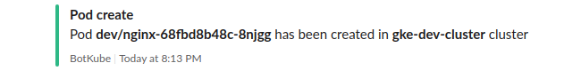
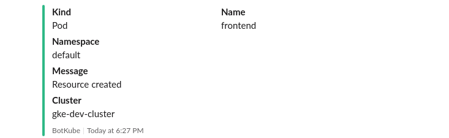

### Resource deleted

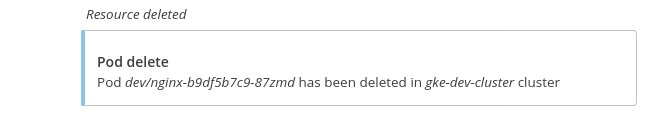
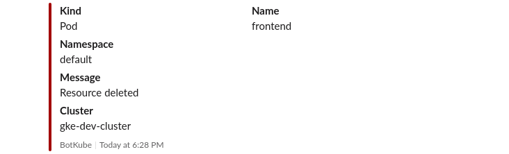

### Failed to pull image

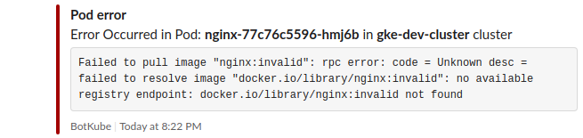
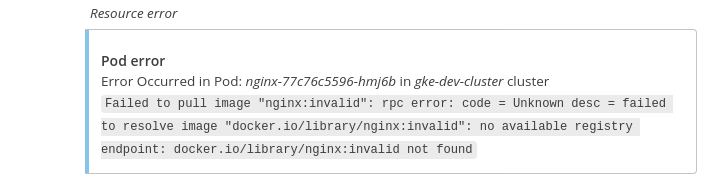
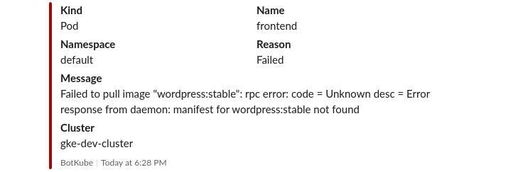

### Error in pod

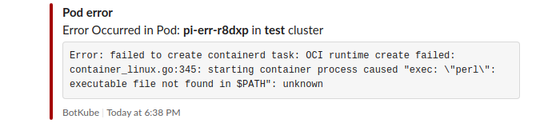

### Readiness probe failed for the pod

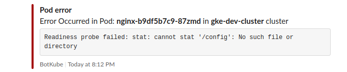
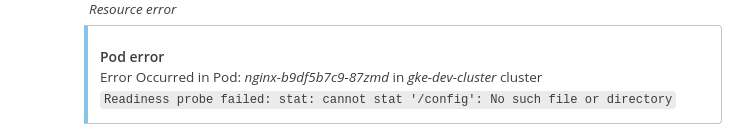

### Job succeeded

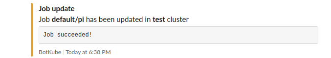
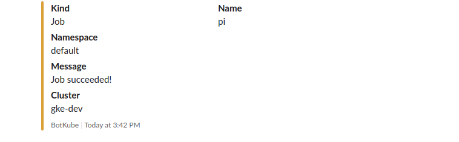

### Monitor Velero backups

Add following configuration resource_config to monitor Velero backups resource.

```bash
    - name: velero.io/v1/backups
      namespaces:
        include:
          - .*
      events:
        - create
        - update
        - delete
        - error
      updateSetting:
        includeDiff: true
        fields:
          - status.phase
```

With this configuration, BotKube will monitor create/delete/error events and updates in _status.phase_ fields in _velero.io/v1/backups_ resource.

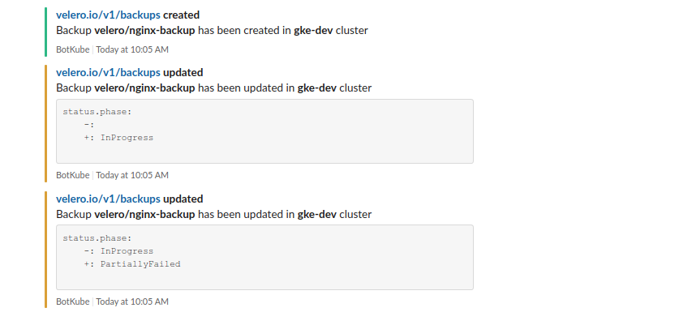

## Debugging use-cases

### List pods in "fission" namespace

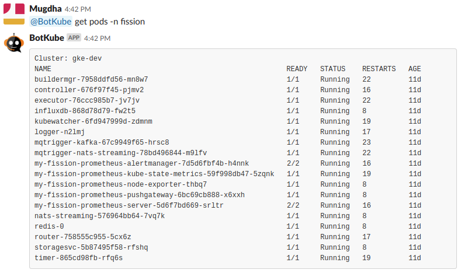

### Get logs of "controller-676f97f45-pjmv2" pod in "fission" namespace

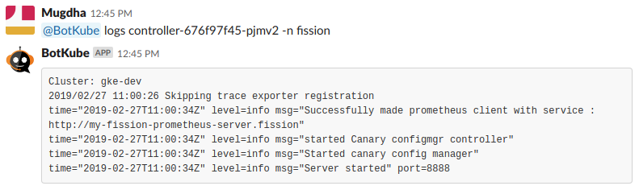
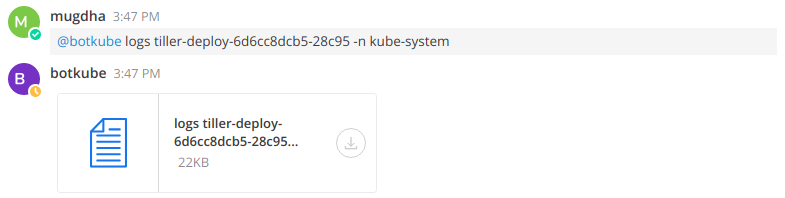

### Show cluster health

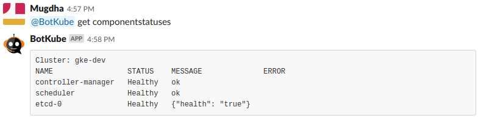

### Describe a node

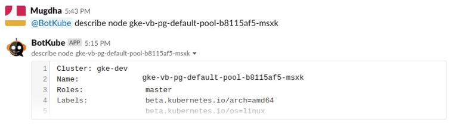

### List top pods in "fission" namespace


### Check connection status of "gke-stg" cluster


### List services in a "gke-dev" cluster

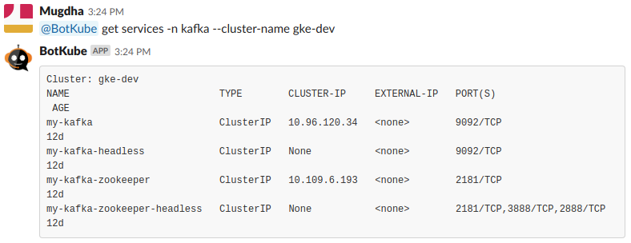

### Describe deployment in a "gke-stg" cluster

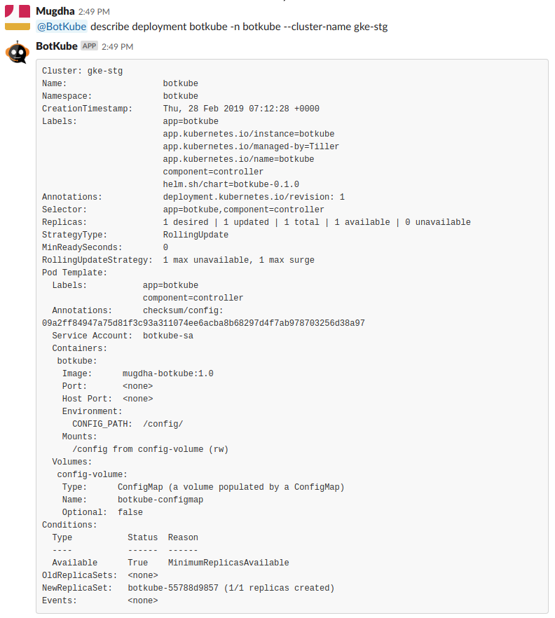
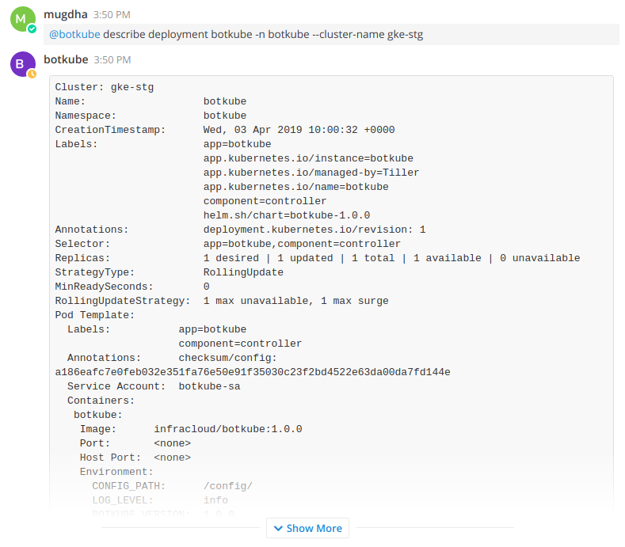
