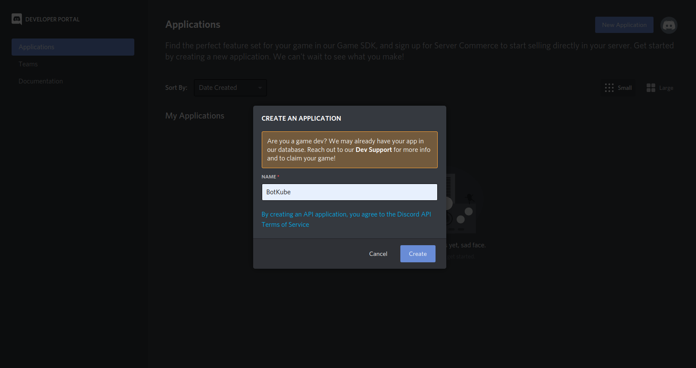
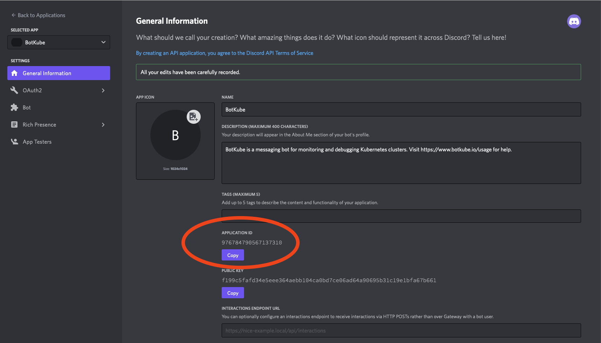
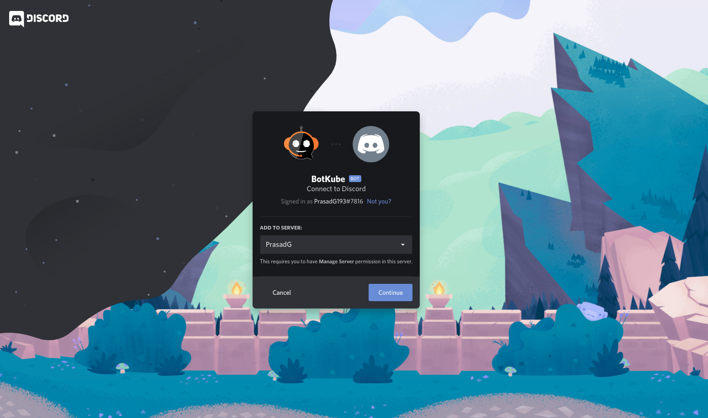

## Install Botkube to the Discord Server:

Follow the steps below to install Botkube Discord app to your Discord server.

### Create Botkube app at your Discord Server

1. Reach https://discordapp.com/developers/applications.

   

2. Create a "New Application" named Botkube and add a bot named **Botkube** into the Application.

   

3. Copy the Application **APPLICATION ID** and export it as the `DISCORD_BOT_ID` environment variable.

   ```
   export DISCORD_BOT_ID={APPLICATION_ID}
   ```

   

4. Add a description - `Botkube helps you monitor your Kubernetes cluster, debug critical deployments and gives recommendations for standard practices by running checks on the Kubernetes resources.`.

   Set the Botkube icon (Botkube icon can be downloaded from [this link](https://github.com/kubeshop/botkube/blob/main/branding/logos/botkube-color-192x192.png)).

   Click on Save Changes to update the Bot.

5. Now, reach the **Bot** page and Click **Add Bot** to add a Discord Bot to your application.

   

6. After Bot creation, now you can see a bot is added to your application. Click on the **Reset Token** button.

   

7. Copy the Token and export it as the `DISCORD_TOKEN` environment variable.

   ```
   export DISCORD_TOKEN={TOKEN}
   ```

8. Go to the **OAuth2** page. Generate the URL with suitable permissions using the **OAuth2 URL Generator** available under the OAuth2 section to add bot to your Discord server.

   

   the generated URL contains **YOUR_CLIENT_ID**, Scope and permission details.

   ```
   https://discord.com/api/oauth2/authorize?client_id={YOUR_CLIENT_ID}&permissions={SET_OF_PERMISSIONS}&scope=bot
   ```

9. Copy and Paste the generated URL in a new tab, select the discord server to which you want to add the bot, click Continue and Authorize Bot addition.

   

   

10. Switch to the Discord app. Navigate to **User settings** and select **Advanced** tab.

    Enable the **Developer Mode**.

    

11. Create a new channel or select an existing one and copy the **CHANNEL ID**.

    To get the channel ID, right-click on a channel you want to receive notification in and click on **Copy ID**.

    

    Copy the channel ID and export it as the `DISCORD_CHANNEL_ID` environment variable.

    ```
    export DISCORD_CHANNEL_ID={ID}
    ```

12. Now, go ahead and install the Botkube backend on your Kubernetes cluster.

:::note
Follow the first 4 mins of this [Video Tutorial](https://youtu.be/8o25pRbXdFw) to understand the process visually.
:::

### Install Botkube Backend in Kubernetes cluster

- We use [Helm](https://helm.sh/) to install Botkube in Kubernetes. Follow [this](https://docs.helm.sh/using_helm/#installing-helm) guide to install helm if you don't have it installed already.
- Add **botkube** chart repository:

  ```bash
  helm repo add botkube https://charts.botkube.io
  helm repo update
  ```

- Deploy Botkube backend using **helm install** in your cluster:

  ```bash
  export CLUSTER_NAME={cluster_name}
  export ALLOW_KUBECTL={allow_kubectl}

  helm install --version v0.14.0 botkube --namespace botkube --create-namespace \
  --set communications.default-group.discord.enabled=true \
  --set communications.default-group.discord.channels.default.id=${DISCORD_CHANNEL_ID} \
  --set communications.default-group.discord.botID=${DISCORD_BOT_ID} \
  --set communications.default-group.discord.token=${DISCORD_TOKEN} \
  --set settings.clusterName=${CLUSTER_NAME} \
  --set executors.kubectl-read-only.kubectl.enabled=${ALLOW_KUBECTL} \
  botkube/botkube
  ```

  where:

  - **DISCORD_CHANNEL_ID** is the channel name where @Botkube needs to send notifications,
  - **DISCORD_BOT_ID** is the Botkube Application Client ID,
  - **DISCORD_TOKEN** is the Token you received after adding Botkube bot to your Discord Application,
  - **CLUSTER_NAME** is the cluster name set in the incoming messages,
  - **ALLOW_KUBECTL** set true to allow kubectl command execution by Botkube on the cluster.

  Configuration syntax is explained [here](../../configuration).
  Full Helm chart parameters list is documented [here](../../configuration/helm-chart-parameters).

  Send **@Botkube ping** in the channel to see if Botkube is running and responding.

  With the default configuration, Botkube will watch all the resources in all the namespaces for _create_, _delete_ and _error_ events.

  If you wish to monitor only specific resources, follow the steps given below:

  1. Create a new `config.yaml` file and add Kubernetes resource configuration as described on the [source](../../configuration/source) page.
  2. Pass the YAML file as a flag to `helm install` command, e.g.:

     ```
     helm install --version v0.14.0 --name botkube --namespace botkube --create-namespace -f /path/to/config.yaml --set=...other args..
     ```

  Alternatively, you can also update the configuration at runtime as documented [here](../../configuration/#updating-the-configuration-at-runtime)

### Remove Botkube from Discord Server

- Goto Discord Developers Portel [Applications](https://discord.com/developers/applications) page,
- Click on "Botkube" and click on "Delete App" button.

## Remove Botkube from Kubernetes cluster

Execute following command to completely remove Botkube and related resources from your cluster.

```bash
helm uninstall botkube --namespace botkube
```
