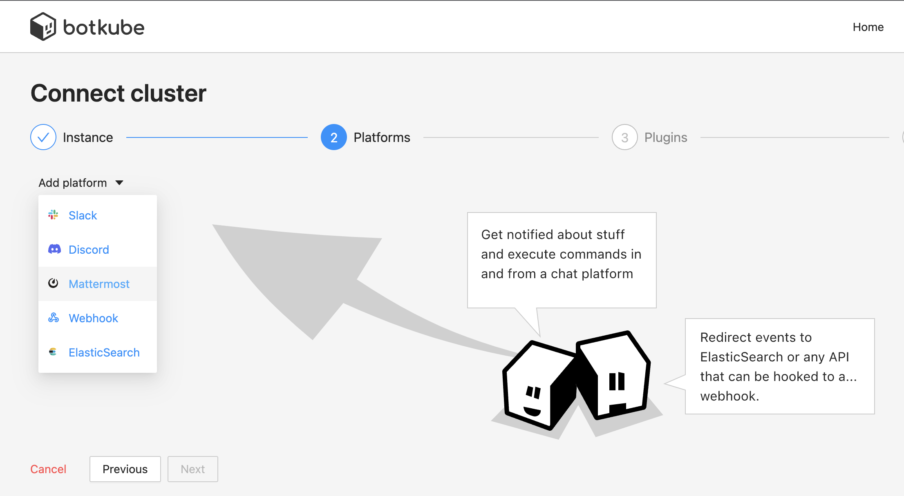
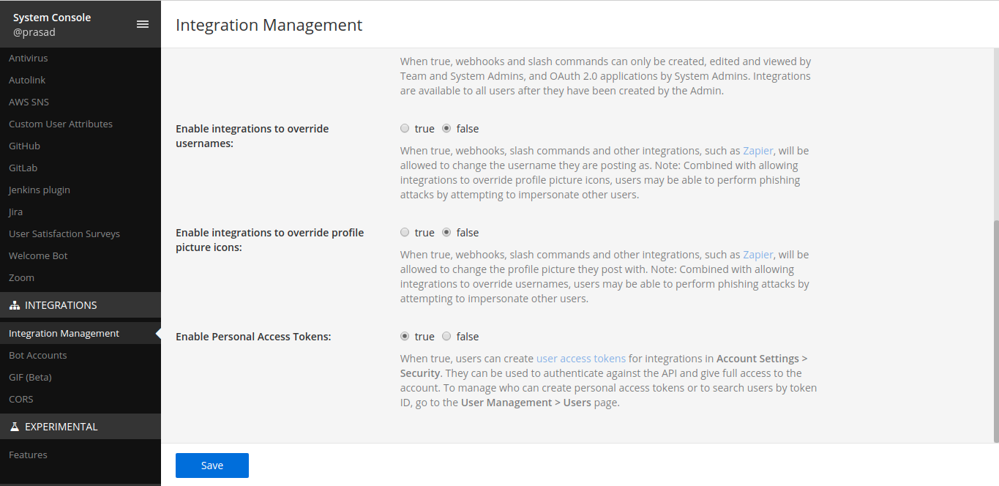
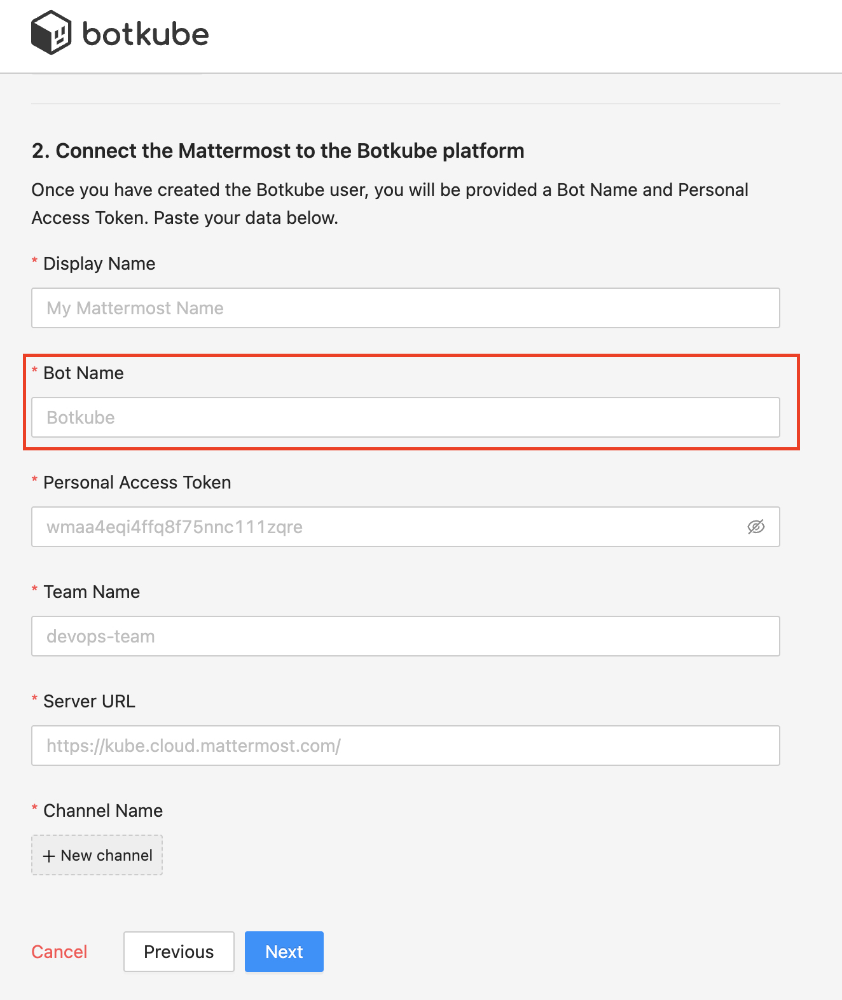
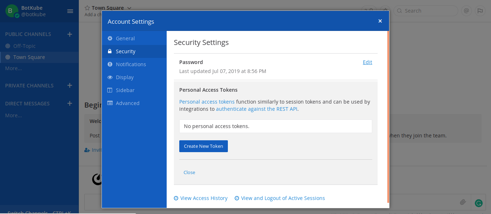
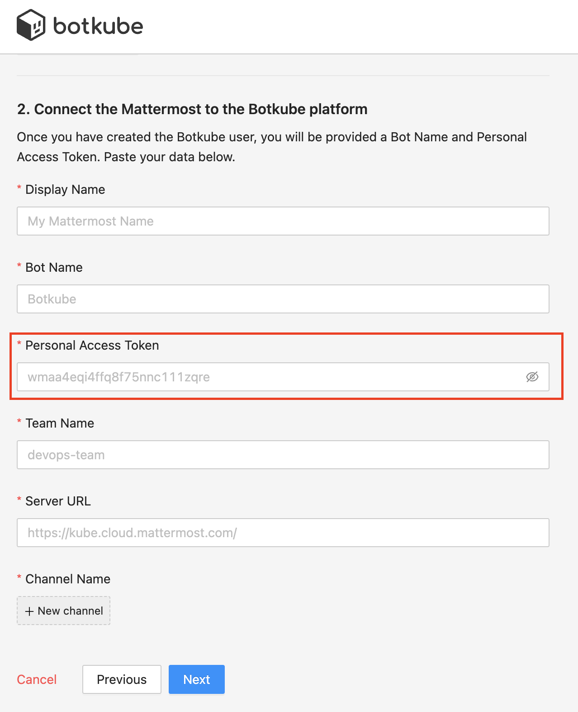
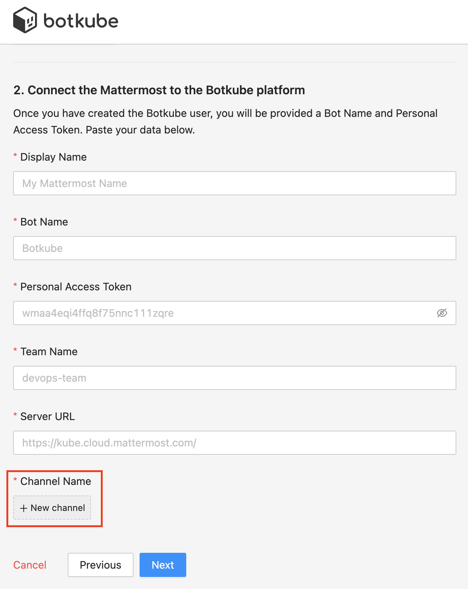
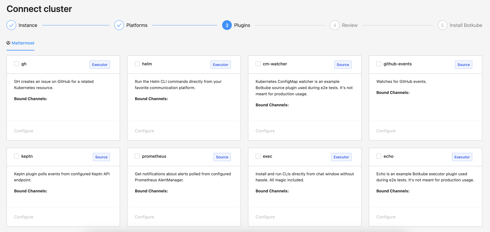
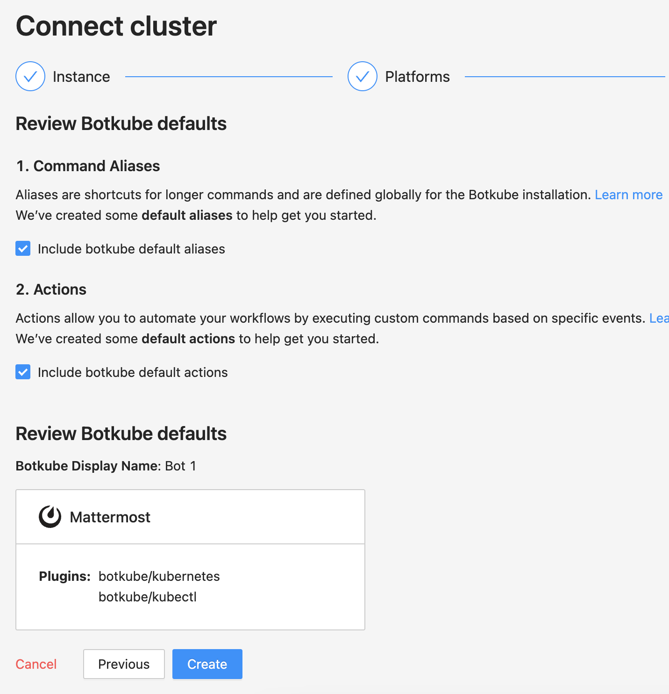

## Prerequisites

- Botkube Cloud account which you can create [here](https://app.botkube.io) for free.

## Create a Botkube Cloud Instance with Mattermost

Follow the steps below to install Botkube in your Mattermost Team (v5.14.0).

1. Go to Botkube Cloud [Web App](https://app.botkube.io/) and create a new instance.

    You can do it by clicking "Create an Instance" button on Home Page or under this link [Create an Instance](https://app.botkube.io/instances/add)

2. Fill in the `Instance Display Name` and click `Next` button.

   
    
3. Click `Add platform` dropdown, and select `Mattermost` option.
   

4. Enable Personal Access Token

   In the mattermost login with System Admin account, and in the Menu proceed to **System console > Integrations > Integration Management** and enable **Personal Access Token**.

   

5. Create Botkube user

   To create a Botkube user, if not already created, proceed to the menu and Get a team invite link.

   

   Logout from the admin account and paste the link in the address bar and create a user with the username **Botkube**.

   :::note
   You can also use a custom username for your bot. However, it needs to be passed during Botkube installation in one of the further steps.
   :::

   Past the bot name in the form

   

6. Manage Roles for Botkube user

   Login as System Admin, in the Menu, proceed to **System console > Users**. For Botkube user, Manage Roles and select System Admin role.

   

7. Create a Token for Botkube user

   Login as Botkube user, in the Menu, proceed to **Account Settings > Security > Personal Access Token > Create** and copy the token.

   

   Past the token in the form

   

8. Add Botkube to a channel

   Add Botkube user created to the channel you want to receive notifications in.

   

9. Add plugins you want to enable in your Botkube instance and click `Next` button.

   

10. Include optional `default aliases` and `default actions` and click `Create` button to create Botkube Cloud instance.

   

11. Follow the instructions in the summary page to deploy Botkube into your environment.

      

## Clean up

### Remove Botkube from Mattermost Team

- Deactivate or remove Botkube user from Mattermost Team. Login as System Admin, in the Menu proceed to System console -> Users -> botkube -> Deactivate.
- Archive Channel created for Botkube communication if required.

## Remove Botkube from Kubernetes cluster

1. Go to Botkube Cloud instances page and click `Manage` button of the instance you want to remove.

2. Click `Delete instance` button, type instance name in the popup and click `Delete instance`.

   :::caution
   Remember to execute the displayed command to completely remove Botkube and related resources from your cluster.
   :::

   
   