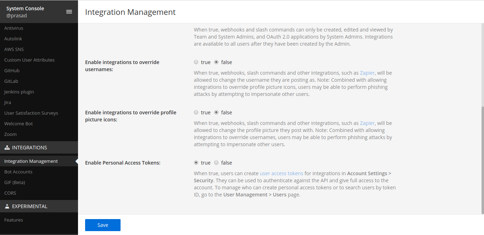

## Install Botkube to the Mattermost team

Follow the steps below to install Botkube in your Mattermost Team (v5.14.0).

### 1. Enable Personal Access Token

Login with System Admin account, and in the Menu proceed to **System console > Integrations > Integration Management** and enable **Personal Access Token**.



### 2. Create Botkube user

To create a Botkube user, if not already created, proceed to the menu and Get a team invite link. Logout from the admin account and paste the link in the address bar and create a user with the username **Botkube**.

:::note
You can also use a custom username for your bot. However, it needs to be passed during Botkube installation in one of the further steps.
:::

Export the bot name as an environment variable:

```bash
export MATTERMOST_BOT_NAME="{bot_name}"
```


### 3. Manage Roles for Botkube user

Login as System Admin, in the Menu, proceed to **System console > Users**. For Botkube user, Manage Roles and allow tokens and post_all access.


### 4. Create a Token for Botkube user

Login as Botkube user, in the Menu, proceed to **Account Settings > Security > Personal Access Token > Create** and copy the token.


Export it as an environment variable:

```bash
export MATTERMOST_TOKEN="{token}"
```

### 5. Add Botkube to a channel

Add Botkube user created to the channel you want to receive notifications in.

Export the channel name as an environment variable:

```bash
export MATTERMOST_CHANNEL="{channel_name}"
```

## Install Botkube in Kubernetes cluster

- We use [Helm](https://helm.sh/) to install Botkube in Kubernetes. Follow [this](https://docs.helm.sh/using_helm/#installing-helm) guide to install helm if you don't have it installed already.
- Add **botkube** chart repository:

  ```bash
  helm repo add botkube https://charts.botkube.io
  helm repo update
  ```

- Deploy Botkube backend using **helm install** in your cluster:

  ```bash
  export MATTERMOST_SERVER_URL={mattermost_server_url}
  export MATTERMOST_CERT={mattermost_cert_path}
  export MATTERMOST_TEAM={mattermost_team_name}
  export CLUSTER_NAME={cluster_name}
  export ALLOW_KUBECTL={allow_kubectl}
  export ALLOW_HELM={allow_helm}

  helm install --version v0.17.0 botkube --namespace botkube --create-namespace \
  --set communications.default-group.mattermost.enabled=true \
  --set communications.default-group.mattermost.url=${MATTERMOST_SERVER_URL} \
  --set communications.default-group.mattermost.cert=${MATTERMOST_CERT} \
  --set communications.default-group.mattermost.token=${MATTERMOST_TOKEN} \
  --set communications.default-group.mattermost.team=${MATTERMOST_TEAM} \
  --set communications.default-group.mattermost.channels.default.name=${MATTERMOST_CHANNEL} \
  --set communications.default-group.mattermost.botName=${MATTERMOST_BOT_NAME} \
  --set settings.clusterName=${CLUSTER_NAME} \
  --set executors.kubectl-read-only.kubectl.enabled=${ALLOW_KUBECTL} \
  --set 'executors.helm.botkube/helm.enabled'=${ALLOW_HELM} \
  botkube/botkube
  ```

  where:

  - **MATTERMOST_SERVER_URL** is the URL (including http/https schema) where Mattermost is running,
  - **MATTERMOST_CERT** _(optional)_ is the SSL certificate file for HTTPS connection. Place it in Helm directory and specify the path,
  - **MATTERMOST_TOKEN** is the Token received by creating Personal Access Token for Botkube user,
  - **MATTERMOST_TEAM** is the Team name where Botkube is added,
  - **MATTERMOST_CHANNEL** is the Channel name where Botkube is added and used for communication,
  - **MATTERMOST_BOT_NAME** is the Mattermost bot username (usually it is `Botkube`),
  - **CLUSTER_NAME** is the cluster name set in the incoming messages,
  - **ALLOW_KUBECTL** set true to allow `kubectl` command execution by Botkube on the cluster,
  - **ALLOW_HELM** set true to allow `helm` command execution by Botkube on the cluster,

  - To deploy with TLS, replace **MATTERMOST_CERT** with the location of the SSL certificate file placed in Helm directory. Leave this value to None if deploying without TLS.

    Configuration syntax is explained [here](../../configuration).
    Full Helm chart parameters list is documented [here](../../configuration/helm-chart-parameters).

  Send `@Botkube ping` in the channel to see if Botkube is running and responding.

  With the default configuration, Botkube will watch all the resources in all the namespaces for _create_, _delete_ and _error_ events.

  If you wish to monitor only specific resources, follow the steps given below:

  1. Create a new `config.yaml` file and add Kubernetes resource configuration as described on the [source](../../configuration/source) page.
  2. Pass the YAML file as a flag to `helm install` command, e.g.:

     ```
     helm install --version v0.17.0 --name botkube --namespace botkube --create-namespace -f /path/to/config.yaml --set=...other args..
     ```

  Alternatively, you can also update the configuration at runtime as documented [here](../../configuration/#updating-the-configuration-at-runtime).

## Remove Botkube from Mattermost Team

- Deactivate or remove Botkube user from Mattermost Team. Login as System Admin, in the Menu proceed to System console -> Users -> botkube -> Deactivate.
- Archive Channel created for Botkube communication if required.

## Remove Botkube from Kubernetes cluster

Execute following command to completely remove Botkube and related resources from your cluster:

```bash
helm uninstall botkube --namespace botkube
```
