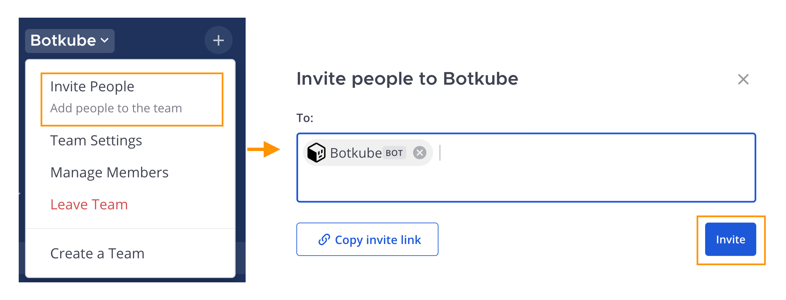

## Prerequisites

- Botkube CLI installed according to the [Getting Started guide](../../cli/getting-started.mdx#installation)
- Access to Kubernetes cluster

## Install Botkube to the Mattermost

Follow the steps below to install Botkube in your Mattermost instance.

### Create the Botkube bot account

1. Follow the [Mattermost instructions](https://developers.mattermost.com/integrate/reference/bot-accounts/) for creating a bot account. When creating the bot account, use the following details:

   - Username — `Botkube`

     :::note
     You can also use a custom username for your bot. Just remember that you'll need to provide this username during a later step of the Botkube installation.
     :::

   - Description — `Botkube helps you monitor your Kubernetes cluster, debug critical deployments and gives recommendations for standard practices by running checks on the Kubernetes resources.`.

   - Icon — You can download the Botkube icon from [this link](https://github.com/kubeshop/botkube/blob/main/branding/logos/botkube-black-192x192.png).

2. Export the bot name as an environment variable:

   ```bash
   export MATTERMOST_BOT_NAME="{bot_name}"
   ```

3. Also, export the bot's token as an environment variable:

   ```bash
   export MATTERMOST_TOKEN="{token}"
   ```

### Add Botkube to a channel

Make sure that the newly created bot account is added to your Mattermost team by following [these instructions](https://developers.mattermost.com/integrate/reference/bot-accounts/#bot-account-creation).



Next, invite the Botkube bot into the specific channel where you want to receive notifications. Export the channel name as an environment variable:

```bash
export MATTERMOST_CHANNEL="{channel_name}"
```

## Install Botkube in Kubernetes cluster

To deploy Botkube agent in your cluster, run:

```bash
export MATTERMOST_SERVER_URL={mattermost_server_url}
export MATTERMOST_TEAM={mattermost_team_name}
export CLUSTER_NAME={cluster_name}
export ALLOW_KUBECTL={allow_kubectl}

botkube install --version v1.8.0 \
--set communications.default-group.mattermost.enabled=true \
--set communications.default-group.mattermost.url=${MATTERMOST_SERVER_URL} \
--set communications.default-group.mattermost.token=${MATTERMOST_TOKEN} \
--set communications.default-group.mattermost.team=${MATTERMOST_TEAM} \
--set communications.default-group.mattermost.channels.default.name=${MATTERMOST_CHANNEL} \
--set communications.default-group.mattermost.botName=${MATTERMOST_BOT_NAME} \
--set settings.clusterName=${CLUSTER_NAME} \
--set 'executors.k8s-default-tools.botkube/kubectl.enabled'=${ALLOW_KUBECTL}
```

where:

- **MATTERMOST_SERVER_URL** is the URL (including http/https schema) where Mattermost is running,
- **MATTERMOST_TOKEN** is the Token received by creating Personal Access Token for Botkube bot,
- **MATTERMOST_TEAM** is the Team name where Botkube is added,
- **MATTERMOST_CHANNEL** is the Channel name where Botkube is added and used for communication,
- **MATTERMOST_BOT_NAME** is the Mattermost bot username (usually it is `Botkube`),
- **CLUSTER_NAME** is the cluster name set in the incoming messages,
- **ALLOW_KUBECTL** set true to allow `kubectl` command execution by Botkube on the cluster.

Configuration syntax is explained [here](../../configuration).
All possible installation parameters are documented [here](../../configuration/helm-chart-parameters).

Send `@Botkube ping` in the channel to see if Botkube is running and responding.

## Remove Botkube from Mattermost Team

- Deactivate or remove Botkube bot from Mattermost Team.
- Archive Channel created for Botkube communication if required.

## Remove Botkube from Kubernetes cluster

Execute the following command to completely remove Botkube and related resources from your cluster:

```bash
botkube uninstall
```

## Troubleshooting

### Botkube doesn't start

**Symptoms**

The Botkube Pod is restarting and the Botkube logs show the following error:

```json
{
  "level": "fatal",
  "msg": "while running application: while waiting for goroutines to finish gracefully: 1 error occurred:\n\t* while creating Mattermost bot: while getting team details: team \"Botkube\" not found",
  "time": "2023-08-25T14:52:30+02:00"
}
```

**Solution**

You need to ensure that the configuration used by Botkube is valid.

1. Get and decode the communication Secret details:
   ```bash
   kubectl get secret botkube-communication-secret -n botkube --template='{{index .data "comm_config.yaml" | base64decode }}'
   ```
2. Verify the following:

   - Ensure that the value of `communications.default-group.mattermost.team` in the configuration matches the actual team name in your Mattermost UI.

   - Confirm that the bot specified in `communications.default-group.mattermost.botName` has been invited to the relevant team and all specified channels.

   - Check the validity of the token provided in `communications.default-group.mattermost.token`. If you're unsure, navigate to the Bot Accounts section in Mattermost and generate a new one.

3. Additional Steps:

   If you continue to experience issues with Botkube restarts, you can perform further troubleshooting by following the instructions provided by Mattermost on [testing bot connections](https://developers.mattermost.com/integrate/reference/bot-accounts/#how-can-i-quickly-test-if-my-bot-account-is-working).
