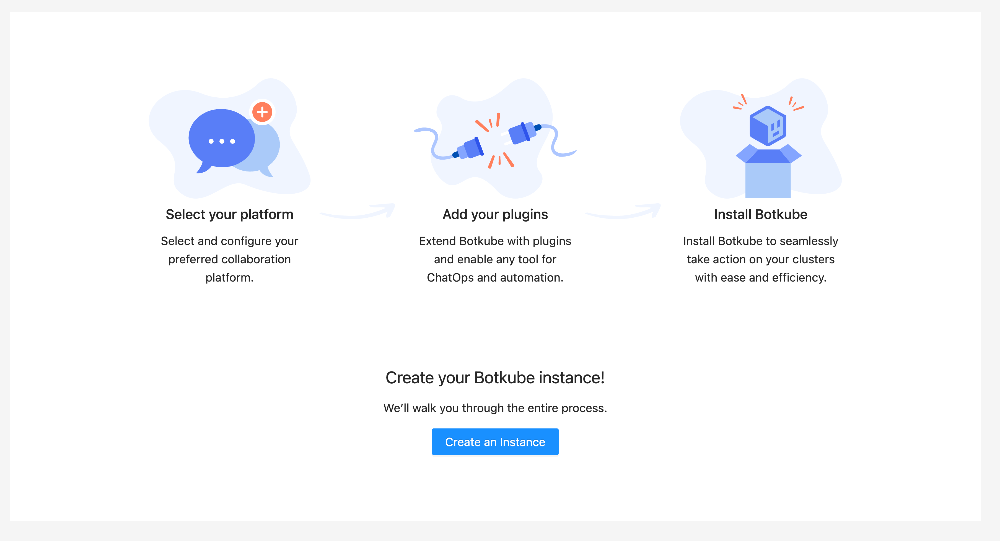
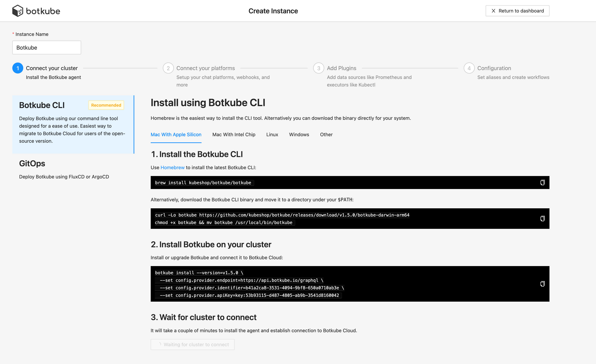
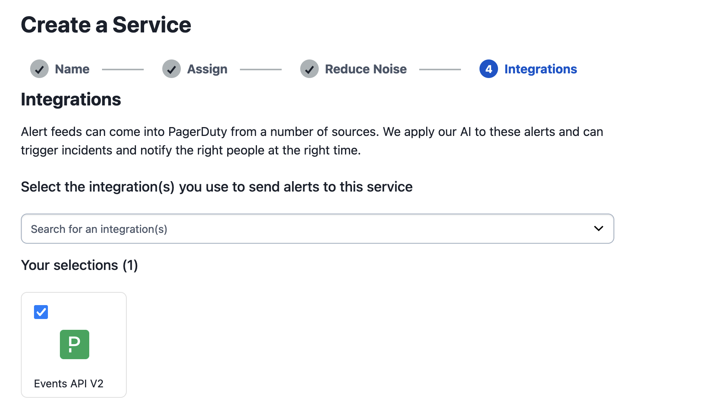
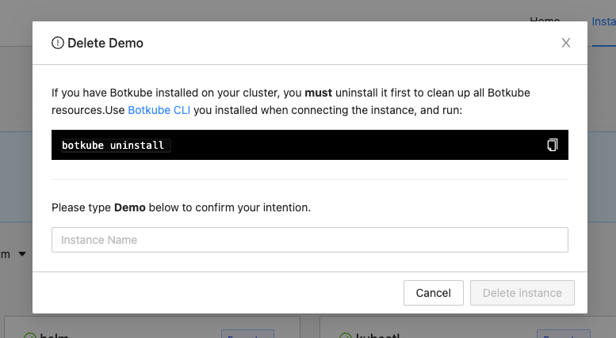

## Botkube Cloud Pager Duty

The Botkube Cloud Pager Duty integration ensure timely reactions to both alerts and changes in your system.

<!-- Action Item: Ask @Blair to provide Pager Duty description -->

You can directly try Botkube Cloud Microsoft Teams app for free by creating an account in the [Botkube Web App](https://app.botkube.io). Follow the steps below to install the app.

## Prerequisites

- A Botkube Cloud account.

  You can try out the Botkube Cloud Microsoft Teams app for free by creating an account in the [Botkube Cloud app](https://app.botkube.io).

## Create a Botkube Cloud Instance with Pager Duty

### Connect Botkube Cloud to your Kubernetes cluster

1. Go to Botkube Cloud [Web App](https://app.botkube.io/) and click on `New Instance` button.

   

2. Install Botkube Agent on your Kubernetes cluster by following the instructions on the page.

   

3. Click `Add platform` dropdown, and select `Pager Duty` option.

   

Proceed with the next section.

### Create a Pager Duty Service

:::note
For a detailed guide, navigate to PagerDuty's support page [Services and Integrations](https://support.pagerduty.com/docs/services-and-integrations#create-a-service).
:::

To create a service in the Pager Duty web app:

1. Go to **Services** -> **Service Directory** and click **New Service**. On the next screen you will be guided through several steps.
   1. Enter **Name**. We suggest to put a cluster name, for example: "Production EU".
   2. Click **Next** to continue.
2. Select Escalation Policy that suits you best. Click **Next** to continue.
3. Select the **Events API V2** integration.

   

4. Click **Create Service**.
5. Now you will be in the service’s Integrations tab, where you’ll find the **integration key**.
6. Copy the **integration key**.

Proceed with the next section.

### Finalize Botkube Cloud instance configuration

Go back to the Botkube Cloud instance creation.

1. In step 2, specify configuration details:

   - **Integration key:** The integration key generated by Pager Duty in the previous section.

   

2. Add source plugins you want to enable in your Botkube instance and click `Next` button.

   

3. Click `Apply Changes` button to update Botkube Cloud instance.

   

## Using Botkube Cloud with PagerDuty Integration

From now on, all events emitted by enabled sources are routed directly to created PagerDuty service using the [Events API v2](https://developer.pagerduty.com/docs/ZG9jOjExMDI5NTgw-events-api-v2-overview). Botkube follows the best practices by recognizing different event types and sending them to PagerDuty accordingly.

### Alerts

An [alert](https://developer.pagerduty.com/docs/ZG9jOjExMDI5NTgx-send-an-alert-event) indicates a problem within a monitored system. Botkube forwards the following types of alerts to PagerDuty:

- [Kubernetes'](../../configuration/source/kubernetes.md#event-types) `error` and `delete` events.
- All configured [Prometheus](../../configuration/source/prometheus.md) alerts.
- [ArgoCD](../../configuration/source/argocd.md) alerts (details to be specified).

### Changes

A [change](https://developer.pagerduty.com/docs/ZG9jOjExMDI5NTgy-send-a-change-event) indicates a non-problematic update within a system. Botkube forwards the following types of change events to PagerDuty:

- [Kubernetes'](../../configuration/source/kubernetes.md) `create` and `update` events.
- [ArgoCD](../../configuration/source/argocd.md) changes (details to be specified).

## Instance Cleanup

1. Go to Botkube Cloud instances page and click `Manage` button of the instance you want to remove.

   

2. Click `Delete instance` button, type instance name in the popup and click `Delete instance`.

   :::caution
   Remember to execute the displayed command to completely remove Botkube and related resources from your cluster.
   :::

   

## Limitations

Botkube Cloud Microsoft Teams App currently doesn't support the following features:

- Botkube doesn't send a follow-up events to acknowledge or resolve triggered alert.
