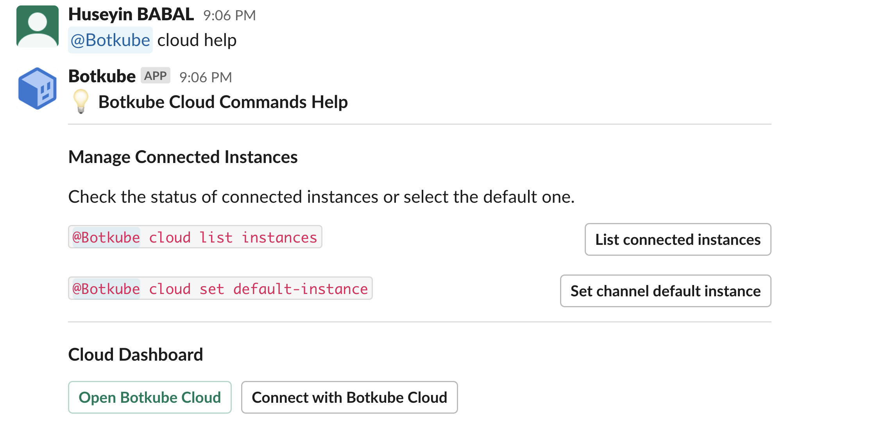
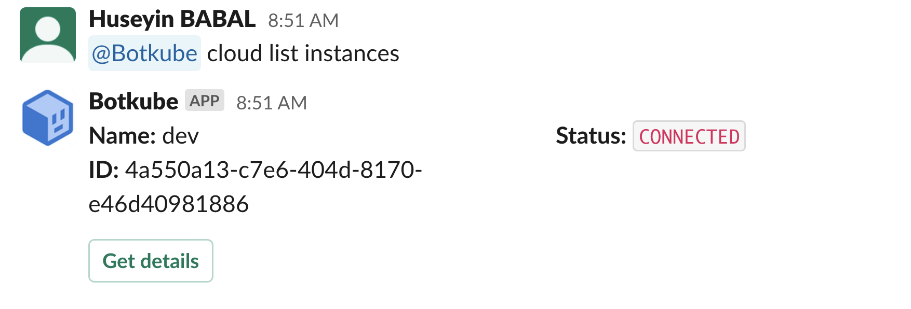
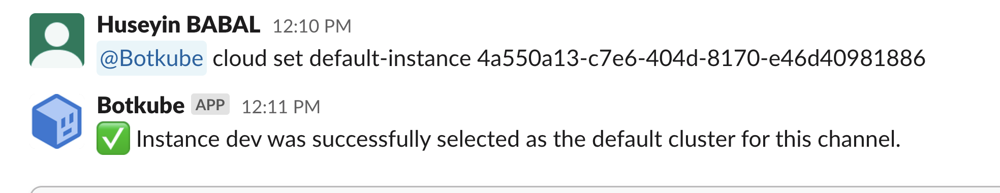
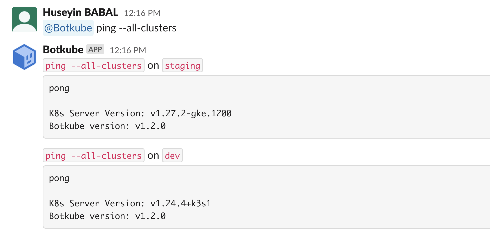

The Botkube Cloud Slack App uses Botkube Cloud services to manage channels and route executor commands. This allows multi-cluster support without a need to create a dedicated Slack application for each cluster. Events and alerts are sent directly from your cluster to your Slack workspace for reliable, fast notifications.

## Prerequisites

- A Botkube Cloud account with active subscription.

You can try out the Botkube Cloud Slack App for free by creating an account in the [Botkube Web App](https://app.botkube.io) and starting a free trial. You will need an active subscription to continue using the Botkube Cloud Slack App after the trial period.

:::warning
Once you downgrade your subscription to free, you will not be able to use Botkube commands whereas you will continue to receive notification from Slack.
:::

## Create a Botkube Cloud Instance with Cloud Slack

1. Go to Botkube Cloud [Web App](https://app.botkube.io/) and click on `New Instance` button.

   

2. Fill in the `Instance Display Name` and click `Next` button.

   

3. Click `Add platform` dropdown, and select `Slack` option.

   

4. In the popup, select `Official Botkube Slack App` option and click `Select` button.

   

5. Click `Add to Slack` button to add Cloud Slack integration to your Slack workspace.

   

6. Click `Allow` to grant permission for Botkube Cloud Slack app to access your Slack workspace.

   

7. Provide the Slack app details as described follows and click `Next` button.

   - **Connected Slack Workspace:** Slack workspace that you granted permission in previous step.
   - **Display Name:** Display name of the Cloud Slack integration.
   - **Channel:** Slack channel where you can execute Botkube commands and receive notification.

   

8. Add plugins you want to enable in your Botkube instance and click `Next` button.

   

9. Include optional `default aliases` and `default actions` and click `Create` button to create Botkube Cloud instance.

10. Follow the instructions in the summary page to deploy Botkube into your environment.

## Using Botkube Cloud Slack App

You can start using Botkube Cloud Slack App by typing `@Botkube cloud help` in the Slack channel you configured in one of the previous steps.

### Listing Cloud Instances

You can list all the Botkube Cloud instances by typing `@Botkube cloud list instances` in the Slack channel or click the button `List connected instances` in the help command response.
Besides the instance `name`, `ID`, and `status` in the list response, you can also see a button `Get details` that you can click to go to instance details on Botkube Cloud Dashboard.

### Setting Default Cloud Instances

Once a Botkube command is executed, it will be handled on target kubernetes cluster specified with `--cluster-name` flag. However, this is an optional flag,
where if you have not specified it, Botkube Cloud will select the first instance. However, you can also achieve setting default instance with command `@Botkube cloud set default-instance instance_id`.

After this point, all of your commands will be executed on the default instance. Moreover, if you want to execute a command on all the target clusters, you can use `--all-clusters` flag.

## Clean up

1. Go to Botkube Cloud instances page and click `Manage` button of the instance you want to remove.

   

2. Click `Delete instance` button, type instance name in the popup and click `Delete instance`.

   :::caution
   Remember to execute the displayed command to completely remove Botkube and related resources from your cluster.
   :::

   
