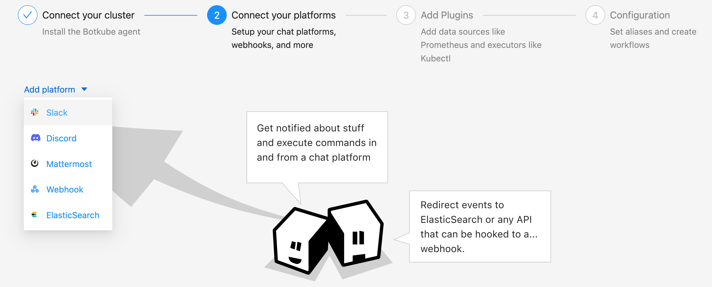
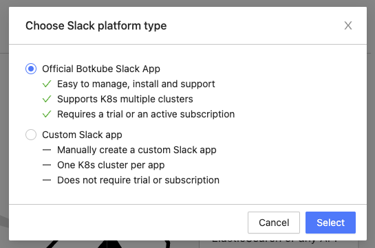
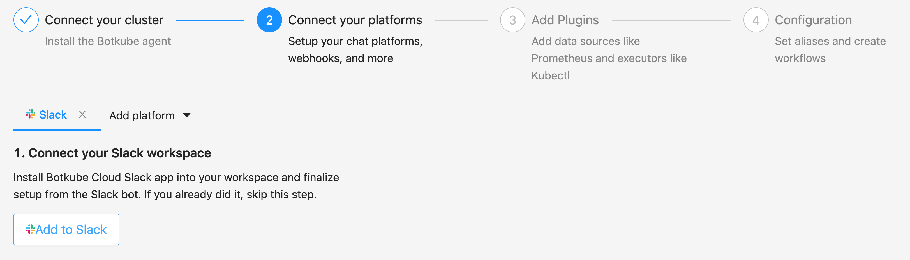
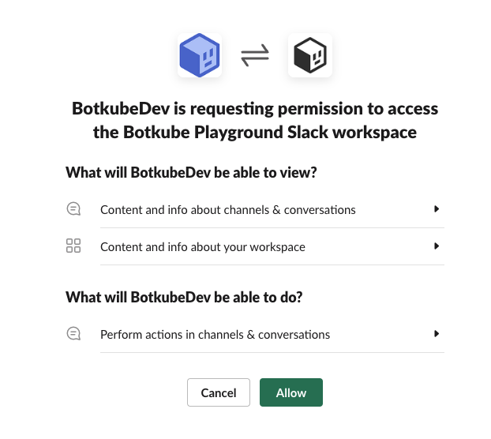
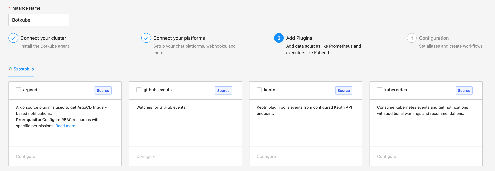
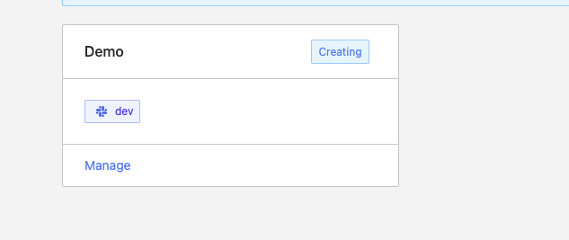
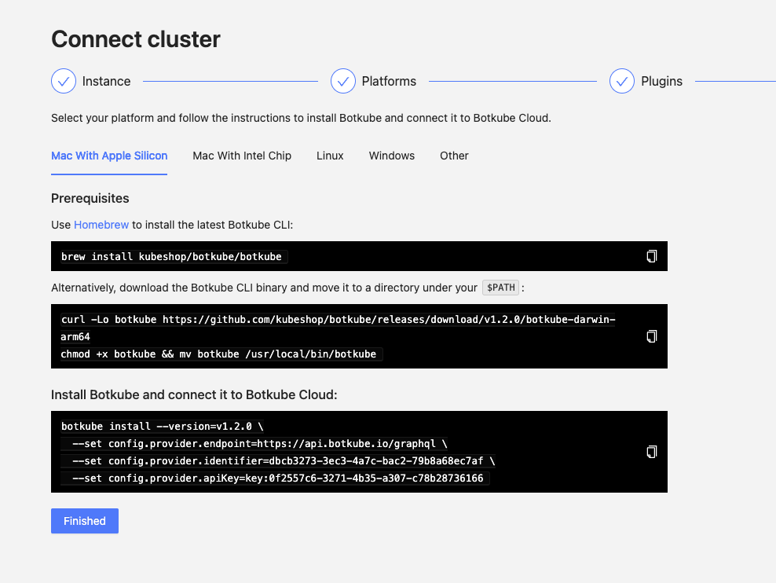

The Botkube Cloud Slack App uses Botkube's cloud services to manage channels and route executor commands. Events and alerts are sent directly from your cluster to your Slack workspace for reliable, fast notifications.

## Prerequisites

- A Botkube Cloud account with paid subscription which you can create one [here](https://app.botkube.io)

## Create a Botkube Cloud Instance

1. Go to Botkube Cloud [Web App](https://app.botkube.io/) and click on `New Instance` button.
   

2. Fill in the `Instance Display Name` and click `Next` button.
   

3. Click `Add platform` dropdown, and select `Slack` option.
   

4. In the popup, select `Official Botkube Slack App` option and click `Select` button.
   

5. Click `Add to Slack` button to add Cloud Slack integration to your Slack workspace
   

6. Click `Allow` to grant permission to Botkube Cloud Slack app to access your Slack workspace.
   

7. Provide the Slack app details as described follows and click `Next` button.

   - **Connected Slack Workspace:** Slack workspace that you granted permission in previous step.
   - **Display Name:** Display name of the Cloud Slack integration.
   - **Channel:** Slack channel where you can execute Botkube commands and receive notification.
     

8. Add plugins you want to enable in your Botkube instance and click `Next` button.
   

9. Include optional `default aliases` and `default actions` and click `Create` button to create Botkube Cloud instance.


10. Follow the instructions in the summary page to deploy Botkube into your environment.


## Remove Botkube Cloud Instance

1. Go to Botkube Cloud instances page and click `Manage` button of the instance you want to remove.



2. Click `Delete instance` button, type instance name in the popup and click `Delete instance`.



## Remove Botkube from Kubernetes Cluster

Execute the following command to completely remove Botkube and related resources from your cluster:

```bash
botkube uninstall
```
