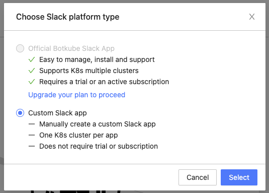

## Prerequisites

- A Botkube Cloud account which you can freely create [here](https://app.botkube.io)
- Create a Slack application and install it into your workspace, as described [here](./self_hosted.md). You can skip the steps about helm installation since we will use Botkube Cloud instance in this documentation.

## Create a Botkube Cloud Instance

1. Go to Botkube Cloud [Web App](https://app.botkube.io/) and click on `New Instance` button.
   

2. Fill in the `Instance Display Name` and click `Next` button.
   

3. Click `Add platform` dropdown, and select `Slack` option.
   

4. In the popup, select `Custom Slack app` option and click `Select` button.
   

5. Provide the Slack app details as described follows and click `Next` button.
   - **Display :** This is the name of the Slack app which will be displayed in your platform list.
   - **App Token:** Grab `SLACK_API_APP_TOKEN` as described [here](./self_hosted.md#generate-and-obtain-app-level-token).
   - **Bot Token:** Grab `SLACK_API_BOT_TOKEN` as described [here](./self_hosted.md#obtain-bot-token).
   - **Channel Name:** Slack channel where you can execute Botkube commands and receive notification.


6. Add plugins you want to enable in your Botkube instance and click `Next` button.


7. Include optional `default aliases` and `default actions` and click `Create` button to create Botkube Cloud instance.


8. Follow the instructions on the summary page to deploy Botkube into your environment.


## Remove Botkube Cloud Instance

1. Go to Botkube Cloud instances page and click `Manage` button of the instance you want to remove.


2. Click `Delete instance` button, type the instance name in the popup and click `Delete instance`.


## Remove Botkube from Kubernetes Cluster

Execute the following command to completely remove Botkube and related resources from your cluster:

```bash
botkube uninstall
```
