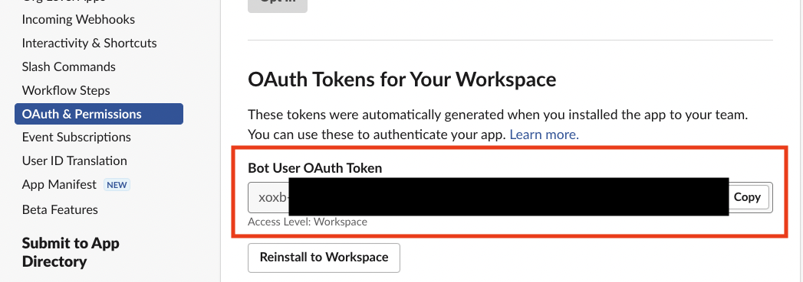

:::info
[Legacy Slack integration](/0.14/installation/slack/) known from previous Botkube versions has been deprecated and removed from the Slack App Directory. Follow the tutorial below to use the new Slack integration.
:::

## Install Slack App in Your Slack workspace

Botkube uses interactive messaging to provide better experience. Interactive messaging needs a Slack App with Socket Mode enabled and currently this is not suitable for Slack App Directory listing. For this reason, you need to create a Slack App in your own Slack workspace and use it for Botkube deployment.

:::warning
**Multi-cluster caveat:** The architecture of socket-based Slack apps is different from the older Slack app. If you would like to use [Botkube executors](../../configuration/executor/index.md) (e.g. kubectl commands) and have multiple Kubernetes clusters, you need to create and install a Botkube Slack app for each cluster. This is required so that the Slack to Botkube connections go to the right place. We recommend you set the name of each app to reflect the cluster it will connect to in the next steps.

To learn more about the Slack Socket API limitation, see the [comment](https://github.com/slackapi/bolt-js/issues/1263#issuecomment-1006372826) in the official Slack bot framework repository.
:::

Follow the steps below to create and install Botkube Slack app to your Slack workspace.

### Create Slack app

1. Go to [Slack App console](https://api.slack.com/apps) to create an application.
1. Click **Create New App** and select **From an app manifest** in the popup to create application from manifest.

   

1. Select a workspace where you want to create application and click **Next**.

   

1. Select **YAML** tab, copy & paste one of the following manifests, and click **Next**, and then **Create**.

import Tabs from '@theme/Tabs';
import TabItem from '@theme/TabItem';

<div className="tab-container-nested">
<Tabs>
  <TabItem value="public" label="Public channels only" default>

```yaml
display_information:
  name: Botkube
  description: Botkube
  background_color: "#a653a6"
features:
  bot_user:
    display_name: Botkube
    always_online: false
oauth_config:
  scopes:
    bot:
      - channels:read
      - app_mentions:read
      - chat:write
      - files:write
      - users:read # Remote configuration only: Used to get Real Name for audit reporting
settings:
  event_subscriptions:
    bot_events:
      - app_mention
  interactivity:
    is_enabled: true
  org_deploy_enabled: false
  socket_mode_enabled: true
  token_rotation_enabled: false
```

  </TabItem>
  <TabItem value="priv" label="Private channels only">

```yaml
display_information:
  name: Botkube
  description: Botkube
  background_color: "#a653a6"
features:
  bot_user:
    display_name: Botkube
    always_online: false
oauth_config:
  scopes:
    bot:
      - groups:read
      - app_mentions:read
      - chat:write
      - files:write
      - users:read # Remote configuration only: Used to get Real Name for audit reporting
settings:
  event_subscriptions:
    bot_events:
      - app_mention
  interactivity:
    is_enabled: true
  org_deploy_enabled: false
  socket_mode_enabled: true
  token_rotation_enabled: false
```

  </TabItem>
  <TabItem value="public-priv" label="Public and private channels">

```yaml
display_information:
  name: Botkube
  description: Botkube
  background_color: "#a653a6"
features:
  bot_user:
    display_name: Botkube
    always_online: false
oauth_config:
  scopes:
    bot:
      - channels:read
      - groups:read
      - app_mentions:read
      - chat:write
      - files:write
      - users:read # Remote configuration only: Used to get Real Name for audit reporting
settings:
  event_subscriptions:
    bot_events:
      - app_mention
  interactivity:
    is_enabled: true
  org_deploy_enabled: false
  socket_mode_enabled: true
  token_rotation_enabled: false
```

  </TabItem>
</Tabs>
</div>

### Install Botkube to the Slack workspace

Once the application is created, you will be redirected to application details page. Press the **Install your app** button, select the workspace and click **Allow to finish installation**.


### Obtain Bot Token

Follow the steps to obtain the Bot Token:

1. Select **OAuth & Permissions** section on the left sidebar. On this page you can copy the bot token which starts with `xoxb...`.

   

1. Export Slack Bot Token as follows:

   ```shell
   export SLACK_API_BOT_TOKEN="{botToken}"
   ```

### Generate and obtain App-Level Token

Slack App with Socket Mode requires an App-Level Token for the websocket connection.

Follow the steps to generate an App-Level Token:

1. Select **Basic Information** link from the left sidebar and scroll down to section **App-Level Token**. Click on the **Generate Token and Scopes** button.
1. Enter a **Name**, select `connections:write` scope, and click **Generate**.

   

   

1. Copy **App-Level Token** and export it as follows:

   ```shell
   export SLACK_API_APP_TOKEN="${appToken}"
   ```

### Add Botkube user to a Slack channel

After installing Botkube app to your Slack workspace, you could see a new bot user with the name "Botkube" added in your workspace. Add that bot to a Slack channel you want to receive notification in. You can add it by inviting `@Botkube` in a channel.

## Install Botkube Backend in Kubernetes cluster

- We use [Helm](https://helm.sh/) to install Botkube in Kubernetes. Follow [this](https://docs.helm.sh/using_helm/#installing-helm) guide to install helm if you don't have it installed already.
- Add **botkube** chart repository:

  ```bash
  helm repo add botkube https://charts.botkube.io
  helm repo update
  ```

- Deploy Botkube backend using **helm install** in your cluster:

  ```bash
  export CLUSTER_NAME={cluster_name}
  export ALLOW_KUBECTL={allow_kubectl}
  export ALLOW_HELM={allow_helm}
  export SLACK_CHANNEL_NAME={channel_name}

  helm install --version v1.0.1 botkube --namespace botkube --create-namespace \
  --set communications.default-group.socketSlack.enabled=true \
  --set communications.default-group.socketSlack.channels.default.name=${SLACK_CHANNEL_NAME} \
  --set communications.default-group.socketSlack.appToken=${SLACK_API_APP_TOKEN} \
  --set communications.default-group.socketSlack.botToken=${SLACK_API_BOT_TOKEN} \
  --set settings.clusterName=${CLUSTER_NAME} \
  --set 'executors.k8s-default-tools.botkube/kubectl.enabled'=${ALLOW_KUBECTL} \
  --set 'executors.k8s-default-tools.botkube/helm.enabled'=${ALLOW_HELM} \
  botkube/botkube
  ```

  where:

  - **SLACK_CHANNEL_NAME** is the channel name where @Botkube is added
  - **SLACK_API_BOT_TOKEN** is the Token you received after installing Botkube app to your Slack workspace
  - **SLACK_API_APP_TOKEN** is the Token you received after installing Botkube app to your Slack workspace and generate in App-Level Token section
  - **CLUSTER_NAME** is the cluster name set in the incoming messages
  - **ALLOW_KUBECTL** set true to allow `kubectl` command execution by Botkube on the cluster,
  - **ALLOW_HELM** set true to allow `helm` command execution by Botkube on the cluster,

  Configuration syntax is explained [here](../../configuration).
  Full Helm chart parameters list is documented [here](../../configuration/helm-chart-parameters).

  Send `@Botkube ping` in the channel to see if Botkube is running and responding.

  With the default configuration, Botkube will watch all the resources in all the namespaces for _create_, _delete_ and _error_ events.

  If you wish to monitor only specific resources, follow the steps given below:

  1. Create a new `config.yaml` file and add Kubernetes resource configuration as described on the [source](../../configuration/source) page.
  2. Pass the YAML file as a flag to `helm install` command, e.g.:

     ```
     helm install --version v1.0.1 --name botkube --namespace botkube --create-namespace -f /path/to/config.yaml --set=...other args..
     ```

  Alternatively, you can also update the configuration at runtime as documented [here](../../configuration/#updating-the-configuration-at-runtime).

### Delete Botkube from Slack workspace

- Go to the [Slack apps](https://api.slack.com/apps) page,
- Click on "Botkube", scroll to bottom, and click on "Delete App" button.

## Remove Botkube from Kubernetes cluster

Execute following command to completely remove Botkube and related resources from your cluster:

```bash
helm uninstall botkube --namespace botkube
```
