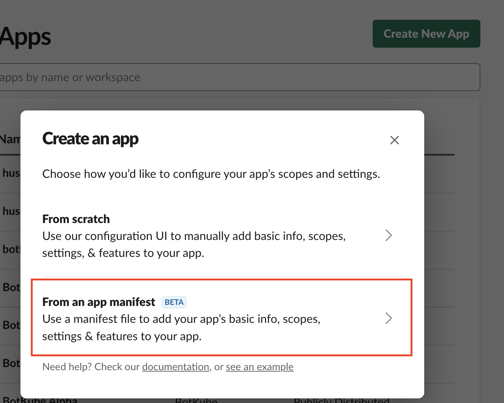
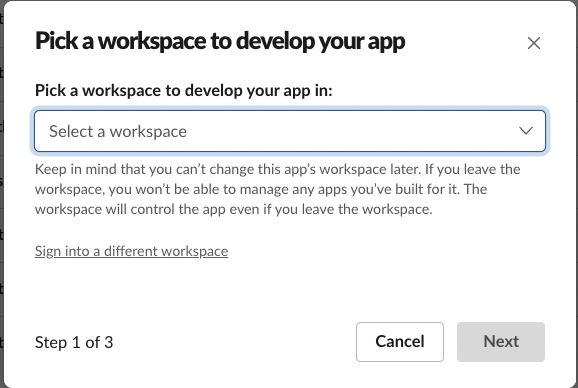
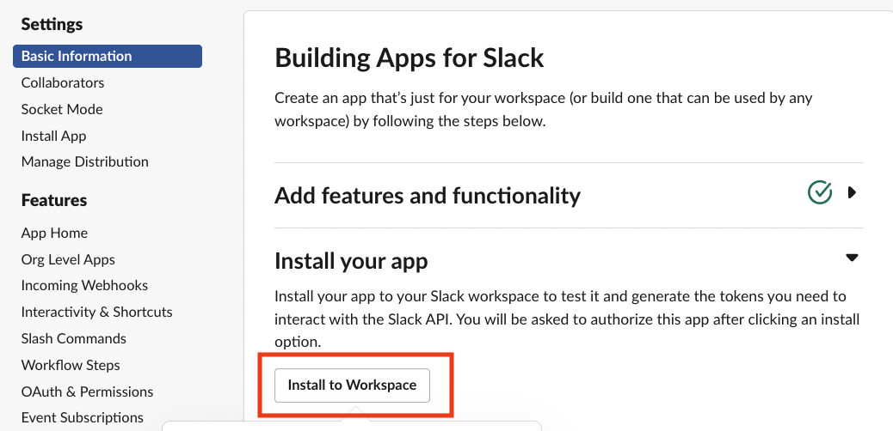
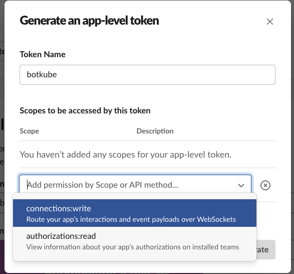

## Prerequisites

- Botkube Cloud account which you can create [here](https://app.botkube.io) for free.

## Install Socket Slack App in Your Slack workspace

Botkube uses interactive messaging to provide better experience. Interactive messaging needs a Slack App with Socket Mode enabled and currently this is not suitable for Slack App Directory listing. For this reason, you need to create a Slack App in your own Slack workspace and use it for Botkube deployment.

:::warning
**Multi-cluster caveat:** The architecture of socket-based Slack apps has a limitation on the routing of executor commands. If you would like to use [Botkube executors](../../../configuration/executor/index.md) (e.g. kubectl commands) and have multiple Kubernetes clusters, you need to create and install a Botkube Slack app for each cluster. This is required so that the Slack to Botkube connections go to the right place. We recommend you set the name of each app to reflect the cluster it will connect to in the next steps.

To learn more about the Slack Socket API limitation, see the [comment](https://github.com/slackapi/bolt-js/issues/1263#issuecomment-1006372826) in the official Slack bot framework repository.

The [Botkube Cloud Slack App](#botkube-cloud-slack-app) does not have this limitation.
:::

Follow the steps below to create and install Botkube Slack app to your Slack workspace.

### Create Slack app

1. Go to [Slack App console](https://api.slack.com/apps) to create an application.
1. Click **Create New App** and select **From an app manifest** in the popup to create application from manifest.

   

1. Select a workspace where you want to create application and click **Next**.

   

1. Select **YAML** tab, copy & paste one of the following manifests, and click **Next**, and then **Create**.

import Tabs from '@theme/Tabs';
import TabItem from '@theme/TabItem';

<div className="tab-container-nested">
<Tabs>
  <TabItem value="public" label="Public channels only" default>

```yaml
display_information:
  name: Botkube
  description: Botkube
  background_color: "#a653a6"
features:
  bot_user:
    display_name: Botkube
    always_online: false
oauth_config:
  scopes:
    bot:
      - channels:read
      - app_mentions:read
      - reactions:write
      - chat:write
      - files:write
      - users:read # Remote configuration only: Used to get Real Name for audit reporting
settings:
  event_subscriptions:
    bot_events:
      - app_mention
  interactivity:
    is_enabled: true
  org_deploy_enabled: false
  socket_mode_enabled: true
  token_rotation_enabled: false
```

  </TabItem>
  <TabItem value="priv" label="Private channels only">

```yaml
display_information:
  name: Botkube
  description: Botkube
  background_color: "#a653a6"
features:
  bot_user:
    display_name: Botkube
    always_online: false
oauth_config:
  scopes:
    bot:
      - groups:read
      - app_mentions:read
      - reactions:write
      - chat:write
      - files:write
      - users:read # Remote configuration only: Used to get Real Name for audit reporting
settings:
  event_subscriptions:
    bot_events:
      - app_mention
  interactivity:
    is_enabled: true
  org_deploy_enabled: false
  socket_mode_enabled: true
  token_rotation_enabled: false
```

  </TabItem>
  <TabItem value="public-priv" label="Public and private channels">

```yaml
display_information:
  name: Botkube
  description: Botkube
  background_color: "#a653a6"
features:
  bot_user:
    display_name: Botkube
    always_online: false
oauth_config:
  scopes:
    bot:
      - channels:read
      - groups:read
      - app_mentions:read
      - reactions:write
      - chat:write
      - files:write
      - users:read # Remote configuration only: Used to get Real Name for audit reporting
settings:
  event_subscriptions:
    bot_events:
      - app_mention
  interactivity:
    is_enabled: true
  org_deploy_enabled: false
  socket_mode_enabled: true
  token_rotation_enabled: false
```

  </TabItem>
</Tabs>
</div>

### Install Botkube to the Slack workspace

Once the application is created, you will be redirected to application details page. Press the **Install your app** button, select the workspace and click **Allow to finish installation**.



### Obtain Bot Token

1. Select **OAuth & Permissions** section on the left sidebar. On this page you can copy the bot token which starts with `xoxb...`.

   

2. Note down the `Bot User OAuth Token`. You will use the value when creating a Botkube Cloud instance.

### Generate and obtain App-Level Token

Slack App with Socket Mode requires an App-Level Token for the websocket connection.

Follow the steps to generate an App-Level Token:

1. Select **Basic Information** link from the left sidebar and scroll down to section **App-Level Token**. Click on the **Generate Token and Scopes** button.
1. Enter a **Name**, select `connections:write` scope, and click **Generate**.

   

   

1. Note down the `Token`. You will use the value when creating a Botkube Cloud instance.

## Create a Botkube Cloud Instance

1. Go to Botkube Cloud [Web App](https://app.botkube.io/) and click on `New Instance` button.

   

2. Fill in the `Instance Display Name` and click `Next` button.

   

3. Click `Add platform` dropdown, and select `Slack` option.

   

4. In the popup, select `Custom Slack app` option and click `Select` button.

   

5. Provide the Slack app details as described follows and click `Next` button.

   - **Display Name:** This is the name of the Slack app which will be displayed in your platform list.
   - **App Token:** Use the app token noted down in one of the previous steps.
   - **Bot Token:** Use the bot user token noted down in one of the previous steps.
   - **Channel Name:** Provide Slack channel name(s) where you can execute Botkube commands and receive notifications. This will be configured in the next step.

   

6. Add plugins you want to enable in your Botkube instance and click `Next` button.

   

7. Include optional `default aliases` and `default actions` and click `Create` button to create Botkube Cloud instance.

   

8. Follow the instructions on the summary page to deploy Botkube into your environment.

   

## Clean up

1. Go to Botkube Cloud instances page and click `Manage` button of the instance you want to remove.

   

2. Click `Delete instance` button, type the instance name in the popup and click `Delete instance`.

   :::caution
   Remember to execute the displayed command to completely remove Botkube and related resources from your cluster.
   :::

   
