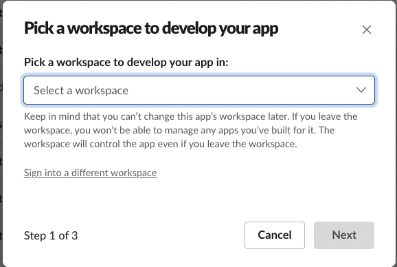
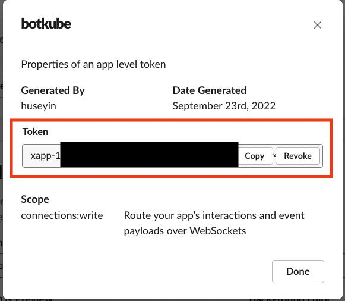

## Install Slack App in Your Slack workspace

BotKube uses interactive messaging to provide better experience. Interactive messaging needs a Slack App with Socket Mode enabled
and currently this is not suitable for Slack App Directory listing. For this reason, you need to create a Slack App in your own Slack workspace and use it for BotKube deployment.

Follow the steps below to create and install BotKube Slack app to your Slack workspace.

### Create Slack app

1. Go to [Slack App console](https://api.slack.com/apps) to create an application.
1. Click **Create New App** and select **From an app manifest** in the popup to create application from manifest.

   

1. Select a workspace where you want to create application and click **Next**.

   

1. Select **YAML** tab, copy & paste following manifest, and click **Next**, and then **Create**.

   ```yaml
   display_information:
     name: Botkube
     description: Botkube
     background_color: "#a653a6"
   features:
     bot_user:
       display_name: Botkube
       always_online: false
   oauth_config:
     scopes:
       bot:
         - app_mentions:read
         - chat:write
         - channels:read
         - files:write
   settings:
     event_subscriptions:
       bot_events:
         - app_mention
     interactivity:
       is_enabled: true
     org_deploy_enabled: false
     socket_mode_enabled: true
     token_rotation_enabled: false
   ```

### Install BotKube to the Slack workspace

Once the application is created, you will be redirected to application details page. Press the **Install your app** button, select the workspace and click **Allow to finish installation**.


### Obtain Bot Token

Follow the steps to obtain the Bot Token:

1. Select **OAuth & Permissions** section on the left sidebar. On this page you can copy the bot token which starts with `xoxb...`.

   

1. Export Slack Bot Token as follows:

   ```shell
   export SLACK_API_BOT_TOKEN="{botToken}"
   ```

### Generate and obtain App-Level Token

Slack App with Socket Mode requires an App-Level Token for the websocket connection.

Follow the steps to generate an App-Level Token:

1. Select **Basic Information** link from the left sidebar and scroll down to section **App-Level Token**. Click on the **Generate Token and Scopes** button.
1. Enter a **Name**, select `connections:write` scope, and click **Generate**.

   

   

1. Copy **App-Level Token** and export it as follows:

   ```shell
   export SLACK_API_APP_TOKEN="${appToken}"
   ```

### Add BotKube user to a Slack channel

After installing BotKube app to your Slack workspace, you could see a new bot user with the name "BotKube" added in your workspace. Add that bot to a Slack channel you want to receive notification in. You can add it by inviting **@BotKube** in a channel.

## Install BotKube Backend in Kubernetes cluster

- We use [Helm](https://helm.sh/) to install BotKube in Kubernetes. Follow [this](https://docs.helm.sh/using_helm/#installing-helm) guide to install helm if you don't have it installed already.
- Add **botkube** chart repository:

  ```bash
  helm repo add botkube https://charts.botkube.io
  helm repo update
  ```

- Deploy BotKube backend using **helm install** in your cluster:

  ```bash
  export CLUSTER_NAME={cluster_name}
  export ALLOW_KUBECTL={allow_kubectl}
  export SLACK_CHANNEL_NAME={channel_name}

  helm install --version v0.14.0 botkube --namespace botkube --create-namespace \
  --set communications.default-group.socketSlack.enabled=true \
  --set communications.default-group.socketSlack.channels.default.name=${SLACK_CHANNEL_NAME} \
  --set communications.default-group.socketSlack.appToken=${SLACK_API_APP_TOKEN} \
  --set communications.default-group.socketSlack.botToken=${SLACK_API_BOT_TOKEN} \
  --set settings.clusterName=${CLUSTER_NAME} \
  --set executors.kubectl-read-only.kubectl.enabled=${ALLOW_KUBECTL} \
  botkube/botkube
  ```

  where:

  - **SLACK_CHANNEL_NAME** is the channel name where @BotKube is added
  - **SLACK_API_BOT_TOKEN** is the Token you received after installing BotKube app to your Slack workspace
  - **SLACK_API_APP_TOKEN** is the Token you received after installing BotKube app to your Slack workspace and generate in App-Level Token section
  - **CLUSTER_NAME** is the cluster name set in the incoming messages
  - **ALLOW_KUBECTL** set true to allow kubectl command execution by BotKube on the cluster

  Configuration syntax is explained [here](../../configuration).
  Full Helm chart parameters list is documented [here](../../configuration/helm-chart-parameters).

  Send **@BotKube ping** in the channel to see if BotKube is running and responding.

  With the default configuration, BotKube will watch all the resources in all the namespaces for _create_, _delete_ and _error_ events.<br/>
  If you wish to monitor only specific resources, follow the steps given below:

  1. Create a new `config.yaml` file and add Kubernetes resource configuration as described on the [source](../../configuration/source) page.
  2. Pass the YAML file as a flag to `helm install` command, e.g.:

     ```
     helm install --version v0.14.0 --name botkube --namespace botkube --create-namespace -f /path/to/config.yaml --set=...other args..
     ```

  Alternatively, you can also update the configuration at runtime as documented [here](../../configuration/#updating-the-configuration-at-runtime)

### Delete BotKube from Slack workspace

- Go to the [Slack apps](https://api.slack.com/apps) page,
- Click on "BotKube", scroll to bottom, and click on "Delete App" button.

## Remove BotKube from Kubernetes cluster

Execute following command to completely remove BotKube and related resources from your cluster.

```bash
helm uninstall botkube
```
