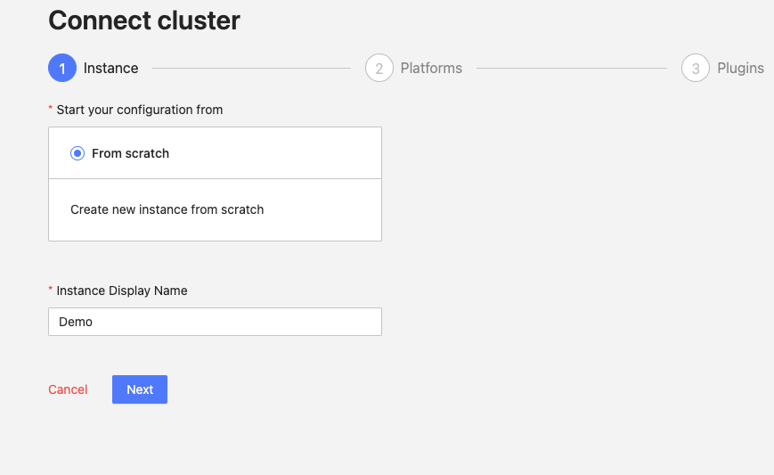
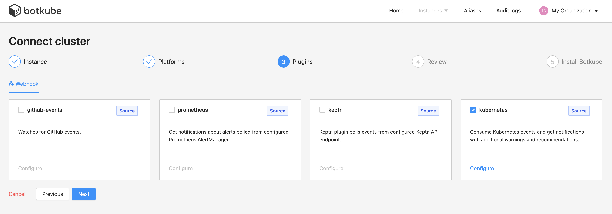
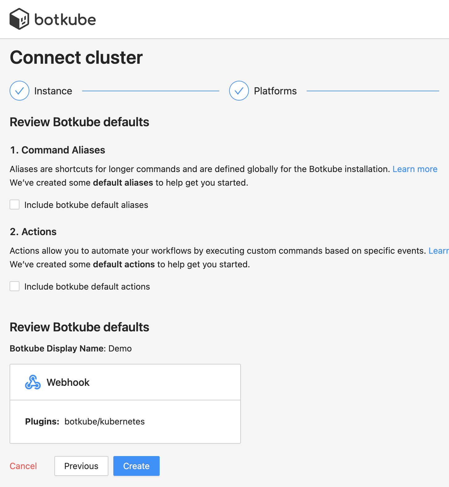

## Prerequisites

- Botkube Cloud account which you can create [here](https://app.botkube.io) for free.

## Create a Botkube Cloud Instance with Webhook

1. Go to Botkube Cloud [Web App](https://app.botkube.io/) and create a new instance.

   You can do it by clicking "Create an Instance" button on Home Page or under this link [Create an Instance](https://app.botkube.io/instances/add)

2. Fill in the `Instance Display Name` and click `Next` button.

   

3. Click `Add platform` dropdown, and select `Webhook` option.

   

4. Fill in all required data in the form

5. Add plugins you want to enable in your Botkube instance and click `Next` button.

   

6. Include optional `default aliases` and `default actions` and click `Create` button to create Botkube Cloud instance.

   

   :::note
   If you don't include other platforms which use `Executor` plugins we recommend `default aliases` and `default actions` options unchecked
   :::

7. Follow the instructions in the summary page to deploy Botkube into your environment.

   

## Clean up

### Remove Botkube from Kubernetes cluster

1. Go to Botkube Cloud instances page and click `Manage` button of the instance you want to remove.

2. Click `Delete instance` button, type instance name in the popup and click `Delete instance`.

   :::caution
   Remember to execute the displayed command to completely remove Botkube and related resources from your cluster.
   :::

   
