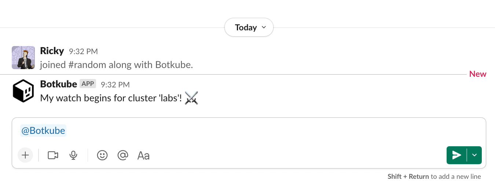

You can extend Botkube functionality by writing custom executor plugin. An executor allows you to run a given command directly in the chat window of each communication platform. For example, running `kubectl` or `helm` commands.

Plugin executor is a binary that implements the [executor](https://github.com/kubeshop/botkube/blob/main/proto/executor.proto) Protocol Buffers contract.

## Goal

This tutorial shows you how to build a custom `echo` executor that responds with a command that was specified by the user in a chat window.



For a final implementation, see the [Botkube template repository](./quick-start.md).

## Prerequisites

- Basic understanding of the Go language.
- [Go](https://golang.org/doc/install) at least 1.18.
  - See [go.mod](https://github.com/kubeshop/botkube/blob/main/go.mod#L1) for the recommended version used by Botkube team.
- [GoReleaser](https://goreleaser.com/) at least 1.13.

### Develop plugin business logic

1. Create an executor plugin directory:

   ```bash
   mkdir botkube-plugins && cd botkube-plugins
   ```

2. Initialize the Go module:

   ```bash
   go mod init botkube-plugins
   ```

3. Create the `main.go` file for the `echo` executor with the following template:

   ```go
   cat << EOF > main.go
   package main

   import (
     "context"
     "fmt"

     "github.com/MakeNowJust/heredoc"
     "github.com/hashicorp/go-plugin"
     "github.com/kubeshop/botkube/pkg/api"
     "github.com/kubeshop/botkube/pkg/api/executor"
   )

   // EchoExecutor implements the Botkube executor plugin interface.
   type EchoExecutor struct{}

   func main() {
     executor.Serve(map[string]plugin.Plugin{
       "echo": &executor.Plugin{
         Executor: &EchoExecutor{},
       },
     })
   }
   EOF
   ```

   This template code imports required packages and registers `EchoExecutor` as the gRPC plugin. At this stage, the `EchoExecutor` service doesn't implement the required [Protocol Buffers](https://github.com/kubeshop/botkube/blob/main/proto/executor.proto) contract. We will add the required methods in the next steps.

4. Download imported dependencies:

   ```bash
    go mod tidy
   ```

5. Add the required `Metadata` method:

   ```go
   // Metadata returns details about the Echo plugin.
   func (*EchoExecutor) Metadata(context.Context) (api.MetadataOutput, error) {
     return api.MetadataOutput{
       Version:     "1.0.0",
       Description: "Echo sends back the command that was specified.",
       JSONSchema: api.JSONSchema{
       Value: heredoc.Doc(`{
          "$schema": "http://json-schema.org/draft-04/schema#",
          "title": "echo",
          "description": "Example echo plugin",
          "type": "object",
          "properties": {
            "formatOptions": {
              "description": "Options to format echoed string",
              "type": "array",
              "items": {
                "type": "string",
                "enum": [ "bold", "italic" ]
              }
            }
          },
          "additionalProperties": false
        }`),
       },
     }, nil
   }
   ```

   The `Metadata` method returns basic information about your plugin. This data is used when the plugin index is generated in an automated way. You will learn more about that in the next steps.

   Ąs a part of the `Metadata` method, you can define the plugin dependencies. To learn more about them, see the [Dependencies](./dependencies.md) document.

6. Add the required `Execute` method:

   ```go
   // Execute returns a given command as a response.
   func (*EchoExecutor) Execute(_ context.Context, in executor.ExecuteInput) (executor.ExecuteOutput, error) {
   	return executor.ExecuteOutput{
   		Message: api.NewCodeBlockMessage(response, true),
   	}, nil
   }
   ```

   The `Execute` method is the heart of your executor plugin. This method runs your business logic and returns the execution output. Next, the Botkube core sends back the response to a given communication platform.
   If the communication platform supports interactivity, you can construct and return interactive messages containing buttons, dropdowns, input text, and more complex formatting. To learn more about it, see the [Interactive Messages](./interactivity.md) guide.

   For each `Execute` method call, Botkube attaches the list of associated configurations. You will learn more about that in the [**Passing configuration to your plugin**](#passing-configuration-to-your-plugin) section.

7. Add the required `Help` method:

   ```go
   // Help returns help message
   func (EchoExecutor) Help(context.Context) (api.Message, error) {
   	btnBuilder := api.NewMessageButtonBuilder()
   	return api.Message{
   		Sections: []api.Section{
   			{
   				Base: api.Base{
   					Header:      "Run `echo` commands",
   					Description: description,
   				},
   				Buttons: []api.Button{
   					btnBuilder.ForCommandWithDescCmd("Run", "echo 'hello world'"),
   				},
   			},
   		},
   	}, nil
   }
   ```

   You can use `api.NewCodeBlockMessage` or `api.NewPlaintextMessage` helper functions, or construct your own message.

## Build plugin binaries

Now it's time to build your plugin. For that purpose, we will use GoReleaser. It simplifies building Go binaries for different architectures. The important thing is to produce the binaries for the architecture of the host platform where Botkube is running. Adjust the `goos`, `goarch`, and `goarm` properties based on your needs.

:::note
Instead of GoReleaser, you can use another tool of your choice.
:::

1. Create the GoReleaser configuration file:

   ```yaml
   cat << EOF > .goreleaser.yaml
   project_name: botkube-plugins
   before:
     hooks:
       - go mod download

   builds:
     - id: echo
       binary: executor_echo_{{ .Os }}_{{ .Arch }}

       no_unique_dist_dir: true
       env:
         - CGO_ENABLED=0
       goos:
         - linux
         - darwin
       goarch:
         - amd64
         - arm64
       goarm:
         - 7

   snapshot:
     name_template: 'v{{ .Version }}'
   EOF
   ```

2. Build the binaries:

   ```bash
   goreleaser build --rm-dist --snapshot
   ```

Congrats! You just created your first Botkube executor plugin! :tada:

Now it's time to [test it locally with Botkube](local-testing.md). Once you're done testing, see how to [distribute it](repository.md).

## Passing configuration to your plugin

Sometimes your executor plugin requires a configuration specified by the end-user. Botkube supports such requirement and provides an option to specify plugin configuration under `config`. An example Botkube configuration looks like this:

```yaml
communications:
  "default-group":
    slack:
      channels:
        "default":
          name: "all-teams"
          bindings:
            executors:
              - echo-team-a
              - echo-team-b

executors:
  "echo-team-a": # executor configuration group name
    botkube/echo:
      enabled: true
      config:
        formatOptions: ["italic"]
  "echo-team-b": # executor configuration group name
    botkube/echo:
      enabled: true
      config:
        formatOptions: ["bold"]
```

This means that two different `botkube/echo` plugin configurations were bound to the `all-teams` Slack channel. Under `executor.ExecuteInput{}.Configs`, you will find the list of configurations in the YAML format as specified under the `config` property for each bound and enabled executor. The order of the configuration is the same as specified under the `bindings.executors` property. It's up to the plugin author to merge the passed configurations. You can use our helper function from the plugin extension package (`pluginx`).

```go
import (
	"context"
	"github.com/kubeshop/botkube/pkg/api/executor"
	"github.com/kubeshop/botkube/pkg/pluginx"
)

// Config holds the executor configuration.
type Config struct {
	FormatOptions []string `yaml:"options,omitempty"`
}

func (EchoExecutor) Execute(_ context.Context, in executor.ExecuteInput) (executor.ExecuteOutput, error) {
	var cfg Config
	err := pluginx.MergeExecutorConfigs(in.Configs, &cfg)
	if err != nil {
		return executor.ExecuteOutput{}, err
	}
	// rest logic
}
```

:::caution
Botkube starts only one process of a given executor plugin, and the list of configuration YAMLs can be different per gRPC call, so you shouldn't cache the merged configuration.
:::

## Passing kube config to your plugin

You can request botkube to generate and pass kubeconfig file to your plugin by adding RBAC section
to your plugin configuration. The following example requests a kubeconfig that impersonates
user **User.rbac.authorization.k8s.io** `read-only-user`.

```yaml
executors:
  "echo-team-a":
    botkube/echo:
      enabled: true
      context:
        user:
          type: Static
          static:
            values: read-only-user
```

The kubeconfig is available in `executor.ExecuteInput` as a slice of bytes.
There are two options to instantiate a kubernetes go client with this config.

1. From bytes

```go
import (
	"context"
	"k8s.io/client-go/tools/clientcmd"
	"k8s.io/client-go/kubernetes"
	"github.com/kubeshop/botkube/pkg/api/executor"
	"github.com/kubeshop/botkube/pkg/pluginx"
)

func (EchoExecutor) Execute(_ context.Context, in executor.ExecuteInput) (executor.ExecuteOutput, error) {
	config, err := clientcmd.RESTConfigFromKubeConfig(in.Context.KubeConfig)
	if err != nil {
		return executor.ExecuteOutput{}, err
	}
	clientset, err := kubernetes.NewForConfig(config)
	if err != nil {
		return executor.ExecuteOutput{}, err
	}
	...
}
```

2. From file

```go
import (
	"context"
	"k8s.io/client-go/tools/clientcmd"
	"k8s.io/client-go/kubernetes"
	"github.com/kubeshop/botkube/pkg/api/executor"
	"github.com/kubeshop/botkube/pkg/pluginx"
)

func (EchoExecutor) Execute(ctx context.Context, in executor.ExecuteInput) (executor.ExecuteOutput, error) {
	kubeConfigPath, deleteFn, err := pluginx.PersistKubeConfig(ctx, in.Context.KubeConfig)
	if err != nil {
		return executor.ExecuteOutput{}, fmt.Errorf("while writing kubeconfig file: %w", err)
	}
	defer func() {
		if deleteErr := deleteFn(ctx); deleteErr != nil {
			fmt.Fprintf(os.Stderr, "failed to delete kubeconfig file %s: %v", kubeConfigPath, deleteErr)
		}
	}()
	config, err := clientcmd.BuildConfigFromFlags("", kubeConfigPath)
	if err != nil {
		return executor.ExecuteOutput{}, err
	}
	clientset, err := kubernetes.NewForConfig(config)
	if err != nil {
		return executor.ExecuteOutput{}, err
	}
  ...
}
```

## Notes

- Streaming command response is not supported. As a result, commands like `helm install --wait` doesn't work well, as the response won't be sent until the command finishes. It's recommended to return the response as soon as possible.
- The interactive message is not yet supported.
