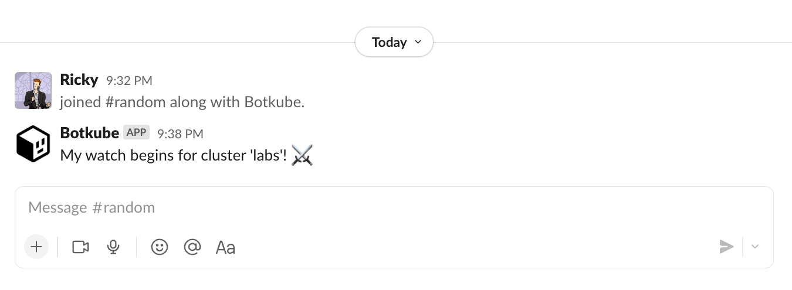

You can extend Botkube functionality by writing custom source plugin. A source allows you to get asynchronous streaming of domain-specific events. For example, streaming Kubernetes or Prometheus events .

Source is a binary that implements the [source](https://github.com/kubeshop/botkube/blob/main/proto/source.proto) Protocol Buffers contract.

## Goal

This tutorial shows you how to build a custom `ticker` source that emits an event at a specified interval.



For a final implementation, see the [Botkube template repository](./quick-start.md).

## Prerequisites

- Basic understanding of the Go language.
- [Go](https://golang.org/doc/install) at least 1.18.
  - See [go.mod](https://github.com/kubeshop/botkube/blob/main/go.mod#L1) for the recommended version used by Botkube team.
- [GoReleaser](https://goreleaser.com/) at least 1.13.

### Develop plugin business logic

1. Create a source plugin directory:

   ```bash
   mkdir botkube-plugins && cd botkube-plugins
   ```

2. Initialize the Go module:

   ```bash
   go mod init botkube-plugins
   ```

3. Create the `main.go` file for the `ticker` source with the following template:

   ```go
   cat << EOF > main.go
   package main

   import (
   	"context"
   	"fmt"
   	"time"

   	"github.com/hashicorp/go-plugin"
   	"github.com/kubeshop/botkube/pkg/api"
   	"github.com/kubeshop/botkube/pkg/api/source"
   	"gopkg.in/yaml.v3"
   )

   // Config holds source configuration.
   type Config struct {
   	Interval time.Duration
   }

   // Ticker implements the Botkube source plugin interface.
   type Ticker struct{}

   func main() {
   	source.Serve(map[string]plugin.Plugin{
   		"ticker": &source.Plugin{
   			Source: &Ticker{},
   		},
   	})
   }
   EOF
   ```

   This template code imports required packages and registers `Ticker` as the gRPC plugin. At this stage, the `Ticker` service doesn't implement the required [Protocol Buffers](https://github.com/kubeshop/botkube/blob/main/proto/source.proto) contract. We will add the required methods in the next steps.

4. Download imported dependencies:

   ```bash
   go mod tidy
   ```

5. Add the required `Metadata` method:

   ```go
   // Metadata returns details about the Ticker plugin.
   func (Ticker) Metadata(_ context.Context) (api.MetadataOutput, error) {
   	return api.MetadataOutput{
   		Version:     "0.1.0",
   		Description: "Emits an event at a specified interval.",
   	}, nil
   }
   ```

   The `Metadata` method returns basic information about your plugin. This data is used when the plugin index is generated in an automated way. You will learn more about that in the next steps.

   Ąs a part of the `Metadata` method, you can define the plugin dependencies. To learn more about them, see the [Dependencies](./dependencies.md) document.

6. Add the required `Stream` method:

   ```go
   // Stream sends an event after configured time duration.
   func (Ticker) Stream(ctx context.Context, in source.StreamInput) (source.StreamOutput, error) {
   	cfg, err := mergeConfigs(in.Configs)
   	if err != nil {
   		return source.StreamOutput{}, err
   	}

   	ticker := time.NewTicker(cfg.Interval)
   	out := source.StreamOutput{
   		Event: make(chan source.Event),
   	}

   	go func() {
   		for {
   			select {
   			case <-ctx.Done():
   				ticker.Stop()
   			case <-ticker.C:
   				out.Event <- source.Event{
                       Message: api.NewPlaintextMessage("Ticker Event", true),
                   }
   			}
   		}
   	}()

   	return out, nil
   }

   // mergeConfigs merges all input configuration. In our case we don't have complex merge strategy,
   // the last one that was specified wins :)
   func mergeConfigs(configs []*source.Config) (Config, error) {
   	// default config
   	finalCfg := Config{
   		Interval: time.Minute,
   	}

   	for _, inputCfg := range configs {
   		var cfg Config
   		err := yaml.Unmarshal(inputCfg.RawYAML, &cfg)
   		if err != nil {
   			return Config{}, fmt.Errorf("while unmarshalling YAML config: %w", err)
   		}

   		if cfg.Interval != 0 {
   			finalCfg.Interval = cfg.Interval
   		}
   	}

   	return finalCfg, nil
   }
   ```

   The `Stream` method is the heart of your source plugin. This method runs your business logic and push events into the `out.Output` channel. Next, the Botkube core sends the event to a given communication platform.

   The `Stream` method is called only once. Botkube attaches the list of associated configurations. You will learn more about that in the [**Passing configuration to your plugin**](#passing-configuration-to-your-plugin) section.

## Build plugin binaries

Now it's time to build your plugin. For that purpose we will use GoReleaser. It simplifies building Go binaries for different architectures.

:::note
Instead of GoReleaser, you can use another tool of your choice. The important thing is to produce the binaries for the architecture of the host platform where Botkube is running.
:::

1. Create the GoReleaser configuration file:

   ```yaml
   cat << EOF > .goreleaser.yaml
   project_name: botkube-plugins
   before:
     hooks:
       - go mod download

   builds:
     - id: ticker
       binary: source_ticker_{{ .Os }}_{{ .Arch }}

       no_unique_dist_dir: true
       env:
         - CGO_ENABLED=0
       goos:
         - linux
         - darwin
       goarch:
         - amd64
         - arm64
       goarm:
         - 7

   snapshot:
     name_template: 'v{{ .Version }}'
   EOF
   ```

2. Build the binaries:

   ```bash
   goreleaser build --rm-dist --snapshot
   ```

Congrats! You just created your first Botkube source plugin! :tada:

Now it's time to [test it locally with Botkube](local-testing.md). Once you're done testing, see how to [distribute it](repository.md).

## Passing configuration to your plugin

Sometimes your source plugin requires a configuration specified by the end-user. Botkube supports such requirement and provides an option to specify plugin configuration under `config`. An example Botkube configuration looks like this:

```yaml
communications:
  "default-group":
    slack:
      channels:
        "default":
          name: "all-teams"
          bindings:
            sources:
              - ticker-team-a
              - ticker-team-b

sources:
  "ticker-team-a":
    botkube/ticker:
      enabled: true
      config:
        interval: 1s
  "ticker-team-b":
    botkube/ticker:
      enabled: true
      config:
        interval: 2m
```

This means that two different `botkube/ticker` plugin configurations were bound to the `all-teams` Slack channel. Under `source.StreamInput{}.Configs`, you will find the list of configurations in the YAML format as specified under the `config` property for each bound and enabled sources. The order of the configuration is the same as specified under the `bindings.sources` property. It's up to the plugin author to merge the passed configurations. In this case, the plugin author can override the `interval` property based on the config order, so `ticker-team-b` will take precedence as the last item on the list.
