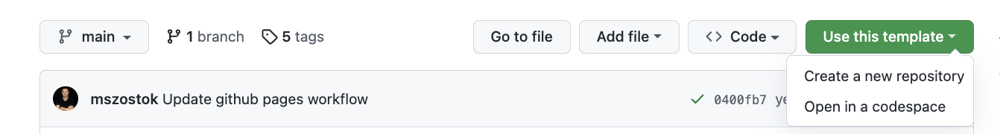

Botkube provides a quick start repository to start developing Botkube [source](../architecture/index.md#source) and [executor](../architecture/index.md#executor) plugins in Go. It has all batteries included; example plugins:

- The [`echo`](https://github.com/mszostok/botkube-plugins-template/blob/main/cmd/echo/main.go) executor that sends back the command that was specified,
- The [`ticker`](https://github.com/mszostok/botkube-plugins-template/blob/main/cmd/ticker/main.go) source that emits an event each time the configured time duration elapses.

and two example release jobs:

- [GitHub releases](https://github.com/mszostok/botkube-plugins-template/blob/main/.github/workflows/release.yml)
- [GitHub Pages](https://github.com/mszostok/botkube-plugins-template/blob/main/.github/workflows/pages-release.yml)

## Use template

1. Navigate to [`botkube-plugins-template`](https://github.com/mszostok/botkube-plugins-template).

2. Click **"Use this template"**, next **"Create a new repository"**

   

   This creates your own plugin repository with a single commit.

3. Decide which release job you prefer, the GitHub releases, or GitHub pages. Once decided, remove one the above workflow in your new repository:

   - GitHub releases, defined at `.github/workflows/release.yml` in your GitHub repository.
   - GitHub Pages, defined at `.github/workflows/pages-release.yml` in your GitHub repository.

4. Update the README.md file to describe the plugins that you created.
