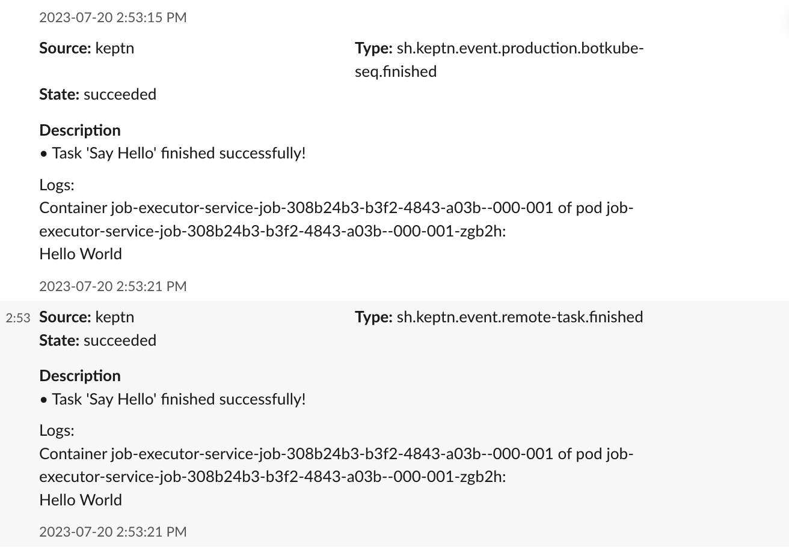

The Botkube Keptn source plugin allows you to consume events from Keptn deployment and notify in configured platforms.

## Get started

### Enable the plugin

Enable the plugin by adding a new [source](../self-hosted-configuration/source.md) plugin to the Botkube configuration:

```yaml
sources:
  # ...
  keptn:
    botkubeExtraPlugins/keptn:
      enabled: true
      config:
        url: "http://api-gateway-nginx.keptn.svc.cluster.local/api" # Keptn API Gateway URL.
        token: "" # Keptn API Token to access events through API Gateway.
        # See the Configuration section for full config properties.

plugins:
  # ...
  repositories:
    botkubeExtraPlugins:
      url: https://github.com/kubeshop/botkube-plugins/releases/download/v1.14.0/plugins-index.yaml
```

Then, use the plugin in your [communication platform](../self-hosted-configuration/communication/index.md).

## Usage

Once it is enabled, Botkube Keptn plugin will consume Keptn events and send them to configured platforms as shown below.



## Configuration

This plugin supports the following configuration:

```yaml
# Keptn API Gateway URL.
url: "http://api-gateway-nginx.keptn.svc.cluster.local/api"
# Keptn API Token to access events through API Gateway.
token: ""
# Optional Keptn project.
project: ""
# Optional Keptn Service name under the project.
service: ""
# Logging configuration
log:
  # Log level
  level: info
```
