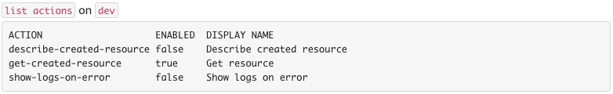
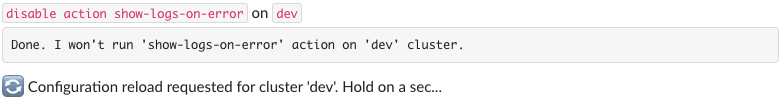
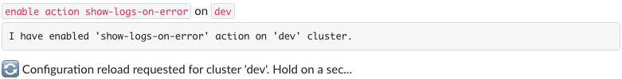

# Automated actions

Actions allow you to automate your workflows by executing custom commands based on specific events. To read how to configure actions, see the [Action](../configuration/action.md) configuration document.

## Manage actions

Botkube allows you to manage actions using `@Botkube` commands.

### List available actions

Run `@Botkube list actions` to get list of configured actions and their running status:

### Disable action

Run `@Botkube disable action {action-name}` to disable an action named `{action-name}`. The action settings are persisted across Botkube app restarts.

When you disable an action, changes are applied once the Botkube is restarted. It is an automated process which usually takes a few seconds.

### Enable action

Run `@Botkube enable action {action-name}` to enable an action named `{action-name}`. The action settings are persisted across Botkube app restarts.

When you enable an action, changes are applied once the Botkube is restarted. It is an automated process which usually takes a few seconds.
