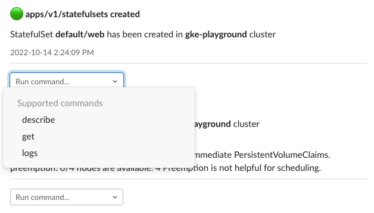
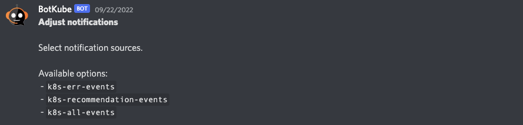

# Event notifications

Botkube sends notifications according to the [sources](../configuration/source.md) configuration.

## Actionable notifications

If you have [`kubectl` executor enabled](../configuration/executor.md) for a given channel, you can run commands related to a resource from the notification itself. Use the dropdown on the left to select and run a given command:

The command dropdown is disabled for resource deletion events. It uses executor bindings to determine which commands are available for a given resource.

:::info
Actionable notifications are only available for the [Slack integration](../installation/slack/index.md) that supports interactive messages. Currently, only a selected list of commands are supported, such as `describe`, `get`, or `logs`.
:::

## Notification formats

Botkube supports two notification formats: `short` and `long`. The `short` format is used by default.

You can change the format by setting the `format` field in the [communication configuration](../configuration/communication/index.md) per a given communication platform.

### Short format

### Long format

## Managing notifications

Depending upon your configuration, you will receive notifications about Kubernetes resources lifecycle events and their health.
Botkube bot allows you to enable/disable notifications on each configured channel separately. Run `@Botkube help`, the bot will reply with the help message about the supported message formats.

### View Botkube configuration

Run `@Botkube config` message from the configured channel where Botkube is added. The bot will reply to you with the configuration with which the controller is running.

To see how to update the configuration, see the [Updating the configuration](../configuration/index.md#updating-the-configuration) section in the Configuration document.

### Change notification sources

To change the notification sources, you can either run the `helm upgrade` command as described in [**View Botkube configuration**](#view-botkube-configuration) or run `@Botkube edit SourceBindings`.

Depending on the communication platform, the possible options are being printed in response message:

<!-- Is this screen shot valuable? -->

or you are able to pick them from an interactive list:

<!-- Is this screen shot valuable? -->

When you save the new notification sources, changes are applied once the Botkube is restarted. It is an automated process which usually takes a few seconds.

### Disable notifications

If you want to stop receiving notifications from Botkube, run `@Botkube disable notifications` from the configured channel where Botkube is added. You will no longer receive notifications from the Botkube in a given communication platform.

The notification settings are persisted across Botkube app restarts.

### Enable notifications

If you want to receive Botkube notifications again, run `@Botkube enable notifications` from the configured channel where Botkube is added.

The notification settings are persisted across Botkube app restarts.

:::note
For MS Teams integration notifications are disabled by default. You need to turn them on manually using this command.
:::

### Check notifier status

Run `@Botkube status notifications` to check if notifications are enabled for a given communication platform.
