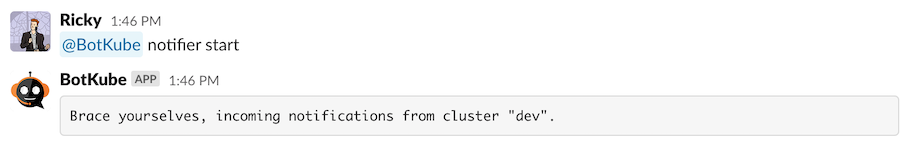

# Event notifications

## Managing notifications

Depending upon your configuration, you will receive notifications about Kubernetes resources lifecycle events and their health.
Botkube bot allows you to enable/disable notifications on each configured channel separately. Run **@Botkube help**, the bot will reply with the help message about the supported message formats.

### View Botkube configuration

Run **@Botkube notifier showconfig** message from the configured channel where Botkube is added. The bot will reply you with the configuration with which the controller is running.

To see how to update the configuration, see the [Updating the configuration](../configuration/index.md#updating-the-configuration) section in the Configuration document.

### Change notification sources

To change the notification sources, you can either run the `helm upgrade` as described in [**View Botkube configuration**](#view-botkube-configuration) or run **@Botkube edit SourceBindings**.

Depending on the communication platform, the possible options are being printed in response message:

or you are able to pick them from an interactive list:

Changes applied via **@Botkube edit SourceBindings** are applied once the Botkube is restarted. It is an automated process, but may take up to 1 minute.

### Disable notifications

If you want to stop receiving notifications from Botkube, run **@Botkube notifier stop** from the configured channel where Botkube is added. You will no longer receive notifications from the Botkube in a given communication platform.

The notification settings are persisted across Botkube app restarts.

### Enable notifications

If you want to receive Botkube notifications again, run **@Botkube notifier start** from the configured channel where Botkube is added.

The notification settings are persisted across Botkube app restarts.

:::note
For MS Teams integration notifications are disabled by default. You need to turn them on manually using this command.
:::

### Check notifier status

Run **@Botkube notifier status** to check if notifications are enabled for a given communication platform.

