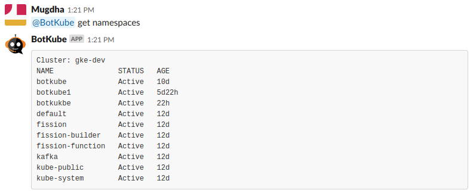
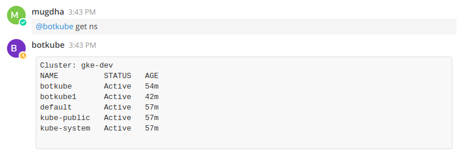
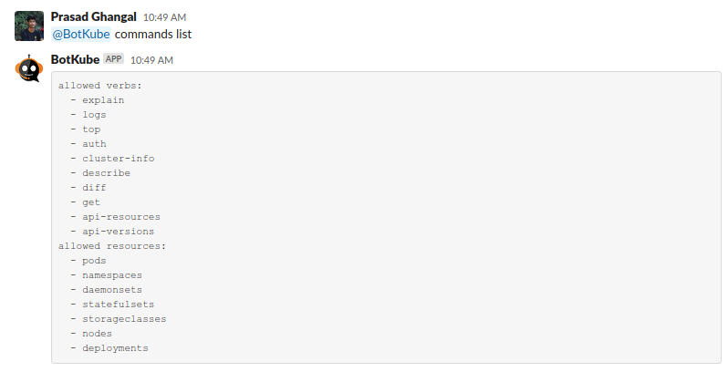
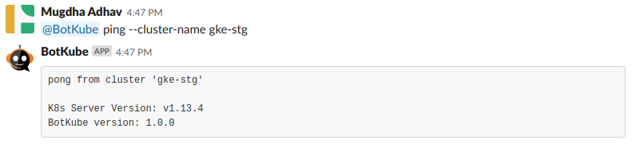

# Executing kubectl commands

Botkube allows you to execute kubectl commands on your Kubernetes cluster. By default, kubectl command execution is disabled. To enable this feature, set `executors.{configuration-name}.kubectl.enabled: true` in [Executor configuration](../configuration/executor).

As suggested in help message, to execute kubectl commands, send message in following format in the channel where Botkube is already added or as a direct message to Botkube.

```
@Botkube {kubectl command with or without `kubectl` prefix} [--cluster-name {cluster_name}]
```

:::info
You can also prefix your commands with `kubectl` , `kc` or `k`.
:::

:::caution
In future, one of the kubectl prefix (`kubectl` , `kc` or `k`) will be required.
:::

This command needs to be executed from configured channel else use `--cluster-name` flag described in the [Specify cluster name](#specify-cluster-name) section.




### Checking allowed commands

While deploying Botkube controller, you can specify which kubectl commands you want to allow Botkube to execute through the [executors configuration](../configuration/executor.md).

To check which commands are allowed for users to execute through Botkube, run **@Botkube commands list**



### Specify cluster name

If you have installed Botkube backend on multiple clusters, you can pass `--cluster-name` flag to execute kubectl command on specific cluster.

To get the list of all clusters configured in botkube, you can use the ping command.


For cluster-specific response, use `--cluster-name` flag to specify the cluster's name on which command needs to be executed.
Use of this flag allows you to get response from any channel or group where Botkube is added.
The flag is ignored in notifier commands as they can be executed from the configured channel only.




See [Examples](../examples/#h-examples) for the use cases.
