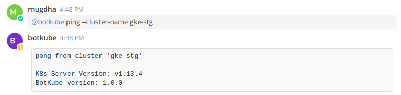
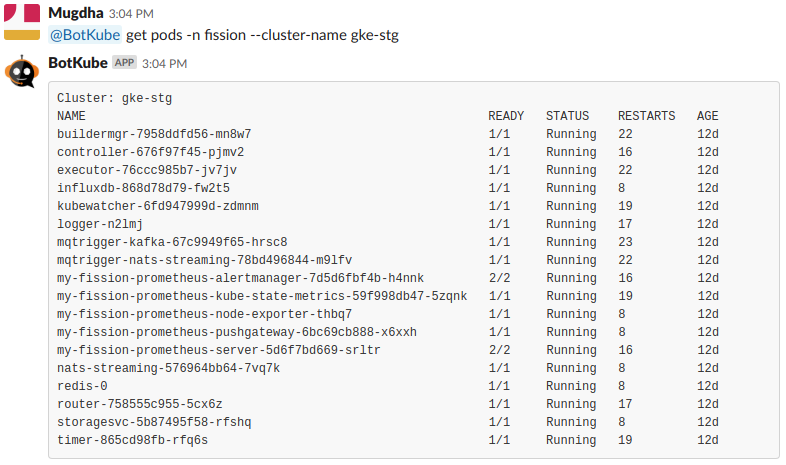

# Executing kubectl commands

Botkube allows you to execute kubectl commands on your Kubernetes cluster. By default, kubectl command execution is disabled. To enable this feature, set `executors.{configuration-name}.kubectl.enabled: true` in [Executor configuration](../configuration/executor).

As suggested in help message, to execute kubectl commands, send message in following format in the channel where Botkube is already added or as a direct message to Botkube.

```
@Botkube {kubectl command with or without `kubectl` prefix} [--cluster-name {cluster_name}]
```

:::info
You can also prefix your commands with `kubectl` , `kc` or `k`.
:::

:::caution
From version `0.17`, one of the kubectl prefixes (`kubectl` , `kc` or `k`) will always be required.
:::

This command needs to be executed from configured channel else use `--cluster-name` flag described in the [Specify cluster name](#specify-cluster-name) section.


## Interactive kubectl commands builder

The interactive `kubectl` command builder allows you to construct a `kubectl` command just by selecting items from dropdowns. It is especially useful with the mobile application when typing the command is harder.

An additional advantage is the resource name dropdown that is pre-populated with all relevant resource names. It increases discoverability and gives you an option to select e.g. a Pod name without the need to type or copy-paste it.

To start the interactive `kubectl` command builder, run **@Botkube k|kc|kubectl** from the configured channel where Botkube is added.


The following policies are applied:

- Verbs, resource types and namespace dropdowns are narrowed down to the `kubectl` permissions in a given channel,
- The `kubectl` command preview is displayed only if the command that you built is valid,
- For resources that are namespace-scoped, the Namespace defined in `executors.{alias}.kubectl.defaultNamespace` is used. If not set, the `default` Namespace is selected.

:::info
Actionable notifications are only available for the [Slack integration](../installation/socketslack/index.md) that supports interactive messages.
:::

## Checking allowed commands

While deploying Botkube controller, you can specify which kubectl commands you want to allow Botkube to execute through the [executors configuration](../configuration/executor.md).

To check which commands are allowed for users to execute through Botkube, run **@Botkube commands list**


## Specify cluster name

If you have installed Botkube backend on multiple clusters, you can pass `--cluster-name` flag to execute kubectl command on specific cluster.

To get the list of all clusters configured in botkube, you can use the ping command.


For cluster-specific response, use `--cluster-name` flag to specify the cluster's name on which command needs to be executed.
Use of this flag allows you to get response from any channel or group where Botkube is added.
The flag is ignored in notifier commands as they can be executed from the configured channel only.






See [Examples](../examples/#h-examples) for the use cases.
