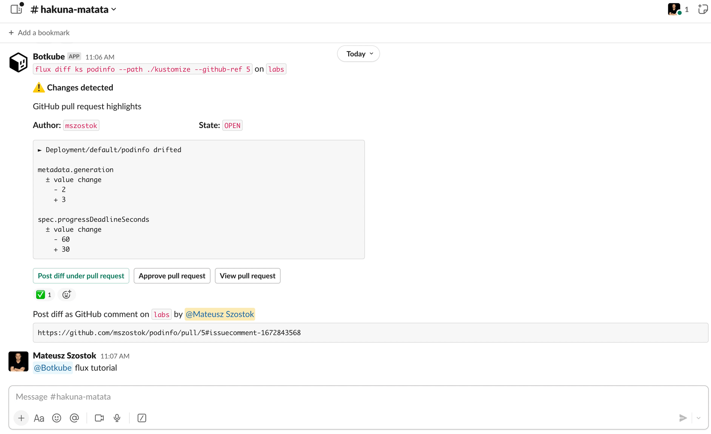

Botkube offers seamless execution of Flux CLI commands within your Kubernetes cluster. By default, Flux command execution is disabled. To enable it, refer to the [**Enabling plugin**](../../configuration/executor/flux.md#enabling-plugin) section.

To execute the `flux` CLI commands, send a message in the channel where Botkube is present. For example:

```
@Botkube flux tutorial
```

## Interactive Usage

We have also incorporated interactivity (tables, etc.) to simplify running Flux CLI commands e.g. from mobile devices.



## Simplified Kustomization Diffing Flow

With the Botkube Flux executor, you can execute a single command to perform a diff between a specific pull request and the cluster state. For instance:

```
@BotKube flux diff kustomization podinfo --path ./kustomize --github-ref [PR Number| URL | Branch]
```


This command automates several tasks:

- Automatically discovering the associated GitHub repository for the given kustomization.
- Cloning the repository.
- Checking out a given pull request.
- Comparing pull request changes with the current cluster state.
- Sharing the diff report.

The diff results are posted on the Slack channel, making it easy for team members to review and discuss the changes. Additionally, the returned message provides additional contextual actions:

- Posting the diff report as a GitHub comment on the corresponding pull request.
- Approving the pull request.
- Viewing the pull request.

### Prerequisite

Before running the `flux diff` command, you need to update the Flux plugin RBAC configuration. This is necessary because the command performs a server-side dry run that requires patch permissions, as specified in the [Kubernetes documentation](https://kubernetes.io/docs/reference/using-api/api-concepts/#dry-run-authorization).

Here's an example RBAC configuration:

```yaml
executors:
  flux:
    botkube/flux:
      enabled: true
      config:
        github:
          auth:
            accessToken: "ghp_"

      context:
        rbac:
          group:
            type: Static
            static:
              values: ["flux-read-patch"]

extraObjects:
  - apiVersion: rbac.authorization.k8s.io/v1
    kind: ClusterRole
    metadata:
      name: flux-read-patch
    rules:
      - apiGroups: ["*"]
        resources: ["*"]
        verbs: ["get", "watch", "list", "patch"]
  - apiVersion: rbac.authorization.k8s.io/v1
    kind: ClusterRoleBinding
    metadata:
      name: flux-read-patch
    roleRef:
      apiGroup: rbac.authorization.k8s.io
      kind: ClusterRole
      name: flux-read-patch
    subjects:
      - kind: Group
        name: flux-read-patch
        apiGroup: rbac.authorization.k8s.io
```
