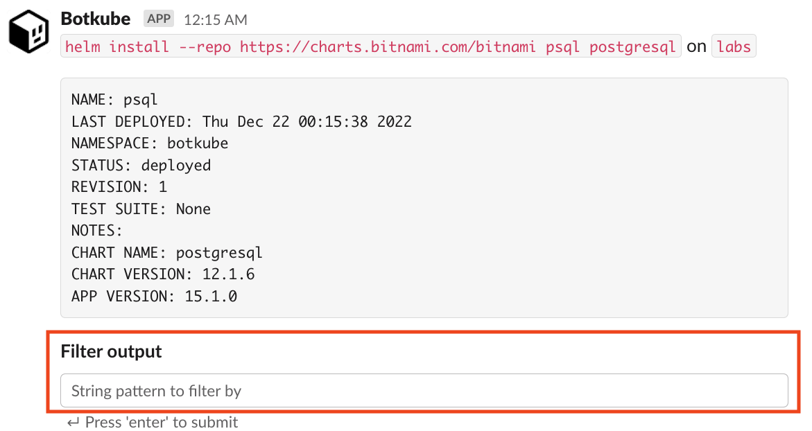

Botkube allows you to execute `helm` commands on your Kubernetes cluster. By default, `helm` command execution is disabled. See the [**Enabling plugin**](../../configuration/executor/helm.md#enabling-plugin) section from the `helm` configuration documentation.

To execute `helm` commands, send message in the following format in the channel where Botkube is already added:

```
@Botkube helm [command] [flags]
```

At least one `helm` executor needs to be enabled and bound to a given channel.

:::caution
Using the interactive filter input field causes the Helm command to be re-executed. Be careful when using it for read-write commands.



This issue is tracked in [botkube#907](https://github.com/kubeshop/botkube/issues/907).
:::

## Supported commands

The Helm executor plugin has the exact same syntax as the Helm CLI. However, not all commands and flags are supported. If an unsupported flag is specified, you will get a dedicated error, e.g:

```
The "--wait" flag is not supported by the Botkube Helm plugin. Please remove it.
```

Additionally, the following flag syntax is not supported:

- No whitespace between short flag name and its value. Instead of `-oyaml`, use `-o yaml`.
- Merging multiple short flags together. Instead of `-Aa`, use `-A -a`.

### Read-only commands

List of the read-only commands:

- `@Botkube helm help` - shows the general Helm plugin help message.
- `@Botkube helm list` - lists all releases on cluster where Botkube is installed.
  - The `--filter` flag is reserved by Botkube. As a result, to use the Helm filter functionality use `-f` instead, e.g. `helm list -f 'ara[a-z]+'`.
- `@Botkube helm status` - displays the status of the named release.
- `@Botkube helm version` - shows the version of the Helm CLI used by this Botkube plugin.

### Read-write commands

For the read-write commands the Botkube RBAC needs to be adjusted. For more information, see the [**Enabling plugin**](../../configuration/executor/helm.md#enabling-plugin) section.

List of the read-write commands:

- `@Botkube helm rollback` - rolls back a given release to a previous revision.
- `@Botkube helm test` - runs tests for a given release.
- `@Botkube helm uninstall` - uninstalls a given release.
- `@Botkube helm upgrade` - upgrades a given release.
- `@Botkube helm install` - installs a given chart to cluster where Botkube is installed. There are two different ways you to install a Helm chart:
  - By absolute URL: `helm install mynginx https://example.com/charts/nginx-1.2.3.tgz`
  - By chart reference and repository URL: `helm install --repo https://example.com/charts/ mynginx nginx`
