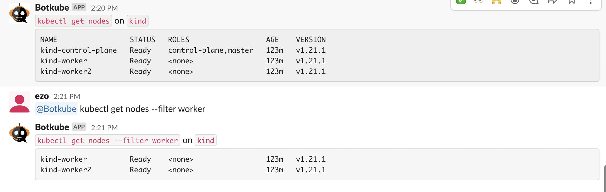
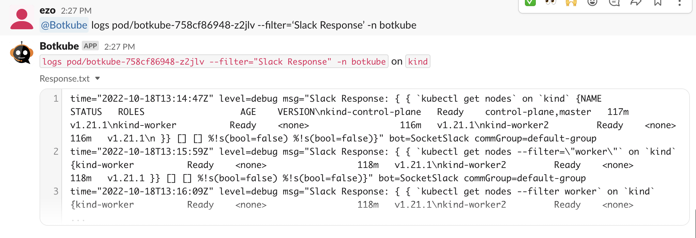

While deploying Botkube, you can specify which [executors](../../configuration/executor) you want to enable.

To check which executors are enabled for users to execute through Botkube, run `@Botkube list executors`

## Specify cluster name

:::info
Multi-cluster approach is supported only the Mattermost and Discord integrations.
:::

If you have installed Botkube backend on multiple clusters, you can pass `--cluster-name` flag to execute kubectl command on specific cluster.

To get the list of all clusters configured in botkube, you can use the ping command.

For cluster-specific response, use `--cluster-name` flag to specify the cluster's name on which command needs to be executed.
Use of this flag allows you to get response from any channel or group where Botkube is added.
The flag is ignored in notifier commands as they can be executed from the configured channel only.

## Filtering text output

Use the `--filter` flag to filter the output of BotKube executor commands. This returns any lines matching the flag's provided value.

The `--filter` flag uses simple string matching. And, only works for BotKube executor commands that return text output, e.g. `kubectl` or `list executors` commands.

### Filtering `kubectl` output

See [Examples](../../examples) for the use cases.
