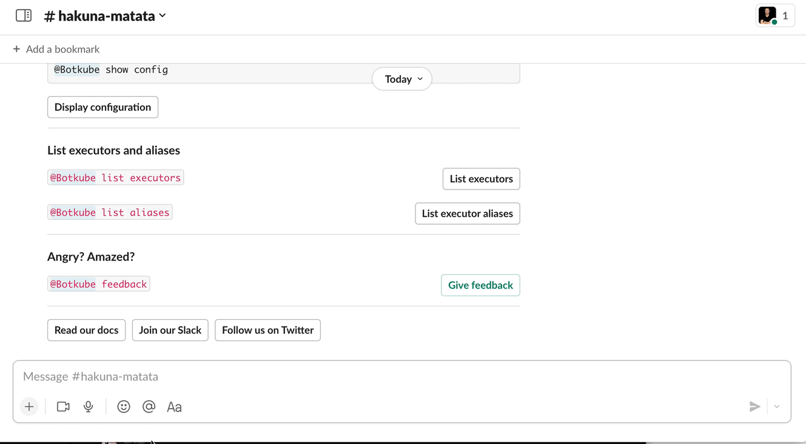

The `x` executor plugin allows you to install and run CLIs directly from a chat window (e.g. Slack, Discord) without any hassle.

:::tip
Interactivity in the form of buttons and dropdowns is also supported. It's crucial as you can easily run all your favourite tools against Kubernetes directly from your phone too.
:::



# Usage

## Install CLI

To install a given CLI binary directly from a chat window, run:

```
@Botkube x install https://get.helm.sh/helm-v3.10.3-linux-amd64.tar.gz --file helm
```

## Execute CLI

To execute a CLI command, run:

```
@Botkube x run helm list -A
```

:::tip
For convenience, you can configure a Botkube alias, to simplify running `helm` commands:

```yaml
aliases:
  helm:
    command: x run helm
    displayName: "Helm CLI alias"
```

Later you can type just, `@Botkube helm list -A`.
:::

## Interactive messages

This section describes how to use Botkube's `x` plugin to handle executed commands and convert them into interactive messages.

The `x` plugin supports templates that describe how to convert the command output into an interactive message. This allows you to select a single item from a dropdown and perform additional actions in the context of the selected item without typing anything.

### Syntax

Here is an example syntax that converts `helm list -A` command into an interactive message using Botkube's `x` plugin:

```yaml
templates:
  - trigger:
      command: "helm list"
    type: "parser:table:space"
    message:
      selects:
        - name: "Release"
          keyTpl: "{{ .Namespace }}/{{ .Name }}"
      actions:
        notes: "helm get notes  {{ .Name }} -n {{ .Namespace }}"
        values: "helm get values {{ .Name }} -n {{ .Namespace }}"
        delete: "helm delete     {{ .Name }} -n {{ .Namespace }}"
      preview: |
        Name:        {{ .Name }}
        Namespace:   {{ .Namespace }}
        Status:      {{ .Status }}
        Chart:       {{ .Chart }}
```

| Field             | Optional | Description                                                                                                                                                                              |
| ----------------- | -------- | ---------------------------------------------------------------------------------------------------------------------------------------------------------------------------------------- |
| `templates`       | No       | An array of templates that define how to convert the command output into an interactive message.                                                                                         |
| `trigger.command` | No       | Specifies the prefix of the command that triggers the template and the parser used to parse the output.                                                                                  |
| `type`            | No       | Specifies the message type.                                                                                                                                                              |
| `message`         | No       | Defines the interactive message that will be displayed to the user.                                                                                                                      |
| `message.select`  | No       | Creates a dropdown menu with a given name, where the items are generated using the `itemKey` parameter.                                                                                  |
| `message.actions` | Yes      | Defines additional actions that can be performed in the context of the selected item. In this example, the user can view notes, values, or delete the selected release.                  |
| `message.preview` | Yes      | Displays a preview of the selected item. Fields `Name`, `Namespace`, `Status`, and `Chart` are generated using the output of the command. It's useful to display only important context. |
