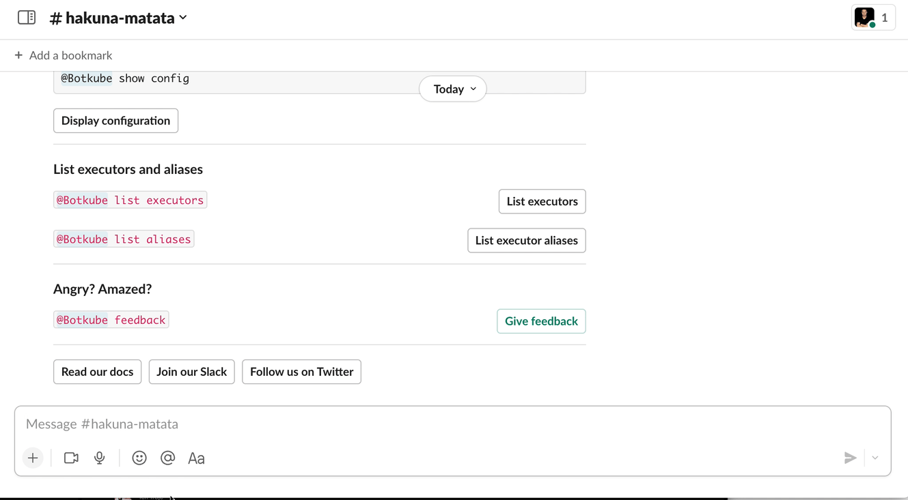
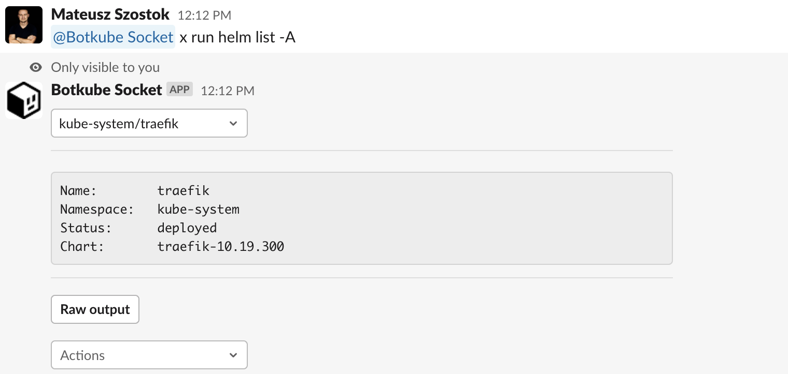

The `exec` executor plugin allows you to install and run CLI applications directly from chat (e.g., Slack, Discord, or Mattermost) without any hassle.

It supports interactivity in the form of buttons and dropdowns. You can easily use all your favorite tools without typing, even from your mobile phone!



:::note
To shorten the command, the `x` alias is used in all examples. Make sure you have it configured for your Botkube installation.

```yaml
aliases:
  x:
    command: exec
    displayName: "Exec alias"
```

In this context, the `x` stands for `extension` or `execution`.
:::

# Usage

## Install CLI

To install a given CLI binary directly from a chat window, run:

```
@Botkube x install {source}
```

For downloading binaries, the `eget` library is used. It supports multiple URL formats and is able to unpack archives and extract binaries from them. For more details, see the documentation on the [`eget`](https://github.com/zyedidia/eget) GitHub repository.

### Examples

- `@Botkube x install https://get.helm.sh/helm-v3.10.3-linux-amd64.tar.gz --file helm`
- `@Botkube x install github.com/fluxcd/flux2`
- `@Botkube x install https://github.com/rikatz/kubepug --asset kubepug_darwin_amd64.tar.gz`

## Execute CLI

To execute a CLI command, run:

```
@Botkube x run {command}
```

### Examples

- `@Botkube x run helm list -A`
- `@Botkube x run flux get sources git`

:::tip
For convenience, you can configure a Botkube alias to simplify running `helm` commands:

```yaml
aliases:
  helm:
    command: x run flux
    displayName: "Flux CLI alias"
```

Later, you can simply type `@Botkube flux get sources git`.
:::

# Templates

The `exec` plugin supports defining templates for executed commands. As a result, you can specify how to process the CLI output or define your own message response.

```yaml
# An array of templates that define how to convert the command output into an interactive message.
templates:
  - trigger:
      command:
        # Specifies the prefix of the command that triggers the template and the parser used to parse the output.
        # If specified, it has higher priority than the regex field.
        prefix: "helm list"
        # Specifies the regex that should match a given command
        # If specified, it has lower priority than the prefix field.
        regex: "regex: '^helm list(?:\s+(-A|-a))*\s?$'"
    # Specifies the message template type.
    type: ""
    # Message template depending on the selected type.
    message: { }
```

Supported template types:

- `parser:table:space`
- `wrapper`
- `tutorial`

Navigate to the [`exec`](https://github.com/kubeshop/botkube/tree/main/cmd/executor/x/templates) plugin directory to see official examples.

import Tabs from "@theme/Tabs";
import TabItem from "@theme/TabItem";

<Tabs groupId="templates">
<TabItem value="table-parser" label="Table parser" default>

The `parser:table:space` template knows how to convert space-separated tables into an interactive message. This allows you to select a single item from a dropdown and perform additional actions in the context of the selected item without typing anything.

For example, such a table:

```
NAME       	NAMESPACE  	REVISION	UPDATED                                	STATUS  	CHART                	APP VERSION
psql       	default    	1       	2023-04-27 19:30:48.042056 +0200 CEST  	deployed	postgresql-12.2.7    	15.2.0
traefik    	kube-system	1       	2023-04-19 20:58:57.709052559 +0000 UTC	deployed	traefik-10.19.300    	2.6.2
traefik-crd	kube-system	1       	2023-04-19 20:58:56.564578223 +0000 UTC	deployed	traefik-crd-10.19.300
```

is displayed as:



The table output is parsed with the following rules:

- All headers are normalized using the [`Title`](https://pkg.go.dev/golang.org/x/text/cases#Title) function. For example:

  - `APP VERSION` is `AppVersion`
  - `NAME` is `Name`
  - `namespace` is `Namespace`

- Empty cells are allowed, and they are printed as an empty string.

By default, the first row is selected and displayed in the message. The `actions` and `preview` properties are rendered in the context of the selected row.

### Syntax

Here is an example syntax that converts the `helm list -A` command into an interactive message:

```yaml
type: "parser:table:space"
message:
  # Creates a dropdown menu with a given name, where the items are generated using the `keyTpl` parameter.
  selects:
    - name: "Release"
      keyTpl: "{{ .Namespace }}/{{ .Name }}"

  # Defines additional actions that can be performed in the context of the selected item. In this example, the user can view notes, values, or delete the selected release.
  # optional
  actions:
    notes: "helm get notes  {{ .Name }} -n {{ .Namespace }}"
    values: "helm get values {{ .Name }} -n {{ .Namespace }}"
    delete: "helm delete     {{ .Name }} -n {{ .Namespace }}"

  # Displays a preview of the selected item. Fields `Name`, `Namespace`, `Status`, and `Chart` are generated using the output of the command. It's useful to display only important context.
  # optional
  preview: |
    Name:        {{ .Name }}
    Namespace:   {{ .Namespace }}
    Status:      {{ .Status }}
    Chart:       {{ .Chart }}
```

</TabItem>

<TabItem value="wrapper" label="Wrapper" default>

The wrapper template allows adding extra buttons to the CLI output without modifying the output itself. It's useful to attach some pre-defined commands.

### Syntax

Here is an example syntax to add two predefined buttons to a given output message:

```yaml
type: "wrapper"
message:
  buttons:
    - # Button name
      name: "Get Help"
      # URL to open on click.
      url: "https://example.com/help"
    - # Button name
      name: "Initialize"
      # Button command to run. Use `{{BotName}}` placeholder for commands that should be executed by Botkube
      command: "{{BotName}} x run flux install"
      # Button style, supported values: primary, danger
      style: "primary"
```

</TabItem>

<TabItem value="tutorial" label="Tutorial" default>

The tutorial template allows you to define a custom response for a given command. For example, when the trigger command is set to `trigger.comand.prefix: "quickstart helm"` and a user types `@Botkube x run quickstart helm`, the command itself is not executed. Instead, a defined tutorial message is returned.

```yaml
type: "tutorial"
message:
  # Pagination rules
  paginate:
    # Maximum number of rendered buttons per page
    page: 5
  # Message header
  header: "Helm Quick Start tutorial"
  # Tutorial steps that are rendered in a given order.
  buttons:
    - # Button name
      name: "Global Help"
      # Button description to display on the left side of the button.
      description: "{{BotName}} helm help"
      # Button command to run. Use `{{BotName}}` placeholder for commands that should be executed by Botkube
      command: "{{BotName}} x run helm help"
    - name: "Version"
      description: "{{BotName}} helm version"
      command: "{{BotName}} x run helm version"
```

</TabItem>
</Tabs>
