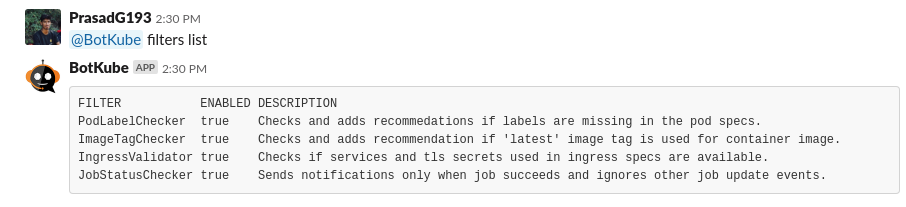

# Filters

Filters allows you to process incoming events and filter out the ones you don't want to see.
To read how to develop your own filter, see the [Custom filter development](./development.md) guide.

## Manage filters

Botkube allows you to manage filters using **@Botkube** commands.

### List available filters

Run **@Botkube filters list** to get list of available filters and their running status:



### Disable filter

Run **@Botkube filters disable {filter-name}** to disable a filter named `{filter-name}`.

The filter settings are persisted across Botkube app restarts.


### Enable filter

Run **@Botkube filters enable {filter-name}** to enable a filter named `{filter-name}`.

The filter settings are persisted across Botkube app restarts.


## Filter and forward events using annotations

Using [Kubernetes resource annotations](https://kubernetes.io/docs/concepts/overview/working-with-objects/annotations/), you can:

- ignore events on a specific resource,
- forward notification about specific resource to different channel then the configured one.

### Ignore events

The annotation `botkube.io/disable: true` disables event notifications for the annotated object.
For example, all events related to the Pod will be ignored, even if the configuration is set to notify about all Pod events:

```yaml
apiVersion: v1
kind: Pod
metadata:
  name: annotations-demo
  annotations:
    botkube.io/disable: "true"
spec:
  containers:
    - name: nginx
      image: nginx:1.14.2
      ports:
        - containerPort: 80
```

### Send notification to non-default channel

The annotation `botkube.io/channel: {channel_name}` sends events notifications of the annotated object to the mentioned channel.
Notification forwarding via annotation is supported only for Slack, Slack legacy and Mattermost integrations.

:::note
Make sure that you have added Botkube in the channel you want to send notification in.
:::

For example, all events related to the Pod will be sent to the channel `#forwarded-channel`:

```yaml
apiVersion: v1
kind: Pod
metadata:
  name: annotations-demo
  annotations:
    botkube.io/channel: "forwarded-channel"
spec:
  containers:
    - name: nginx
      image: nginx:1.14.2
      ports:
        - containerPort: 80
```
