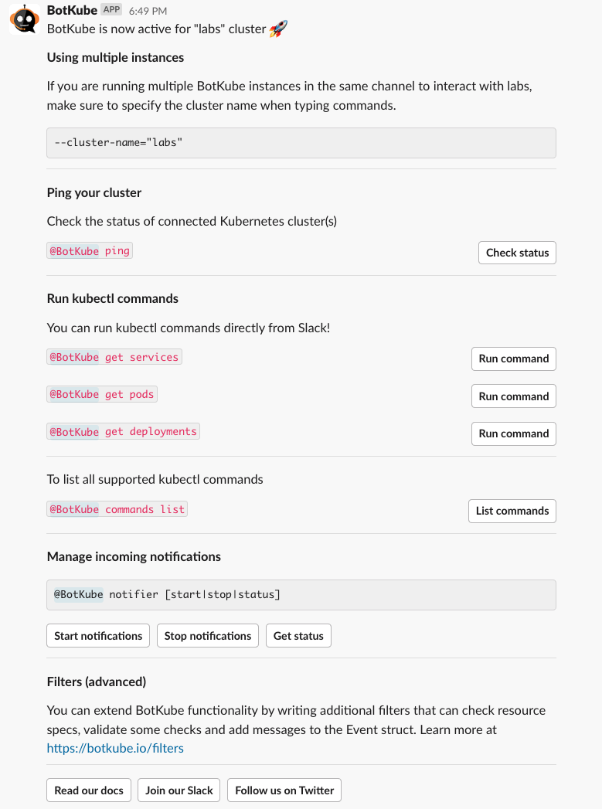
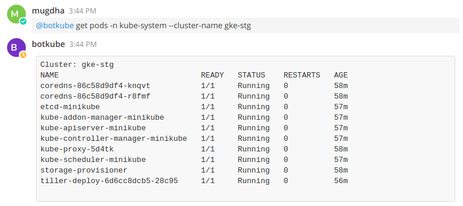
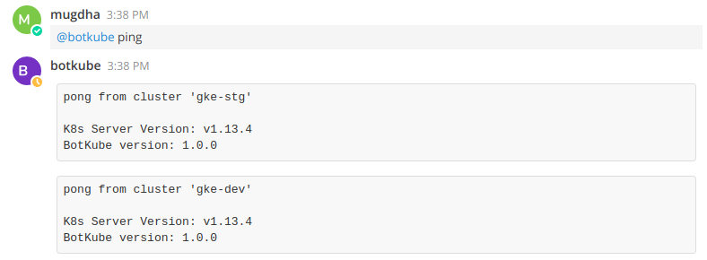
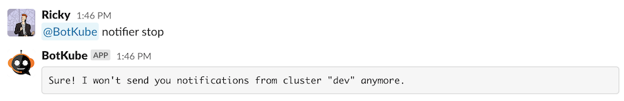

## Debugging deployments using BotKube

@BotKube allows you to execute kubectl commands on your Kubernetes cluster.
Run **@BotKube help** to find more information about the supported commands.



By default, kubectl command execution is disabled. To enable this feature, set `settings.kubectl.enabled: true` in <a href="../configuration/#resource-config-yaml-syntax">resource_config</a>.

As suggested in help message, to execute kubectl commands, send message in following format in the channel where BotKube is already added or as a direct message to BotKube.

```
@BotKube <kubectl command without `kubectl` prefix> [--cluster-name <cluster_name>]
```

### Checking allowed commands

While deploying BotKube controller, you can specify which kubectl commands you want to allow BotKube to execute through <a href="../configuration">configuration</a>.

To check which commands are allowed for users to execute through BotKube, run **@BotKube commands list**


### Run Kubectl commands

BotKube configuration allows you to give execution of kubectl commands

Run **@BotKube < kubectl command without kubectl prefix >** to get kubectl response from the cluster configured with the channel.
This command needs to be executed from configured channel else use `--cluster-name` flag described below.


### Specify cluster name

If you have installed BotKube backend on multiple clusters, you can pass `--cluster-name` flag to execute kubectl command on specific cluster.

To get the list of all clusters configured in botkube, you can use the ping command.


For cluster-specific response,
use `--cluster-name` flag to specify the cluster's name on which command needs to be executed.
Use of this flag allows you to get response from any channel or group where BotKube is added.
The flag is ignored in notifier commands as they can be executed from the configured channel only.




See [Examples](../examples/#h-examples) for the use cases.

## Check BotKube health

Run **@BotKube ping** to the channel where BotKube is added. The BotKube will respond you with the **PONG** message from all the configured clusters. Use `--cluster-name` flag to get response from the cluster mentioned in the flag. Else check the deployment in Kubernetes cluster in the **botkube** namespace.




## Managing notifications

Depending upon your configuration, you will receive notifications about Kubernetes resources lifecycle events and their health.
BotKube bot allows you to enable/disable notifications on each configured channel separately. Run **@BotKube help**, the bot will reply with the help message about the supported message formats.

### View BotKube configuration

Run **@BotKube notifier showconfig** message from the configured channel where BotKube is added. The bot will reply you with the configuration with which the controller is running.

If you wish to change the configuration, you can run **helm upgrade**:

```bash
export CLUSTER_NAME={cluster_name}
export ALLOW_KUBECTL={allow_kubectl}

helm upgrade botkube \
--set settings.clusterName=${CLUSTER_NAME} \
--set executors.kubectl-read-only.kubectl.enabled=${ALLOW_KUBECTL} \
helm/botkube
```

OR

You can also modify the controller configuration at runtime. You have to edit the configmap which will also restart the BotKube pod to update mounted configuration in the pod.

```bash
kubectl edit configmap botkube-global-config -n botkube
```

This command will open configmap specs in vim editor. Do the required changes, save and exit. The BotKube pod will automatically restart to have these configuration in effect.

### Disable notifications

If you want to stop receiving notifications from BotKube, run **@BotKube notifier stop** from the configured channel where BotKube is added. You will no longer receive notifications from the BotKube in a given communication platform.



### Enable notifications

If you want to receive BotKube notifications again, run **@BotKube notifier start** from the configured channel where BotKube is added.

:::note
For MS Teams integration notifications are disabled by default. You need to turn them on manually using this command.
:::


### Check notifier status

Run **@BotKube notifier status** to check if notifications are enabled for a given communication platform.


## Manage filters

BotKube allows you to manage filters using @BotKube commands

### List available filters

Run **@BotKube filters list** to get list of available filters and their running status


### Disable filter

Run **@BotKube filters disable {filter-name}** to disable perticular filter to skip checks on resource specs


### Enable filter

Run **@BotKube filters enable {filter-name}** to enable perticular filter to run checks on resource specs


## Filter events using Annotations

Using Annotations, it is possible -

- to make BotKube ignore events on a specific resource
- Send notification about specific resource to different channel and the configured one

### Ignore events

Annotation `botkube.io/disable: true` disables event notifications for the annotated object.

### Send notification to non-default channel

Annotation `botkube.io/channel: <channel_name>` sends events notifications of the annotated object to the mentioned channel.

:::note
Make sure that you have added BotKube in the channel you want to send notification in
:::
