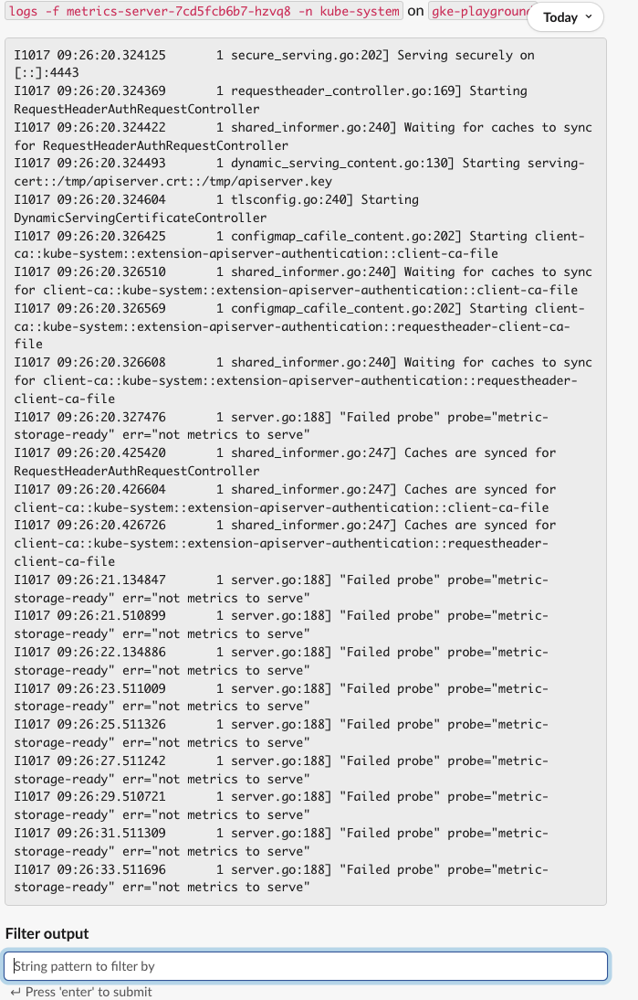
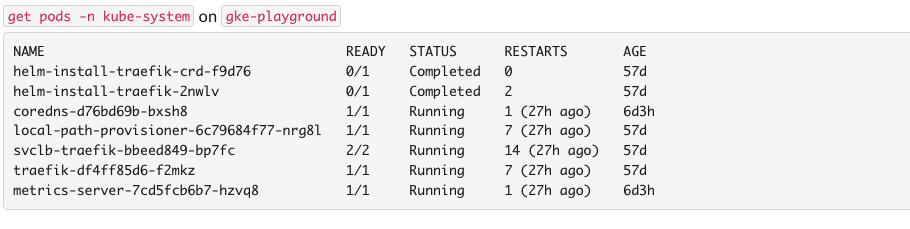

Sometimes you can get long response from a certain command and you may want to filter that to see a subset of the actual result.
while you can achieve that with `--filter` param at the end of your command, there is another option to handle that with interactive
output filtering. Interactivity is achieved via an input action text box where you can add your filter criteria as text and press `Enter`.

:::info
Output Filter input text box will be attached to your command response if response has more than 15 lines. Let's see an example for this situation.
:::

1. List pods with `@Botkube get pods -n kube-system`

2. Let's check the logs of `metrics-server` with `@Botkube logs -f metrics-server-7cd5fcb6b7-hzvq8 -n kube-system`

3. Notice that Filter Output is attached to response. Type `RequestHeaderAuthRequestController` to filter and press `Enter`.

:::info
Command response is uploaded as text file once the actual size of response message reaches the limit of messaging platform. Let's take a look how Filter Output behaves for this situation. 
:::

1. List the pods with `@Botkube get pods -n kube-system`
   
2. Let's check the logs of Traefik with command `@Botkube logs -f traefik-df4ff85d6-f2mkz -n kube-system`. Notice that, you might have different pod list, so please select a suitable one for your case.
   
3. Since the response is big, it is uploaded as file and you can realize a reply thread. Please expand it to see filter output.
4. Assume we want to see log lines only containing `Configuration` word. Type `Configuration` in the Filter Output input box and click enter. You will see filtered result as a response.
   