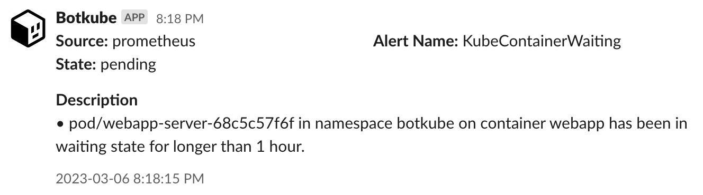

Botkube allows you to consume `prometheus` alerts on your Kubernetes cluster. By default, `prometheus` plugin is disabled. See the [**Enabling plugin**](../../configuration/source/prometheus#enabling-plugin) section from the `prometheus` configuration documentation.

Once it is enabled, Botkube Prometheus plugin will consume Prometheus alerts and send them to configured platforms as shown below.

)
