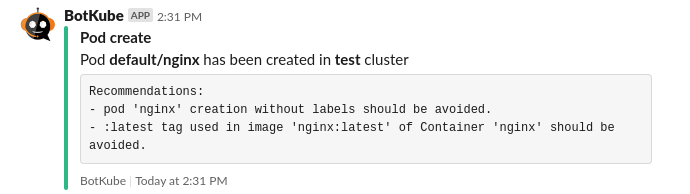

You can extend Botkube functionality by writing additional filters. The **FilterEngine** runs these filters on the Event struct before forwarding it as a notification to a channel. These filters can check resource specs, validate some checks and add messages to the Event struct.

We have already defined a filter to add suggestions in the notifications if container image in pod specs is using **latest** tag.



**Let's see, how we can write a filter like this.**

## A. Writing a filter

Prerequisites:

- As of now, you can write filters only using Go language. So you need to be familiar with it.
- Understanding of Kubernetes Objects needed (https://kubernetes.io/docs/concepts/overview/working-with-objects/kubernetes-objects/)

### 1. Create a new .go file

Create a new file (e.g image_tag_checker.go) in **botkube/pkg/filterengine/filters/** directory

Set package name as "filters" and import required packages:

```go
package filters

import (
	"strings"

	"github.com/sirupsen/logrus"
	apiV1 "k8s.io/api/core/v1"

	"github.com/kubeshop/botkube/pkg/events"
)
```

### 2. Create a structure and implement "Run() and Describe()" methods for the struct.

FilterEngine has an interface Filter defined for the filters:

```go
type Filter interface {
	Run(context.Context, *events.Event)
	Name() string
	Describe() string
}
```

Create a struct which implements the Filter interface. Use logger instance taken as an argument from the constructor:

```go
// NamespaceChecker ignore events from disallowed namespaces.
type NamespaceChecker struct {
	log logrus.FieldLogger
}

// NewNamespaceChecker creates a new NamespaceChecker instance
func NewNamespaceChecker(log logrus.FieldLogger) *ImageTagChecker {
	return &NamespaceChecker{log: log}
}

// Run filer and modifies event struct
func (f *NamespaceChecker) Run(ctx context.Context, event *events.Event) {

	// your logic goes here

}

// Name returns the filter's name
func (f *NamespaceChecker) Name() string {
	return "NamespaceChecker"
}

// Describe describes the filter
func (f *ImageTagChecker) Describe() string {
	return "Checks if event belongs to blocklisted namespaces and filter them."
}
```

### 3. Add your logic in the Run() function

Now, put your logic in the **Run()** function to parse resource object, run validation and modify Event struct. The fields in the Event struct can be found [here](https://github.com/kubeshop/botkube/blob/main/pkg/events/events.go).

```go
// Run filters and modifies event struct
func (f *NamespaceChecker) Run(_ context.Context, event *events.Event) error {
	// Skip filter for cluster scoped resource
	if len(event.Namespace) == 0 {
		return nil
	}

	for _, resource := range f.configuredResources {
		if event.Resource != resource.Name {
			continue
		}
		shouldSkipEvent := !resource.Namespaces.IsAllowed(event.Namespace)
		event.Skip = shouldSkipEvent
		break
	}
	f.log.Debug("Ignore Namespaces filter successful!")
	return nil
}
```

### 4. Register your filter in the Filter Engine

Open [**pkg/filterengine/with_all_filters.go**](https://github.com/kubeshop/botkube/blob/main/pkg/filterengine/with_all_filters.go) file and call the constructor of your new filter in the `WithAllFilters` method:

```go
// WithAllFilters returns new DefaultFilterEngine instance with all filters registered.
func WithAllFilters(logger *logrus.Logger, dynamicCli dynamic.Interface, mapper meta.RESTMapper, conf *config.Config) *DefaultFilterEngine {
	filterEngine := New(logger.WithField(componentLogFieldKey, "Filter Engine"))
	filterEngine.Register([]Filter{
		filters.NewNodeEventsChecker(logger.WithField(filterLogFieldKey, "Node Events Checker")),
		// ...

		// Your filter goes here:
		filters.NewNamespaceChecker(logger.WithField(filterLogFieldKey, "Namespace Checker"), res), // make sure to use `logger.WithField`
	}...)

	return filterEngine
}
```

## B. Rebuild and deploy the Botkube backend

- Build the Botkube backend docker image with `make container-image`.
- Push the image to Dockerhub registry.
- Install/Upgrade your Botkube deployment (Steps are provided [here](../installation)).

_The implementation of built-in filters can be found at: https://github.com/kubeshop/botkube/tree/main/pkg/filterengine/filters_
