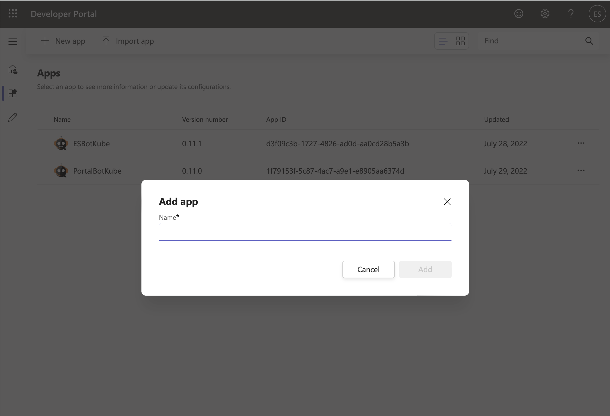
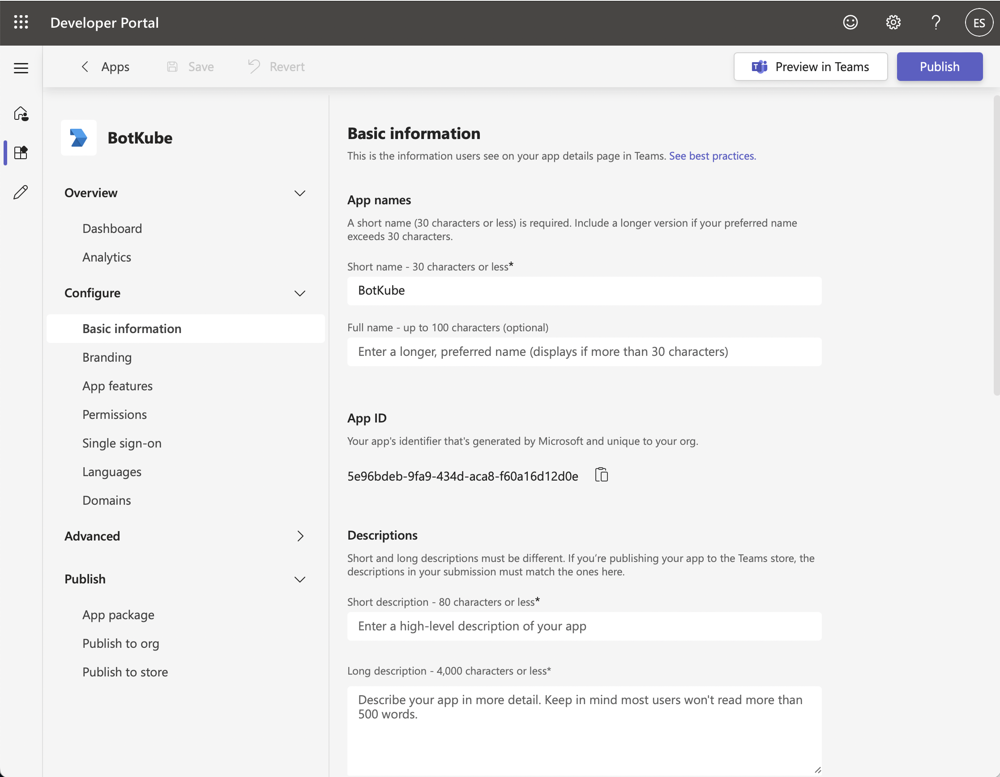
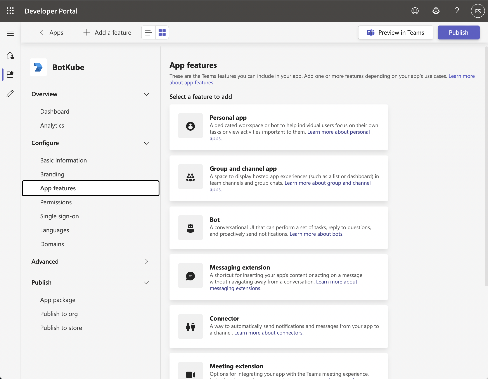
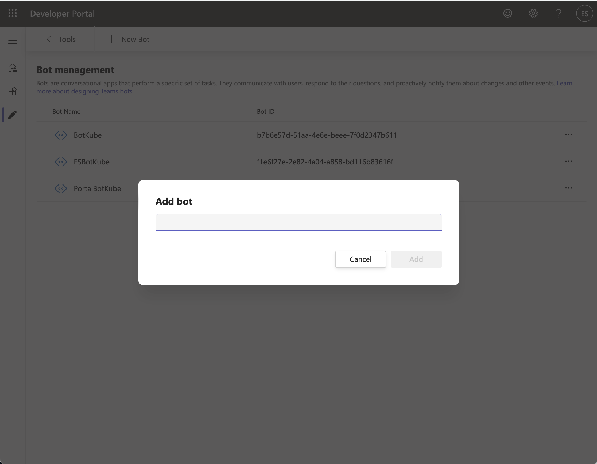
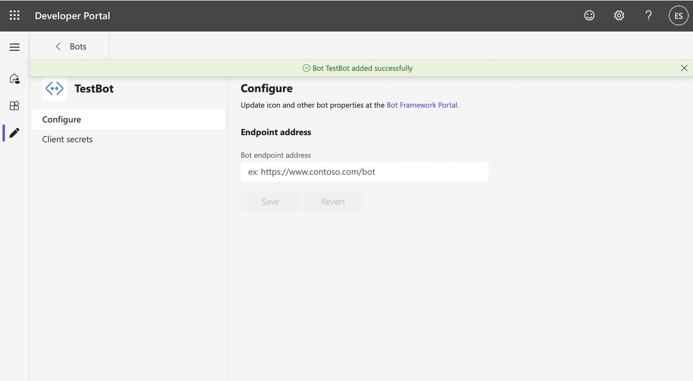
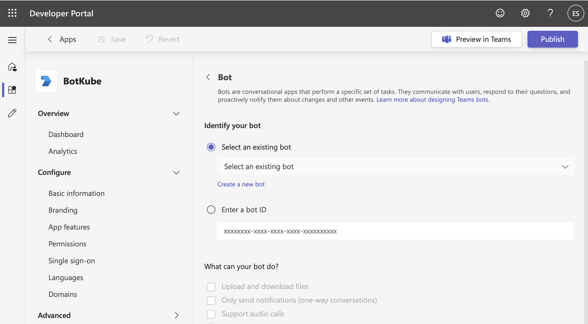
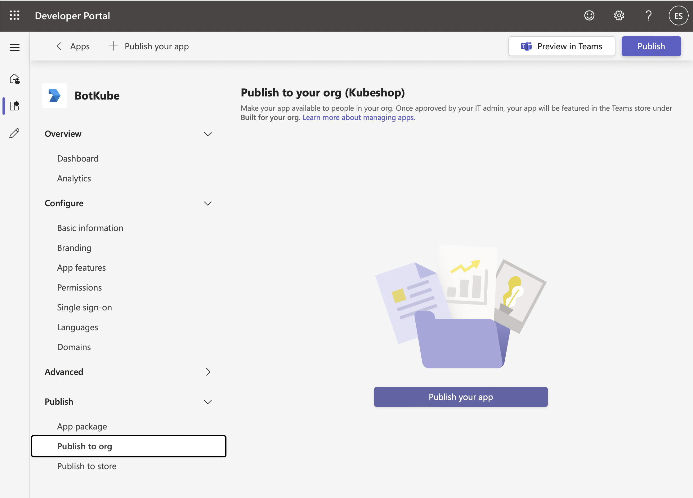
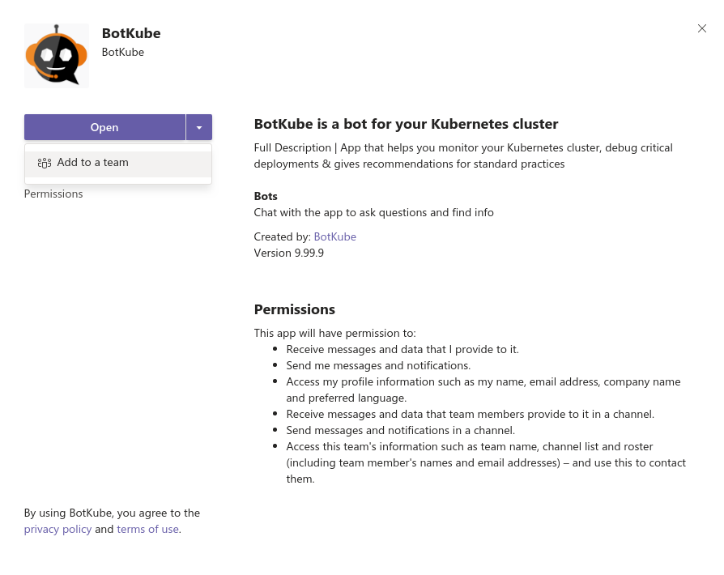
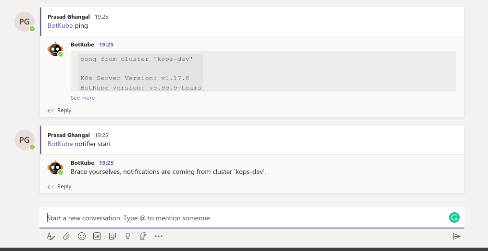

1. Register BotKube as a bot with Microsoft Bot Framework.
2. Deploy the BotKube controller.
3. Add the BotKube app to a channel and enable notifications.

## Prerequisites

Unlike Slack/Mattermost, MS Teams apps communicate with backends by sending POST requests to the public endpoints. So to establish communications between Teams app and respective backend, it needs to be reachable from the outside world.

Now there are few different ways to enable access to the K8s Service from the outside cluster.
We will be discussing the most common way i.e exposing using [ingress](https://kubernetes.io/docs/concepts/services-networking/ingress/) resources.

Before we start, make sure you have -

- a domain name with the ability to configure DNS
- TLS cert and key for the registered domain name to configure SSL termination
- nginx-ingress controller deployed on your cluster

## A. Register BotKube as a bot with Microsoft Bot Framework.

We will use the "Developer Portal for Teams" to register and install BotKube as an app on MS Teams.

But first, ensure that you have [registered the app in Azure Active Directory](https://docs.microsoft.com/en-us/azure/active-directory/develop/howto-create-service-principal-portal#register-an-application-with-azure-ad-and-create-a-service-principal) - you'll need the "Application (client) ID" to fully configure your app.

Then, configure your app by following the steps below,

1. Log into [Developer Portal for Teams](https://dev.teams.microsoft.com).

2. Click on the "Apps" left-hand side menu item and choose "+ New app"

   

3. You'll see an "Add app" pop-up. Add an app name.

4. You should now see your app listed in the "Apps" table, Click the app to continue.

5. Fill in the App details in the "Configure/Basic information" section.

   | Field                                 | Value                                                                                                                          |
   | ------------------------------------- | ------------------------------------------------------------------------------------------------------------------------------ |
   | App name / Short name                 | BotKube                                                                                                                        |
   | Descriptions / Short description      | BotKube is a bot for your Kubernetes cluster                                                                                   |
   | Descriptions / Long description       | App that helps you monitor your Kubernetes cluster, debug critical deployments & gives recommendations for standard practices. |
   | Version                               | 0.13.0                                                                                                                         |
   | Developer Information / Developer ... | BotKube                                                                                                                        |
   | Developer Information / Website       | https://botkube.io                                                                                                             |
   | App URLs / Privacy policy             | https://botkube.io/privacy                                                                                                     |
   | App URLs / Terms of use               | https://botkube.io/license                                                                                                     |
   | Application (client) ID               | Add the Application (client) ID you obtained from Azure Active Directory                                                       |

   

6. Click the "Save" button to save your details.

7. Navigate to "Configure / Branding" left-hand side menu item. Click to open the "Branding" section.

8. Download BotKube icons from https://github.com/kubeshop/botkube/tree/main/branding/logos and update Branding icons.

### Add the Bot feature to the App

On the left-hand side menu click "Configure / App features"

1. In "App features / Select a feature to add", click the "Bot" button

   

2. In "Bot / Identify your bot", select "Create a bot", click the "+ New Bot" and enter a name for the Bot. Export it also as the `BOT_NAME` environment variable.

   

   ```
   export BOT_NAME={name}
   ```

3. In the "Configure" screen, set the **Endpoint address**.
   The Endpoint address is the URL on which BotKube backend listens for incoming requests from MS Teams. While deploying the BotKube backend you can give an option to expose BotKube via Ingress. Please check the [prerequisites](./#prerequisites) for more details. The default URL format is: `{your_domain}/bots/teams/v1/messages`. For example, `https://example.com/bots/teams/v1/messages`.

   

4. Navigate to the "Client secret" screen, then click the "Add a client secret for your bot". Export it as the `APPLICATION_PASSWORD` environment variable.

   ```
   export APPLICATION_PASSWORD={client_secret}
   ```

5. Navigate back the Bot management screen, and **copy the Bot ID displayed next to the Bot name in the table**. Export it also as the `APPLICATION_ID` environment variable.

   ```
   export APPLICATION_ID={id}
   ```

6. Navigate to the Apps section, select your App, click "Configure / App features", select "Bot".

7. In "Identify your bot / Select an existing bot", select the bot you just created.

   

8. In "Bot / Identify your bot" enable

   - What can your bot do?: **[x] Upload and download files**
   - Select the scopes in which people can use this command: **[x] Personal** & **[x] Team**

9. Then click "Save".

### Install Bot to Teams

Go to "Publish / Publish to org" and click on **Publish your app** to install the BotKube app on MS Teams for your org.



An admin has to approve this app in the [Teams Admin Centre](https://admin.teams.microsoft.com/policies/manage-apps).

:::note
If you face "You don't have permissions to add BotKube to this team.", contact your admin to provide an access to install apps on teams.<br/>
If you are using a free version of teams which does not have an admin center, you can click on **Download** to download the app manifest and then choose **Upload a custom app** option in the App center to install the app.
:::

## B. Deploy BotKube controller

The BotKube app we created on Teams sends messages to the endpoint we provided while configuring the app. To POST the requests to the BotKube controller, it needs to be reachable from the outside world.

Now there are few different ways to enable access to the K8s Service from the outside cluster. But we will be discussing the most common way i.e exposing using [ingress](https://kubernetes.io/docs/concepts/services-networking/ingress/) resources.

### Prerequisites

Before we start, make sure you have:

- a domain name with the ability to configure DNS
- TLS cert and key for the registered domain name to configure SSL termination
- nginx-ingress controller deployed on your cluster

Create a Kubernetes TLS Secret in the `botkube` namespace:

```bash
kubectl create namespace botkube
kubectl create secret tls botkube-tls -n botkube --cert=/path/to/cert.pem --key=/path/to/privatekey.pem
```

We use this TLS Secret while deploying the BotKube backend.

- We use [Helm](https://helm.sh/) to install BotKube in Kubernetes. Follow [this](https://docs.helm.sh/using_helm/#installing-helm) guide to install helm if you don't have it installed already.
- Add **botkube** chart repository:

  ```bash
  helm repo add botkube https://charts.botkube.io
  helm repo update
  ```

- Deploy BotKube backend using **helm install** in your cluster:

  ```bash
  export CLUSTER_NAME={cluster_name}
  export ALLOW_KUBECTL={allow_kubectl}
  export HOST={host} # e.g. example.com

  helm install --version v0.13.0 botkube --namespace botkube --create-namespace \
  --set communications.default-group.teams.enabled=true \
  --set communications.default-group.teams.appID=${APPLICATION_ID} \
  --set communications.default-group.teams.appPassword=${APPLICATION_PASSWORD} \
  --set communications.default-group.teams.botName=${BOT_NAME} \
  --set settings.clusterName=${CLUSTER_NAME} \
  --set executors.kubectl-read-only.kubectl.enabled=${ALLOW_KUBECTL} \
  --set ingress.create=true \
  --set ingress.host=${HOST} \
  --set ingress.tls.enabled=true \
  --set ingress.tls.secretName=botkube-tls \
  botkube/botkube
  ```

  where,

  - **APPLICATION_ID** is the BotKube application ID generated while registering Bot to Teams<br/>
  - **APPLICATION_PASSWORD** is the BotKube application password generated while registering Bot to Teams<br/>
  - **BOT_NAME** is the bot name set while registering Bot to Teams (usually it is `BotKube`)<br/>
  - **CLUSTER_NAME** is the cluster name set in the incoming messages<br/>
  - **ALLOW_KUBECTL** set true to allow kubectl command execution by BotKube on the cluster<br/>
  - **HOST** is the Hostname of endpoint provided while registering BotKube to Teams<br/>
  - **URLPATH** is the path in endpoint URL provided while registering BotKube to Teams<br/>
  - **TLS_SECRET_NAME** is the K8s TLS secret name for the SSL termination<br/>

  Configuration syntax is explained [here](../../configuration). A Full Helm chart parameters list is documented [here](../../configuration/helm-chart-parameters).

- Send **@BotKube ping** in the channel to see if BotKube is running and responding.

  With the default configuration, BotKube will watch all the resources in all the namespaces for _create_, _delete_ and _error_ events.

  If you wish to monitor only specific resources, follow the steps given below:

  1. Create a new `config.yaml` file and add Kubernetes resource configuration as described on the [source](../../configuration/source) page.
  2. Pass the YAML file as a flag to `helm install` command, e.g.:

     ```
     helm install --version v0.13.0 --name botkube --namespace botkube --create-namespace -f /path/to/config.yaml --set=...other args..
     ```

  Alternatively, you can also update the configuration at runtime as documented [here](../../configuration/#updating-the-configuration-at-runtime)

### Verify if BotKube endpoint is reachable

Curl on the endpoint to confirm that the BotKube endpoint is reachable and serving the requests.

```bash
curl -k https://<HOST>/<URLPATH>
Authentication headers are missing in the request # Expected response
```

If you get 404, please check the ingress configuration or endpoint you configured while registering the app.

## Add BotKube to a channel

1. Go to Apps and select BotKube.

2. Click the drop-down option besides the "Open" button. That should show "Add to a team" option.
   

3. Type and select the channel name in which you want to receive notifications.

4. Once added, browse to the channel and type `@BotKube ping` to make sure BotKube is responding.
   If BotKube responds, send `@BotKube notifier start` to enable notifications.
   

## Remove BotKube from Kubernetes cluster

Execute the following command to completely remove BotKube and related resources from your cluster.

```bash
helm uninstall botkube
```
