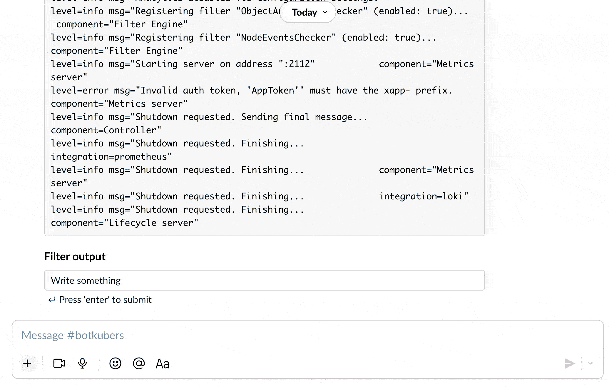

:::caution
From version `0.17`, one of the kubectl prefixes (`kubectl` , `kc` or `k`) are always required.
:::

Botkube allows you to execute `kubectl` commands on your Kubernetes cluster. By default, kubectl command execution is disabled. See the [**Enabling plugin**](../../configuration/executor/kubectl.md#enabling-plugin) section from the `kubectl` configuration documentation.

To execute the `kubectl` commands, send message in following format in the channel where Botkube is already added:

```
@Botkube k|kc|kubectl [verb] [resource] [flags]
```

This command needs to be executed from configured channel.

## Interactive kubectl commands builder

Use the interactive `kubectl` command builder to construct a `kubectl` command just by selecting items from dropdowns. This is especially useful on mobile when typing the command is harder.

The builder includes a resource name dropdown list. This is pre-populated with all the relevant resource names. It's great for discovering resources with the option to select them. E.g. Just grab a Pod name without needing to type or copy-and-paste.

To start the interactive `kubectl` command builder, run `@Botkube k|kc|kubectl` from the configured channel where Botkube is added.



The following policies are applied:

- Verbs, resource types and namespace dropdowns are narrowed down to the `kubectl` permissions in a given channel,
- The `kubectl` command preview is displayed only if the command that you built is valid,
- For resources that are namespace-scoped, the Namespace defined in `executors.{alias}.kubectl.defaultNamespace` is used. If not set, the `default` Namespace is selected.

:::info
Actionable notifications are only available for the [Slack integration](docs/installation/slack/index.md) that supports interactive messages.
:::
