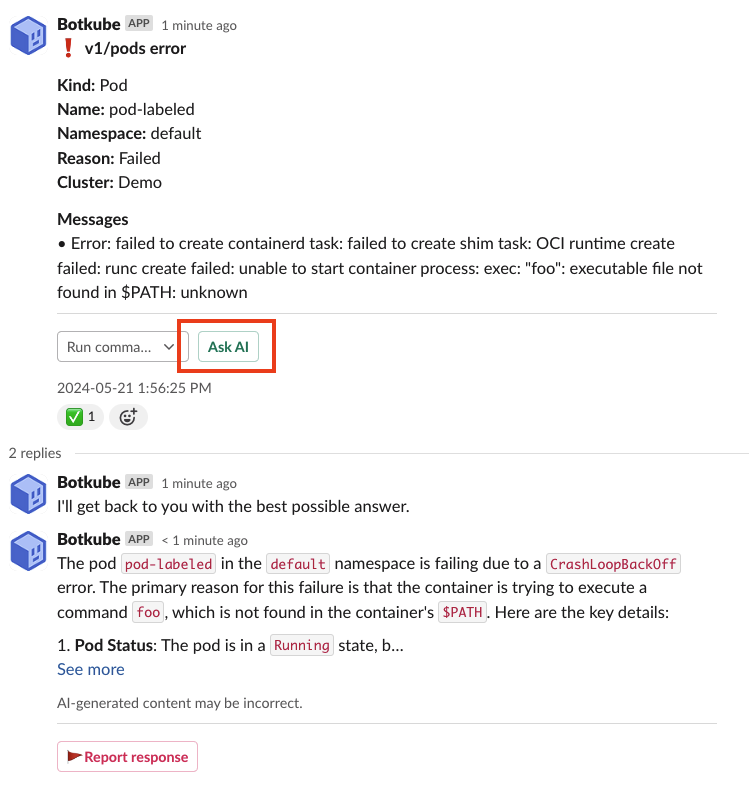

:::info
**This plugin is hosted by the [Botkube Cloud](https://app.botkube.io) plugin repository and requires active Botkube Cloud account.**
:::

The AI Assistant plugin makes it easier than ever for teams to identify, diagnose, and troubleshoot issues in any Kubernetes cluster. It is powered by the OpenAI's `GPT-4o` large language model with additional Kubernetes-related capabilities.

## Features

The plugin provides the following features:

- "AI Help" button for Kubernetes event analysis.
- Answering arbitrary questions or instructions.
- Kubernetes cluster troubleshooting based on:
  - `kubectl` commands,
  - container logs,
  - Kubernetes events,
  - resource usage (CPU/memory).
- Answering Botkube questions or instructions based on:
  - Agent status and configuration,
  - the latest Botkube documentation and other Botkube content.
- Keeping conversation context in the message threads.
- Kubernetes cluster scan.

## Get started

## Enable the plugin

You can enable the plugin as a part of Botkube instance configuration.

1. If you don't have an existing Botkube instance, create a new one, according to the [Installation](../installation/index.mdx) docs.
2. From the [Botkube Cloud homepage](https://app.botkube.io), click on a card of a given Botkube instance.
3. Navigate to the platform tab which you want to configure.
4. Click **Add plugin** button.
5. Select the AI plugin.
6. Click **Save** button.

## Usage

### Highlights

To see the AI assistant in action, watch the video:

import ReactPlayer from "react-player";

<ReactPlayer controls url="https://www.youtube.com/watch?v=VzXUL7rch-4" />

### AI Help for Kubernetes events

Click on the **AI Help** button to get an analysis of the event.

### AI questions and instructions

To ask the Botkube AI Assistant any question, use the `@Botkube ai` command prefix.

Here are a few examples to get you started:

- `@Botkube ai are my pods in default namespace up and running?`
- `@Botkube ai how many nodes are there?`
- `@Botkube ai output a yaml for Kubernetes pod with nginx image`
- `@Botkube what's the current Botkube status?`
- `@Botkube ai what's the difference between Botkube sources and executors?`
- `@Botkube ai what Botkube plugins are available to install? List all of them with one sentence description and link to the docs.`
- `@Botkube ai who's the Botkube maintainer?`

### AI cluster scan

The assistant can help you troubleshoot the Kubernetes cluster by performing a cluster-wide scan for any potential issues,
such as failing pods, high resource usage, or any other anomalies. To start the scan, use the `@Botkube ai scan` command.

## Configuration

Currently, the AI plugin doesn't have any configuration options.

## Limitations

- The conversation context is stored in-memory and will be cleared on Botkube Agent restart.
