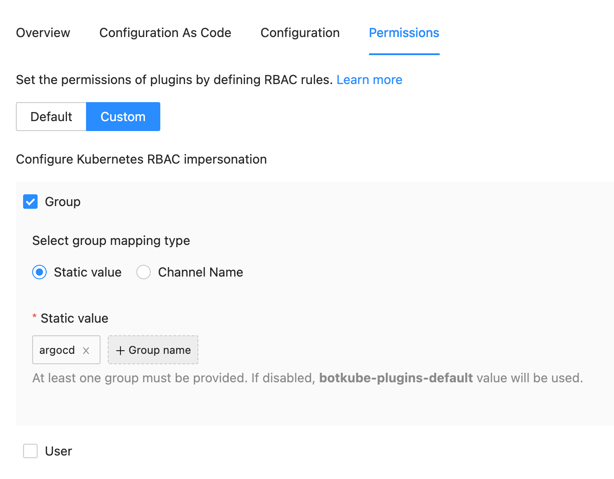
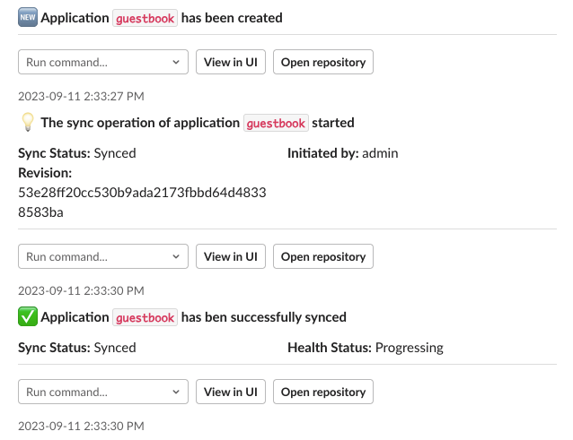

:::info
**This plugin is hosted by the [Botkube Cloud](https://app.botkube.io) plugin repository and requires active Botkube Cloud account.**
:::

ArgoCD source plugin sends events from ArgoCD to configured communication platforms. During startup, the plugin configures ArgoCD webhooks, triggers, templates and subscriptions based on the [ArgoCD Notification Catalog](https://argo-cd.readthedocs.io/en/stable/operator-manual/notifications/catalog/).
It uses native [ArgoCD notifications](https://argo-cd.readthedocs.io/en/stable/operator-manual/notifications/triggers/) configuration to send the events to Botkube communication platforms.

The ArgoCD source plugin is hosted by the Botkube Cloud plugin repository and requires active Botkube Cloud account.

## Get started

### 1. Prepare elevated RBAC permissions

ArgoCD plugin requires specific RBAC permissions.
First, create RBAC resources on your cluster:

```shell
cat > /tmp/argocd-rbac.yaml << ENDOFFILE
---
apiVersion: rbac.authorization.k8s.io/v1
kind: ClusterRole
metadata:
  name: argocd
rules:
  - apiGroups: [""]
    resources: ["configmaps"]
    verbs: ["get", "update"]
  - apiGroups: ["argoproj.io"]
    resources: ["applications"]
    verbs: ["get", "patch"]
---
apiVersion: rbac.authorization.k8s.io/v1
kind: ClusterRoleBinding
metadata:
  name: argocd
roleRef:
  apiGroup: rbac.authorization.k8s.io
  kind: ClusterRole
  name: argocd
subjects:
- kind: Group
  name: argocd
  apiGroup: rbac.authorization.k8s.io
ENDOFFILE

kubectl apply -f /tmp/argocd-rbac.yaml
```

Next, use the `argocd` static group name in the plugin RBAC configuration:



### 2. Enable the plugin

:::note
In order to enable the plugin, ArgoCD has to be already installed on the cluster and all watched Applications need to be created.

Also, remember to create RBAC resources for the plugin. See the [Prepare elevated RBAC permissions](#1-prepare-elevated-rbac-permissions) section.
:::

You can enable the plugin as a part of Botkube instance configuration.

1. If you don't have an existing Botkube instance, create a new one, according to the [Installation](../installation/index.mdx) docs.
2. From the [Botkube Cloud homepage](https://app.botkube.io), click on a card of a given Botkube instance.
3. Navigate to the platform tab which you want to configure.
4. Click **Add plugin** button.
5. Select the ArgoCD plugin.
6. Provide at least one ArgoCD application name and namespace in the configuration.
7. Click **Save** button.

```yaml
defaultSubscriptions:
  applications:
    - name: guestbook
      namespace: argocd
```

You can watch multiple ArgoCD Applications at the same time, for example:

```yaml
defaultSubscriptions:
  applications:
    - name: guestbook
      namespace: argocd
    - name: second-app
      namespace: second-app-namespace
```

1. Click **Save**.

## Usage

Botkube allows you to consume ArgoCD events on your Kubernetes cluster.

Once it is enabled, the ArgoCD plugin will configure ArgoCD notifications so that Botkube receives them on its incoming webhook. Then, Botkube will send them to configured platforms as shown below.



## Interactive events

For platforms that support interactivity, such as Slack and Microsoft Teams, Botkube sends interactive messages for ArgoCD events, that allow you to perform actions on the event. By default, the following actions are supported:

- Run commands on the Application:
  - `get`
  - `describe`
- View the Application in the ArgoCD UI
- Open the source repository in the browser

Interactive buttons and commands can be configured. See the [Configuration](#configuration-syntax) section for more details.

## Cleanup

When you disable or remove the plugin, it won't revert all changes made during the plugin startup. To clean up all ArgoCD follow the manual steps:

- Clean up ArgoCD Notifications ConfigMap. It is usually named `argocd-notifications-cm` in the `argocd` Namespace.

  Remove all properties that contains `b-` or `botkube-` prefixes in the name.

  - Webhook property name follows the syntax `service.webhook.{webhook-name}`. For example, the `service.webhook.b-784e` property was created by Botkube.
  - Template property name follows the syntax `template.{template-name}`. For example, the `template.template.botkube-argocd-ch05k-app-health-degraded` property was created by Botkube.
  - Trigger property name follows the syntax `trigger.{trigger-name}`. For example, the `trigger.b-372839f86ed61c4c88` property was created by Botkube.

- Remove all `argocd.argoproj.io/notifications` annotations from ArgoCD Applications which contain `b-` prefix in the trigger and webhook names.

  The annotation key pattern is `notifications.argoproj.io/subscribe.{trigger-name}.{webhook-name}`. For example, the annotation `notifications.argoproj.io/subscribe.b-5cc4c004df01230f72.b-efc0: ""` was created by Botkube and it should be deleted if the plugin is disabled.

## Configuration Syntax

### Basic configuration

This section lists all basic configuration options for the ArgoCD source plugin. The ArgoCD notification config is created automatically during plugin startup and uses triggers and templates based on the [ArgoCD Notification Catalog](https://argo-cd.readthedocs.io/en/stable/operator-manual/notifications/catalog/).

```yaml
defaultSubscriptions:
  # Provide application name and namespace to subscribe to all events for a given application.
  applications:
    - name: "guestbook"
      namespace: "argocd"
argoCD:
  # ArgoCD UI base URL. It is used for generating links in the incoming events.
  uiBaseUrl: http://localhost:8080
  # ArgoCD Notifications ConfigMap reference.
  notificationsConfigMap:
    name: argocd-notifications-cm
    namespace: argocd
```

### Advanced configuration

The basic configuration should be sufficient for most users. However, you can customize all triggers, templates, webhook registration and more. For advanced properties, see the full default configuration below:

```yaml
log:
  level: "info"

# Interactivity configures command dropdown and additional buttons
# for platforms which support interactivity (`isInteractive: true`) such as Socket Slack or Cloud Slack.
interactivity:
  enableViewInUIButton: true
  enableOpenRepositoryButton: true
  commandVerbs:
    - "get"
    - "describe"

# ArgoCD-related configuration.
argoCD:
  # ArgoCD UI base URL. It is used for generating links in the incoming events.
  uiBaseUrl: http://localhost:8080
  # ArgoCD Notifications ConfigMap reference.
  notificationsConfigMap:
    name: argocd-notifications-cm
    namespace: argocd

# Webhook configuration.
webhook:
  # If true, it registers Botkube webhook in ArgoCD notification config.
  register: true
  # If the name exceeds 6 characters, it might be truncated and modified to match the external constraints.
  name: "b-{{ .SourceName }}"
  url: "{{ .IncomingWebhook.FullURLForSource }}"

# Triggers and templates are based on https://github.com/argoproj/argo-cd/blob/master/notifications_catalog/install.yaml.
# Trigger might be created from existing template (`fromExisting`) or from scratch (`create`).
notifications:
  - trigger:
      # fromExisting:
      #  name: on-created
      #  templateName: "botkube-{{ .SourceName }}-app-created"
      create:
        # If the name exceeds 20 characters, it might be modified to match the external constraints.
        name: "b-{{ .SourceName }}-create"
        conditions: # syntax: https://argo-cd.readthedocs.io/en/stable/operator-manual/notifications/triggers/
          - description: Application is created.
            oncePer: app.metadata.name
            when: "true"
            send:
              - "botkube-{{ .SourceName }}-app-created" # template Name, you can use templating here
    subscriptions: &triggerSubscriptions # Even if false, the default subscriptions are still created.
      create: true
      # Additional subscriptions apart from `defaultSubscriptions`
      additional:
        []
        #  - name: "guestbook"
        #    namespace: "argocd"
  - trigger:
      create:
        name: "b-{{ .SourceName }}-delete"
        conditions:
          - description: Application is deleted.
            oncePer: app.metadata.name
            when: app.metadata.deletionTimestamp != nil
            send:
              - "botkube-{{ .SourceName }}-app-deleted"
    subscriptions: *triggerSubscriptions
  - trigger:
      create:
        name: "b-{{ .SourceName}}-deploy"
        conditions:
          - description: Application is synced and healthy. Triggered once per commit.
            oncePer: app.status.operationState.syncResult.revision
            when: app.status.operationState.phase in ['Succeeded'] and app.status.health.status
              == 'Healthy'
            send:
              - "botkube-{{ .SourceName }}-app-deployed"
    subscriptions: *triggerSubscriptions
  - trigger:
      create:
        name: "b-{{ .SourceName}}-degrade"
        conditions:
          - description: Application has degraded
            when: app.status.health.status == 'Degraded'
            send:
              - "botkube-{{ .SourceName }}-app-health-degraded"
    subscriptions: *triggerSubscriptions
  - trigger:
      create:
        name: "b-{{ .SourceName }}-fail"
        conditions:
          - description: Application syncing has failed
            when: app.status.operationState != nil and app.status.operationState.phase in ['Error',
              'Failed']
            send:
              - "botkube-{{ .SourceName }}-app-sync-failed"
    subscriptions: *triggerSubscriptions
  - trigger:
      create:
        name: "b-{{ .SourceName }}-run"
        conditions:
          - description: Application is being synced
            when: app.status.operationState != nil and app.status.operationState.phase in ['Running']
            send:
              - "botkube-{{ .SourceName }}-app-sync-running"
    subscriptions: *triggerSubscriptions
  - trigger:
      create:
        name: "b-{{ .SourceName }}-unknown"
        conditions:
          - description: Application status is 'Unknown'
            when: app.status.sync.status == 'Unknown'
            send:
              - "botkube-{{ .SourceName }}-app-sync-status-unknown"
    subscriptions: *triggerSubscriptions
  - trigger:
      create:
        name: "b-{{ .SourceName }}-success"
        conditions:
          - description: Application syncing has succeeded
            when: app.status.operationState != nil and app.status.operationState.phase in ['Succeeded']
            send:
              - "botkube-{{ .SourceName }}-app-sync-succeeded"
    subscriptions: *triggerSubscriptions

templates:
  - name: "botkube-{{ .SourceName }}-app-created"
    body: |
      {
        "message": {
          "sections": [
            { "header": ":new: Application `{{.app.metadata.name}}` has been created" }
          ]
        },
        "context": {
          "app": {
            "name": "{{.app.metadata.name}}",
            "namespace": "{{.app.metadata.namespace}}"
          },
          "detailsUiPath": "/applications/{{.app.metadata.name}}",
          "repoUrl": "{{.app.spec.source.repoURL | call .repo.RepoURLToHTTPS}}"
        }
      }
  - name: "botkube-{{ .SourceName }}-app-deleted"
    body: |
      {
        "message": {
          "sections": [
            { "header": ":no_entry_sign: Application `{{.app.metadata.name}}` has been deleted" }
          ]
        }
      }
  - name: "botkube-{{ .SourceName }}-app-deployed"
    body: |
      {
        "message": {
          "sections": [
            {
              "header": ":rocket: New version of the application `{{.app.metadata.name}}` is up and running",
              "textFields": [
                {
                  "key": "Sync Status",
                  "value": "{{.app.status.sync.status}}"
                },
                {
                  "key": "Health Status",
                  "value": "{{.app.status.health.status}}"
                },
                {
                  "key": "Revision",
                  "value": "{{.app.status.sync.revision}}"
                }
                {{range $index, $c := .app.status.conditions}}
                ,{
                  "key": "{{$c.type}}",
                  "value": "{{$c.message}}"
                }
                {{end}}
              ]
            }
          ]
        },
        "context": {
          "app": {
            "name": "{{.app.metadata.name}}",
            "namespace": "{{.app.metadata.namespace}}"
          },
          "detailsUiPath": "/applications/{{.app.metadata.name}}",
          "repoUrl": "{{.app.spec.source.repoURL | call .repo.RepoURLToHTTPS}}"
        }
      }
  - name: "botkube-{{ .SourceName }}-app-health-degraded"
    body: |
      {
        "message": {
          "sections": [
            {
              "header": ":exclamation: Application `{{.app.metadata.name}}` has degraded",
              "textFields": [
                {
                  "key": "Health Status",
                  "value": "{{.app.status.health.status}}"
                },
                {
                  "key": "Revision",
                  "value": "{{.app.status.sync.revision}}"
                }
                {{range $index, $c := .app.status.conditions}}
                ,{
                  "key": "{{$c.type}}",
                  "value": "{{$c.message}}"
                }
                {{end}}
              ]
            }
          ]
        },
        "context": {
          "app": {
            "name": "{{.app.metadata.name}}",
            "namespace": "{{.app.metadata.namespace}}"
          },
          "detailsUiPath": "/applications/{{.app.metadata.name}}",
          "repoUrl": "{{.app.spec.source.repoURL | call .repo.RepoURLToHTTPS}}"
        }
      }
  - name: "botkube-{{ .SourceName }}-app-sync-failed"
    body: |
      {
        "message": {
          "timestamp": "{{.app.status.operationState.finishedAt}}",
          "sections": [
            {
              "header": ":exclamation: The sync operation of application `{{.app.metadata.name}}` failed",
              "textFields": [
                {
                  "key": "Error message",
                  "value": "{{.app.status.operationState.message}}"
                },
                {
                  "key": "Sync Status",
                  "value": "{{.app.status.sync.status}}"
                },
                {
                  "key": "Revision",
                  "value": "{{.app.status.sync.revision}}"
                }
                {{range $index, $c := .app.status.conditions}}
              ,{
                  "key": "{{$c.type}}",
                  "value": "{{$c.message}}"
                }
                {{end}}
              ]
            }
          ]
        },
        "context": {
          "app": {
            "name": "{{.app.metadata.name}}",
            "namespace": "{{.app.metadata.namespace}}"
          },
          "detailsUiPath": "/applications/{{.app.metadata.name}}?operation=true",
          "repoUrl": "{{.app.spec.source.repoURL | call .repo.RepoURLToHTTPS}}"
        }
      }

  - name: "botkube-{{ .SourceName }}-app-sync-running"
    body: |
      {
        "message": {
          "timestamp": "{{.app.status.operationState.startedAt}}",
          "sections": [
            {
              "header": ":bulb: The sync operation of application `{{.app.metadata.name}}` started",
              "textFields": [
                {
                  "key": "Sync Status",
                  "value": "{{.app.status.sync.status}}"
                },
                {{ if and (.app.status.operationState) (.app.status.operationState.operation) }}
                {
                  "key": "Initiated by",
                  "value": "{{.app.status.operationState.operation.initiatedBy.username}}"
                },
                {{ if .app.status.operationState.operation.initiatedBy.automated }}
                {
                  "key": "Automated",
                  "value": "{{.app.status.operationState.operation.initiatedBy.automated}}"
                },
                {{ end }}
                {{ end }}
                {
                  "key": "Revision",
                  "value": "{{.app.status.sync.revision}}"
                }
                {{range $index, $c := .app.status.conditions}}
              ,{
                  "key": "{{$c.type}}",
                  "value": "{{$c.message}}"
                }
                {{end}}
              ]
            }
          ]
        },
        "context": {
          "app": {
            "name": "{{.app.metadata.name}}",
            "namespace": "{{.app.metadata.namespace}}"
          },
          "detailsUiPath": "/applications/{{.app.metadata.name}}?operation=true",
          "repoUrl": "{{.app.spec.source.repoURL | call .repo.RepoURLToHTTPS}}"
        }
      }
  - name: "botkube-{{ .SourceName }}-app-sync-status-unknown"
    body: |
      {
        "message": {
          "sections": [
            {
              "header": ":warning: Application `{{.app.metadata.name}}` sync status is unknown",
              "textFields": [
                {
                  "key": "Sync Status",
                  "value": "{{.app.status.sync.status}}"
                }
                {{range $index, $c := .app.status.conditions}}
              ,{
                  "key": "{{$c.type}}",
                  "value": "{{$c.message}}"
                }
                {{end}}
              ]
            }
          ]
        },
        "context": {
          "app": {
            "name": "{{.app.metadata.name}}",
            "namespace": "{{.app.metadata.namespace}}"
          },
          "detailsUiPath": "/applications/{{.app.metadata.name}}",
          "repoUrl": "{{.app.spec.source.repoURL | call .repo.RepoURLToHTTPS}}"
        }
      }
  - name: "botkube-{{ .SourceName }}-app-sync-succeeded"
    body: |
      {
        "message": {
          "timestamp": "{{.app.status.operationState.finishedAt}}",
          "sections": [
            {
              "header": ":white_check_mark: Application `{{.app.metadata.name}}` has ben successfully synced",
              "textFields": [
                {
                  "key": "Sync Status",
                  "value": "{{.app.status.sync.status}}"
                },
                {
                  "key": "Health Status",
                  "value": "{{.app.status.health.status}}"
                }
                {{range $index, $c := .app.status.conditions}}
              ,{
                  "key": "{{$c.type}}",
                  "value": "{{$c.message}}"
                }
                {{end}}
              ]
            }
          ]
        },
        "context": {
          "app": {
            "name": "{{.app.metadata.name}}",
            "namespace": "{{.app.metadata.namespace}}"
          },
          "detailsUiPath": "/applications/{{.app.metadata.name}}?operation=true",
          "repoUrl": "{{.app.spec.source.repoURL | call .repo.RepoURLToHTTPS}}"
        }
      }
```
