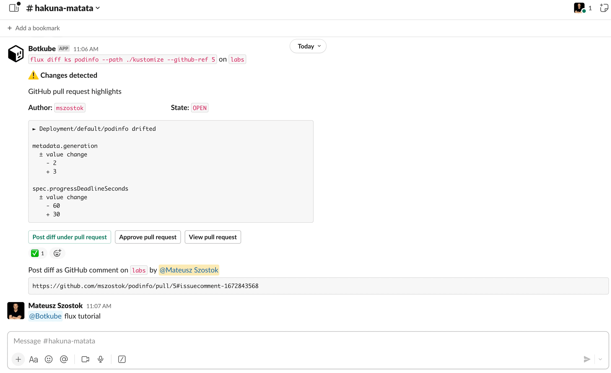

The Botkube Flux executor plugin allows you to run the [`flux`](https://fluxcd.io/) CLI commands directly within the chat window of your chosen communication platform.

## Get started

### 1. Prepare elevated RBAC permissions

One of the plugin capabilities is the `flux diff` command. To use it, you need to update the Flux plugin RBAC configuration. This is necessary because the command performs a server-side dry run that requires patch permissions, as specified in the [Kubernetes documentation](https://kubernetes.io/docs/reference/using-api/api-concepts/#dry-run-authorization).

Create RBAC resources on your cluster:

```shell
cat > /tmp/flux-rbac.yaml << ENDOFFILE
---
apiVersion: rbac.authorization.k8s.io/v1
kind: ClusterRole
metadata:
  name: flux
rules:
  - apiGroups: ["*"]
    resources: ["*"]
    verbs: ["get", "watch", "list", "patch"]
---
apiVersion: rbac.authorization.k8s.io/v1
kind: ClusterRoleBinding
metadata:
  name: flux
roleRef:
  apiGroup: rbac.authorization.k8s.io
  kind: ClusterRole
  name: flux
subjects:
- kind: Group
  name: flux
  apiGroup: rbac.authorization.k8s.io
ENDOFFILE

kubectl apply -f /tmp/flux-rbac.yaml
```

### 2. Enable the plugin

Enable the plugin by adding a new [executor](../self-hosted-configuration/executor.md) plugin to the Botkube configuration:

```yaml
executors:
  # ...
  flux:
    botkubeExtraPlugins/flux:
      displayName: "Flux"
      enabled: true
      context:
        rbac:
          group:
            type: Static
            static:
              values: ["flux"]
      config:
        # See the Configuration section for config properties.
        github: # Optional GitHub support
          auth:
            accessToken: "" # your GitHub access token. Read more: https://help.github.com/articles/creating-a-personal-access-token-for-the-command-line/#creating-a-token

plugins:
  # ...
  repositories:
    botkubeExtraPlugins:
      url: https://github.com/kubeshop/botkube-plugins/releases/download/v1.14.0/plugins-index.yaml
```

Then, use the plugin in your [communication platform](../self-hosted-configuration/communication/index.md).

By default, the Flux plugin has read-only access. To perform actions like creating or deleting Flux-related sources, you'll need to customize the [RBAC](../features/rbac.md).

## Usage

To execute the `flux` CLI commands, send a message in the channel where Botkube is present. For example:

```
@Botkube flux tutorial
```

### Interactive Usage

The Flux plugin supports interactivity (tables, etc.) to simplify running Flux CLI commands e.g. from mobile devices.



### Simplified Kustomization Diffing Flow

With the Botkube Flux executor, you can execute a single command to perform a diff between a specific pull request and the cluster state. For instance:

```
@Botkube flux diff kustomization podinfo --path ./kustomize --github-ref [PR Number| URL | Branch]
```


This command automates several tasks:

- Automatically discovering the associated GitHub repository for the given kustomization.
- Cloning the repository.
- Checking out a given pull request.
- Comparing pull request changes with the current cluster state.
- Sharing the diff report.

The diff results are posted on the Slack channel, making it easy for team members to review and discuss the changes. Additionally, the returned message provides additional contextual actions:

- Posting the diff report as a GitHub comment on the corresponding pull request.
- Approving the pull request.
- Viewing the pull request.

### GitHub automation

To enhance your workflow's efficiency, you can use the [GitHub Events](./github-events.md) source for automatic notification of pull request events, complete with an integrated `flux diff` button.

```yaml
github:
  auth:
    accessToken: "ghp_" # GitHub PAT

repositories:
  - name: { owner }/{name}
    on:
      pullRequests:
          - types: [ "open" ]
            paths:
              # Patterns for included file changes in pull requests.
              include: [ 'kustomize/.*' ]
            notificationTemplate:
              extraButtons:
                - displayName: "Flux Diff"
                  commandTpl: "flux diff ks podinfo --path ./kustomize --github-ref {{ .HTMLURL }} "
```

Don't forget to bind the plugin to one of the channels.

## Configuration

The plugin supports the following configuration:

```yaml
github:
  auth:
    # GitHub access token.
    # Instructions for token creation: https://help.github.com/articles/creating-a-personal-access-token-for-the-command-line/#creating-a-token.
    # Lack of token may limit functionality, e.g., adding comments to pull requests or approving them.
    accessToken: ""
log:
  level: "info"
```
