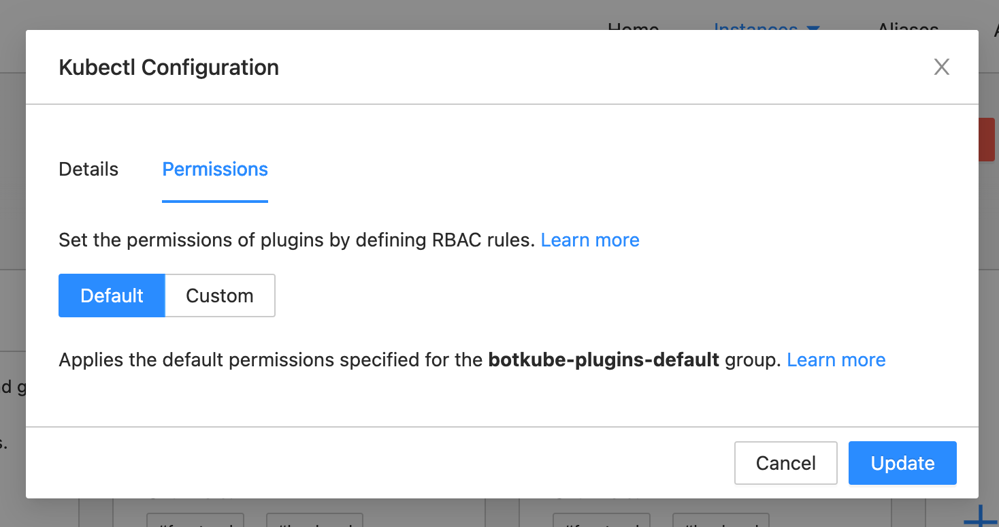

Botkube allows plugins to access Kubernetes API by defining [RBAC](https://en.wikipedia.org/wiki/Role-based_access_control) rules as part of plugin `context.rbac` configuration. Kubeconfig generation needs to be requested by defining `context.rbac` property.

Based on this configuration Botkube generates a temporary [kubeconfig](https://kubernetes.io/docs/concepts/configuration/organize-cluster-access-kubeconfig/) with user and/or group impersonation.
This kubeconfig is available to plugins in the `Execute` and `Stream` contexts.

## Architecture

Botkube uses its own cluster credentials to generate a temporary kubeconfig, and the kubeconfig uses [user/group impersonation](https://kubernetes.io/docs/reference/access-authn-authz/authentication/#user-impersonation).

For source plugins, the kubeconfig is generated once - during plugin startup.
For executor plugins, the kubeconfig is generated every time a command is sent to the plugin, which allows greater flexibility, such as including the name of the channel the command was sent from.



## Configuration

For each executor and source plugin, you can define a `context.rbac` configuration. This config is used to generate a dedicated kubeconfig.

```yaml
executors:
  "kubectl":
    botkube/kubectl@v1:
      enabled: true
      # ...
      context:
        rbac:
          user:
            type: Static # Static or ChannelName
            static: # applicable only for "Static" user mapping type
              value: botkube-internal-static-user
            prefix: "" # optional prefix for user name; useful especially for channel name mapping
          group:
            type: Static # Static or ChannelName
            static: # applicable only for "Static" group mapping type
              values:
                - "my-group1"
                - "my-group2"
            prefix: "" # optional prefix for all group names; useful especially for channel name mapping
```

### Mapping types

For both user and group, the following mapping types are supported:

- `Static`

  For user, it uses a single static value. For group, it uses a list of static values. The value is prepended with an optional prefix.

- `ChannelName`

  Channel name is used as subject for user or group impersonation. The channel name is prepended with an optional prefix.
  This mapping is only available for executor plugins.

### Default configuration

When a given plugin have `context.rbac` property undefined, Botkube doesn't generate a kubeconfig for this plugin. To request kubeconfig generation, define `context.rbac` property with empty value:

```yaml
executors:
  "kubectl":
    botkube/kubectl@v1:
      enabled: true
      # ...
      context:
        rbac: {} # enable kubeconfig generation
```

However, such configuration will generate a kubeconfig with empty impersonation config, which effectively means an anonymous access to the Kubernetes API.

During Botkube installation, Botkube generates Kubernetes ClusterRole and ClusterRoleBinding resources with read-only access for the default group `botkube-plugins-default`. This group is used by default across the `values.yaml` for all default plugins.

```yaml
rbac:
  # ...
  create: true
  rules: # rules for the default static group
    - apiGroups: ["*"]
      resources: ["*"]
      verbs: ["get", "watch", "list"]
  staticGroupName: "botkube-plugins-default" # group name used in the `values.yaml` file for default plugins
```

See the [`values.yaml`](https://github.com/kubeshop/botkube/blob/v1.4.0/helm/botkube/values.yaml#L48-L53) for more details.

#### Defaults for user mapping when group mapping is used

Kubernetes requires user for group impersonation. That's why when a group mapping is user without `context.rbac.user` mapping defined, Botkube uses `botkube-internal-static-user` user name for impersonation.
For example, when the following configuration is used:

```yaml
executors:
  "kubectl":
    botkube/kubectl@v1:
      enabled: true
      # ...
      context:
        rbac:
          # no user mapping defined
          group:
            type: Static
            static:
              value: botkube-plugins-default
```

It is equivalent to:

```yaml
executors:
  "kubectl":
    botkube/kubectl@v1:
      enabled: true
      # ...
      context:
        rbac:
          user:
            type: Static
            static:
              value: botkube-internal-static-user
          group:
            type: Static
            static:
              value: botkube-plugins-default
```

#### Defaults for Botkube Cloud

When configuring plugin on Botkube Cloud, the "Default" permissions mean that the `botkube-plugins-default` group will be used, which have read-only access to Kubernetes API and is configured during Botkube installation. See the [Default configuration](#default-configuration) section.



## Examples

This paragraph contains examples of RBAC configuration for different use cases.

:::tip
You can use `extraObjects` override during Botkube installation. See the [`values.yaml`](https://github.com/kubeshop/botkube/blob/v1.4.0/helm/botkube/values.yaml#L1059) for more details.
:::

### Kubectl executor with read-only Pod access based on static group mapping

In this example an executor plugin is defined with static RBAC that maps to group `read-pods`.

1. Consider the following Botkube config:

   ```yaml
   # ...
   executors:
     "kubectl-read-only":
       botkube/kubectl@v1:
         enabled: true
         # ...
         context:
           rbac:
             group:
               type: Static
               static:
                 values: [read-pods]
   ```

Let's assume this plugin is bound to at least one channel.

1. Consider the following Kubernetes RBAC configuration:

   ```yaml
   apiVersion: rbac.authorization.k8s.io/v1
   kind: ClusterRole
   metadata:
     name: kubectl-read-pods
   rules:
     - apiGroups: [""]
       resources: ["pods"]
       verbs: ["get", "watch", "list"]
   ---
   apiVersion: rbac.authorization.k8s.io/v1
   kind: ClusterRoleBinding
   metadata:
     name: kubectl-read-pods
   roleRef:
     apiGroup: rbac.authorization.k8s.io
     kind: ClusterRole
     name: kubectl-read-pods
   subjects:
     - kind: Group
       name: read-pods # <-- this is the group name used in Botkube config
       apiGroup: rbac.authorization.k8s.io
   ```

In a result, when this executor plugin is invoked, Botkube generates a kubeconfig impersonating group `read-pods` and passes it to the plugin. The plugin then can authenticate with the API server with identity of group `read-pods`. In that way, the plugin can use read-only operations on Pods.

### Kubernetes source plugin with read-only access based on static user mapping

In this example a single source plugin is defined with static RBAC that maps to user `kubernetes-read-only`.

1. Consider the following Botkube config:

   ```yaml
   sources:
     "kubernetes":
       botkube/kubernetes@v1:
         enabled: true
         # ...
         context:
           rbac:
             user:
               type: Static
               static:
                 value: kubernetes-read-only
   ```

1. Consider the following Kubernetes RBAC configuration:

   ```yaml
   apiVersion: rbac.authorization.k8s.io/v1
   kind: ClusterRole
   metadata:
     name: reader
   rules:
     - apiGroups: ["*"]
       resources: ["*"]
       verbs: ["get", "watch", "list"]
   ---
   apiVersion: rbac.authorization.k8s.io/v1
   kind: ClusterRoleBinding
   metadata:
     name: reader
   roleRef:
     apiGroup: rbac.authorization.k8s.io
     kind: ClusterRole
     name: reader
   subjects:
     - kind: User
       name: kubernetes-read-only # <-- this is the username used in Botkube config
       apiGroup: rbac.authorization.k8s.io
   ```

In a result, the source plugin can access all Kubernetes resources with read-only permissions.

### Kubectl executor plugin with different permissions based on channel name mapping

In this example **kubectl** executor plugin is configured with channel name mapping and bound to two channels, `ch-1` and `ch-2`. In Kubernetes RBAC resources, group `ch-1` is given write access, while group `ch-2` is given only read access.

1. Consider the following Botkube config:

   ```yaml
   executors:
     "kubectl":
       botkube/kubectl@v1:
         # ...
         enabled: true
         context:
           rbac:
             group:
               type: ChannelName
   communications:
     "default-group":
       socketSlack:
         enabled: true
         # ...
         channels:
           "ch-1":
             name: ch-1
             bindings:
               executors:
                 - kubectl
           "ch-2":
             name: ch-2
             bindings:
               executors:
                 - kubectl
   # ...
   ```

1. Consider the following Kubernetes RBAC configuration:

   ```yaml
   apiVersion: rbac.authorization.k8s.io/v1
   kind: ClusterRole
   metadata:
     name: editor
   rules:
     - apiGroups: ["*"]
       resources: ["*"]
       verbs: ["get", "watch", "list", "update", "create", "delete"]
   ---
   apiVersion: rbac.authorization.k8s.io/v1
   kind: ClusterRoleBinding
   metadata:
     name: editor
   roleRef:
     apiGroup: rbac.authorization.k8s.io
     kind: ClusterRole
     name: editor
   subjects:
     - kind: Group
       name: ch-1 # <-- channel name used in Botkube config
       apiGroup: rbac.authorization.k8s.io
   ---
   apiVersion: rbac.authorization.k8s.io/v1
   kind: ClusterRole
   metadata:
     name: read-only
   rules:
     - apiGroups: ["*"]
       resources: ["*"]
       verbs: ["get", "watch", "list"]
   ---
   apiVersion: rbac.authorization.k8s.io/v1
   kind: ClusterRoleBinding
   metadata:
     name: read-only
   roleRef:
     apiGroup: rbac.authorization.k8s.io
     kind: ClusterRole
     name: read-only
   subjects:
     - kind: Group
       name: ch-2 # <-- channel name used in Botkube config
       apiGroup: rbac.authorization.k8s.io
   ```

In a result, users in channel `ch-1` can execute all kubectl commands, while users in channel `ch-2` can only execute read-only commands.

## Limitations

This paragraph contains limitations of the current implementation.

### Shared file system

Botkube runs plugin processes in the same container within the same Pod. Therefore, all plugins share the same file system.

If you're a plugin developer and decide to write kubeconfig to the file system, be aware
that it can be accessible by all plugins in the container.

### RBAC configuration merging

The same executor plugins with different RBAC configuration cannot be bound to the same channel. This is validated during Botkube startup and will result in an error.

For example, the following configuration is invalid:

```yaml
communications:
  "default-group":
    socketSlack:
      enabled: true
      # ...
      channels:
        "ch-1":
          name: ch-1
          bindings:
            executors:
              - kubectl
              - kubectl-read-only
executors:
  "kubectl":
    botkube/kubectl@v1:
      enabled: true
      # ...
      context:
        rbac: # Different RBAC configuration
          group:
            type: ChannelName
  "kubectl-read-only":
    botkube/kubectl@v1:
      enabled: true
      # ...
      context:
        rbac: # Different RBAC configuration
          user:
            type: Static
            static:
              value: kubectl-read-only
```

### Supported RBAC mappings

While Executor plugins support multiple mapping types, there are the following limitations:

- Source plugins support only the `Static` mapping.
- Automated [actions](../usage/automated-actions.md) support only the `Static` mapping.

## Troubleshooting

In most cases troubleshooting Botkube RBAC issues means [troubleshooting Kubernetes RBAC](https://kubernetes.io/docs/reference/access-authn-authz/authorization/#checking-api-access), where `kubectl auth` command can help.

If you see the following error:

```
Error: create: failed to create: secrets is forbidden: User "botkube-internal-static-user" cannot create resource "secrets" in API group "" in the namespace "default"
```

that means the RBAC rules configured for a given plugin are insufficient in a given context.

Firstly, ensure what user/group is used for impersonation. To do that, check your configuration against the mapping description from the [Configuration](#configuration) section.

### Checking available actions for a given user/group

After obtaining proper user and group, use the following command to list all available actions for a given user and/or group:

```shell
kubectl auth can-i --as {user} --as-group {group} --list
```

For example, to list all available actions for user `botkube-internal-static-user` and group `private-channel` use:

```shell
kubectl auth can-i --as botkube-internal-static-user --as-group private-channel --list
```

### Checking if a given user/group can perform a given action

To verify if a given user and/or group can perform a given action, use:

```shell
kubectl auth can-i get pod -n botkube --as {user} --as-group {group}
```

For example, to verify if user `botkube-internal-static-user` and group `private-channel` can get Secret in namespace `botkube` use:

```shell
kubectl auth can-i get secret -n botkube --as botkube-internal-static-user --as-group private-channel
```

## Plugin development

If you are a plugin developer and want to learn how to use generated kubeconfig in the plugin codebase, refer to [Using kubeconfig](../plugin/using-kubeconfig.md) document.
